サーベイの結果をもとに、分析したい従業員やサーベイで回答された質問に沿って分析データを作成する方法を説明します。

サーベイの作成者以外のアカウントでも共同管理者に設定すると、分析機能のすべての操作ができるようになります。

サーベイ機能管理者権限がなくても、共同管理者になっていれば、分析のみ利用できます。

[作成したサーベイや分析を他のアカウントに共有する（共同管理者の設定）](https://knowledge.smarthr.jp/hc/ja/articles/4402361764633)を参照してください。

# 分析を新規作成する

## 1\. ［分析］画面で［+ 新規作成］をクリック

 **［従業員サーベイメニュー］** から **［分析］** をクリックして、 **［分析一覧］** 画面を表示します。

画面右上の **［＋新規作成］** をクリックすると **［分析の新規作成］** ダイアログが表示されます。

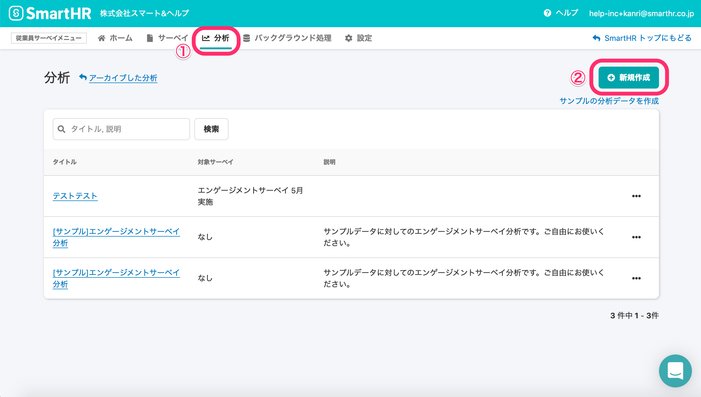

## 2\. 分析したいサーベイを選択

分析したいサーベイを選択してください。推移などを分析する場合には複数のサーベイを選択します。

選択後、 **［次へ］** をクリックしてください。

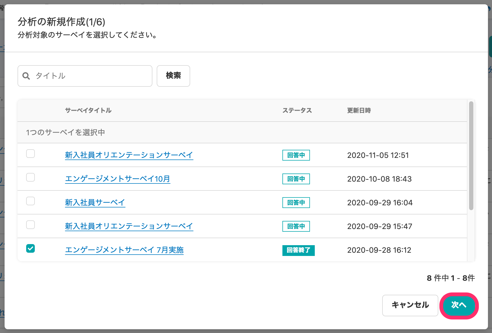

:::tips
サーベイに含まれる従業員情報は、サーベイ送信時のものを保持しています。
このため、過去の従業員情報を利用して、分析や推移分析を作成できます。
:::

## 3\. 分析対象にしたい質問を選択

最初はすべての質問にチェックが入っています。

 **［すべて解除する］** をクリックすると、分析したい質問だけにチェックを入れられます。

質問を選択後、 **［次へ］** をクリックしてください。

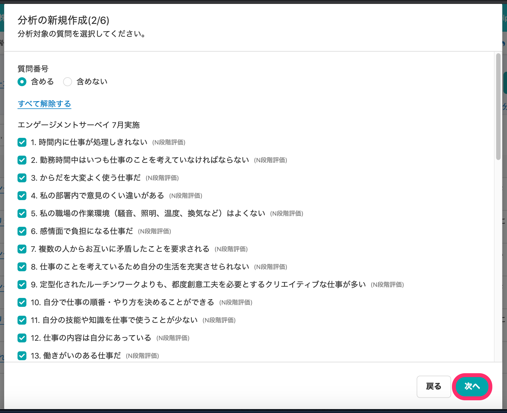

## 4\. 分析対象にしたい従業員の条件を選択

 **［部署の絞り込み］** ならびに **［雇用形態の絞り込み］** の項目で **［する］** をクリックすると、特定の部署や雇用形態の従業員のみの結果を対象にした分析を作成できます。

例えば、特定の部署を対象とした分析を作成し、その部署のマネージャーに分析の権限を付与すると、マネージャーが自部署の回答結果のみを分析できます。[部門ごとに分析を作成する](https://knowledge.smarthr.jp/hc/ja/articles/900007406443)を参照してください。

選択したら **［次へ］** をクリックします。

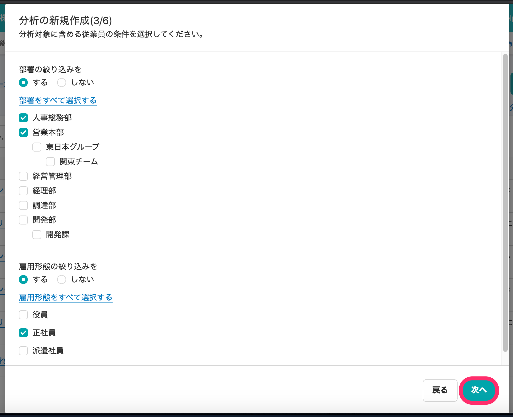

回答者全員を分析対象とする場合には、 **［しない］** を選択してください。

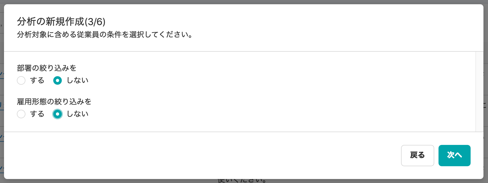

## 5\. 分析データのフォーマットと項目を選択

 **［分析データフォーマット］** では、生成する分析データのフォーマットを指定できます。

-  **［質問への回答ごとに行を分割］** ：回答の平均値などを分析したい場合に選択します。
-  **［回答者ごとに行を分割］** ：質問を1つずつ分析したり、質問同士の相関関係を分析したい場合に選択します。

 **［分析対象の従業員項目］** で選択した項目と、サーベイの回答結果をあわせて分析データが生成されるため、様々な分析を行う際に項目を活用することができます。

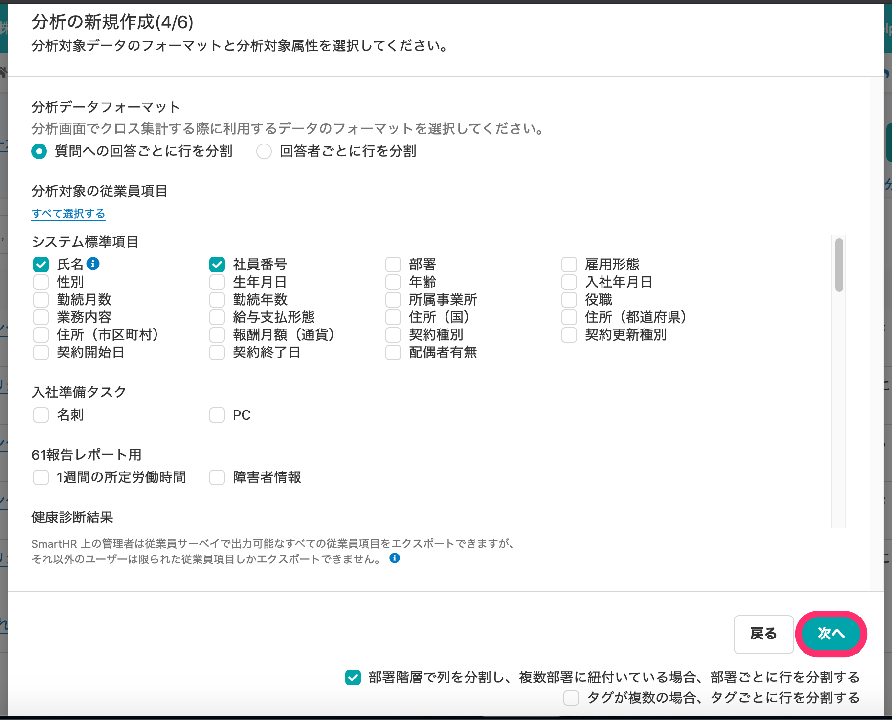

:::tips
 **［分析対象の従業員項目］** は、システム標準項目とカスタム項目から選択します。
カスタム項目の追加方法は、[カスタム従業員項目を追加する](https://knowledge.smarthr.jp/hc/ja/articles/360026265513)を参照してください。
:::

## 6\. クロス集計する際の集計単位を決定

前ページの **［分析対象の従業員項目］** で選択した一部の属性項目は、クロス集計する際にいくつかの単位をまとめた集計単位として表示することができます。

例： **［年齢］** の **［変換する］** にチェックを入れ、60歳以上と20歳以下をまとめ、集計単位を10歳ずつにした場合

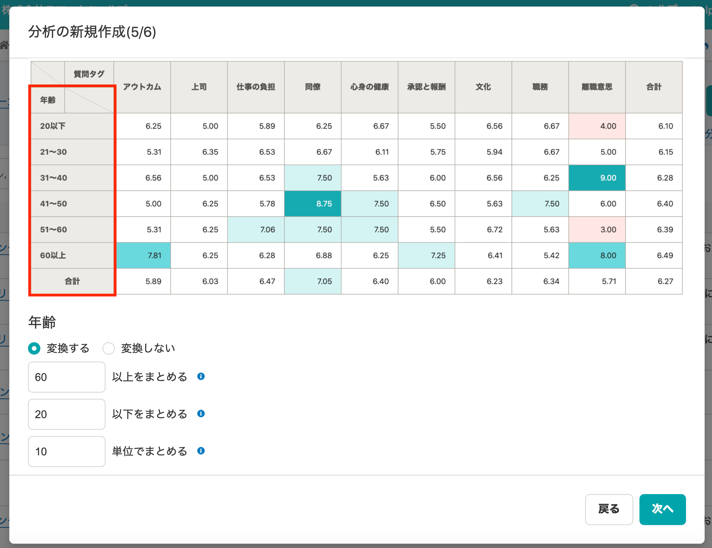

変換可能な属性がない場合

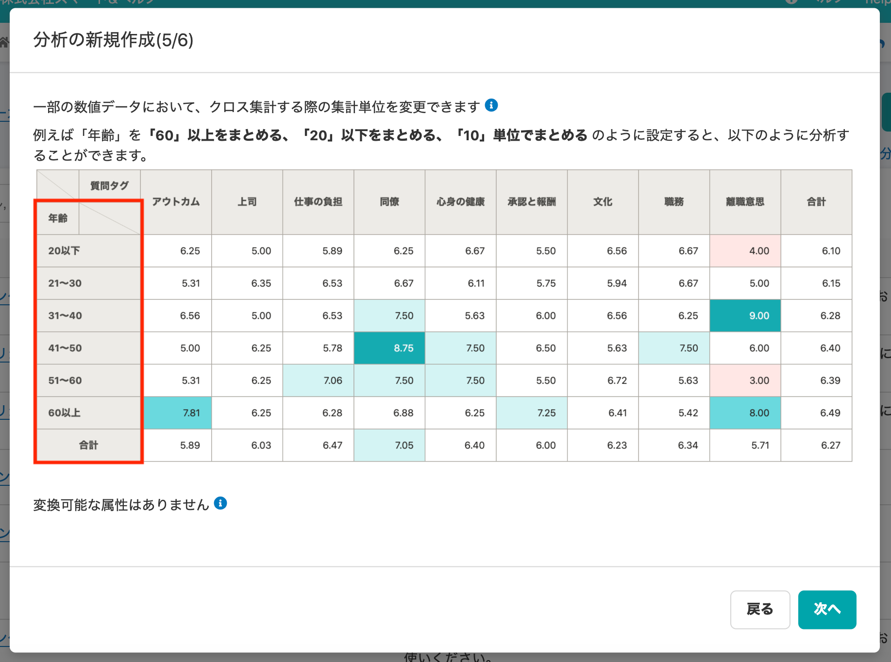

## 7\. 分析のタイトルと説明を入力

 **［タイトル］** と **［説明］** を入力します。あとから、どんな分析をしたか分かるような **［タイトル］** をつけます。

入力したら、 **［作成］** をクリックして完了です。

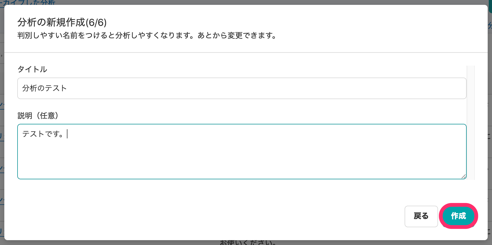

分析の一例として、目的に合わせた各分析の作成方法を以下のページに紹介しています。

:::related
[エンゲージメントサーベイ分析を作成する](https://knowledge.smarthr.jp/hc/ja/articles/360060082234)
[エンゲージメントサーベイ推移分析を作成する](https://knowledge.smarthr.jp/hc/ja/articles/360060309654)
[ラジオボタン分析を作成する](https://knowledge.smarthr.jp/hc/ja/articles/1500001792702)
:::

# 分析の方法

作成した分析結果を使って、分析する方法を説明します。

実施済みのサーベイがない場合は、サンプルのデータを使って分析機能の使い方を試すことができます。

[サンプルの分析を作成する](https://knowledge.smarthr.jp/hc/ja/articles/360053607134)を参照してください。

## ［行］と［列］

 **［行］** と **［列］** に、それぞれ項目を指定すると、その組み合わせた結果が表示されます。

例えば、部署ごとに質問の回答の平均値を見たい場合は、 **［行］** には **［部署1］** 、 **［列］** には **［質問］** を設定します。

そうすることで、部署ごと、質問ごとのデータを表示できます。

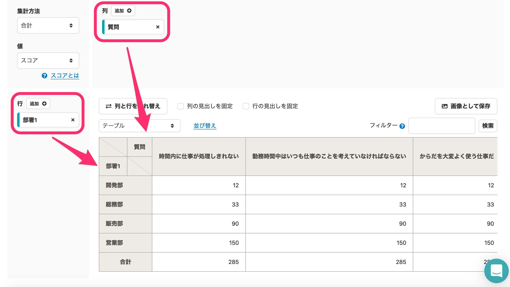

さらに深掘りして分析する場合は、 **［行］** と **［列］** の横にある **［追加＋］** をクリックし、プルダウンされたメニューからそれぞれ項目を追加し、複数の項目をかけ合わせた設定ができます。

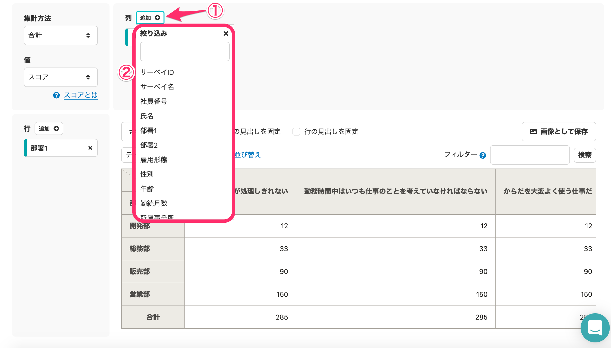

## ［値］と［集計方法］

 **［行］** と **［列］** で設定したデータに対して、「どういった値」で、「どういった集計を行うか」を **［値］** と **［集計方法］** に設定します。

例えば、 **［集計方法］** に **［平均値］** 、 **［値］** に **［スコア］** を設定すると、回答の平均値が表示されます。

下図、矢印に表示されている値 ： **「6.80」** を読み取ってみると、

「 **［1年以内にこの仕事をやめたいと思いますか？］** の質問に対して、**営業部の正社員の回答スコアの平均値**は 、**6.80**である」

ということが分かります。

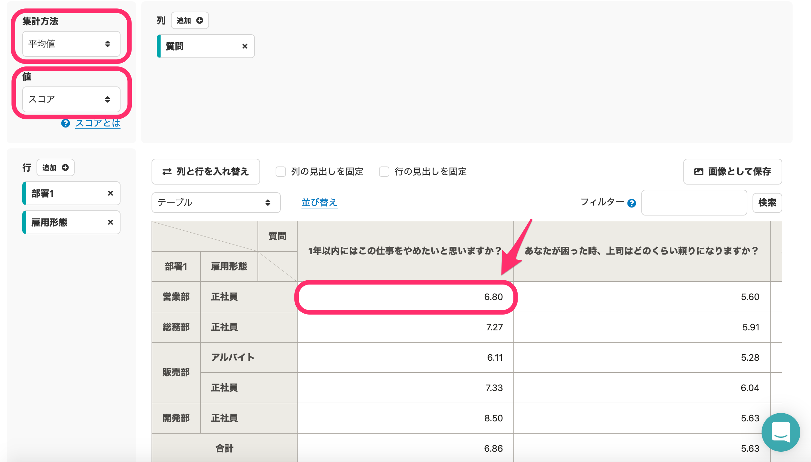

:::tips
 **［スコア］** は、システム標準のエンゲージメントサーベイを分析したときに、自動で設置される項目です。 回答結果を10点満点に換算して表示します。
:::

### 5つの集計方法

集計方法には以下の5つがあり、それぞれ値に対しての集計方法が異なります。

| 合計 | 集計データの値の合計数を算出 |
| --- | --- |
| 平均値 |   集計データの値の平均値を算出（値は数値の場合のみ可／N段階評価）   |
| 全体総数の割合 | 集計データの値の合計数を全体総数の割合に変換して算出 |
| 行の総数の割合 | 集計データの値の合計数を行の全体総数の割合に変換して算出 |
| 列の総数の割合 | 集計データの値の合計数を列の全体総数の割合に変換して算出 |

#### ［合計］

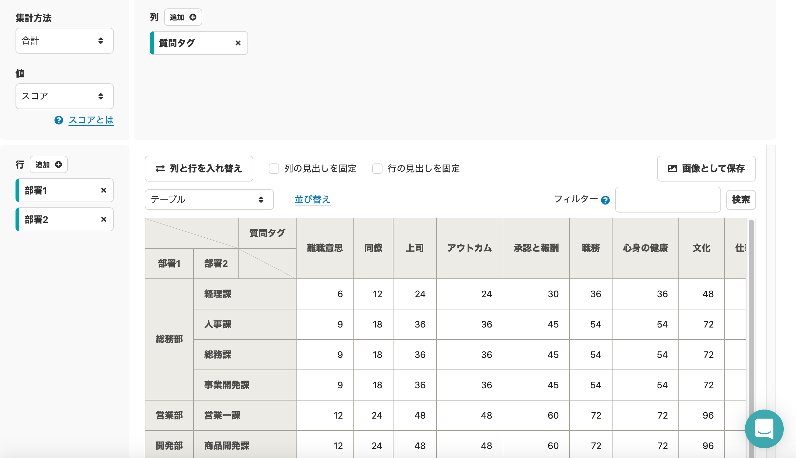

#### ［平均値］

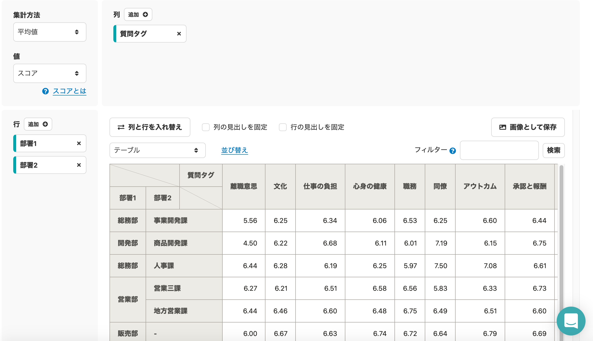

#### ［全体総数の割合］

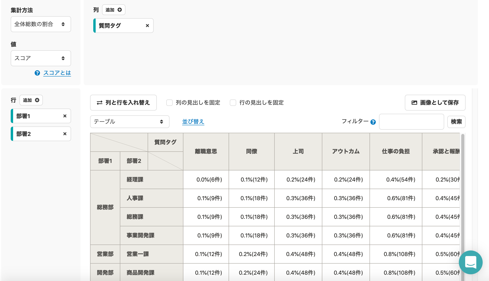

#### ［行の総数の割合］

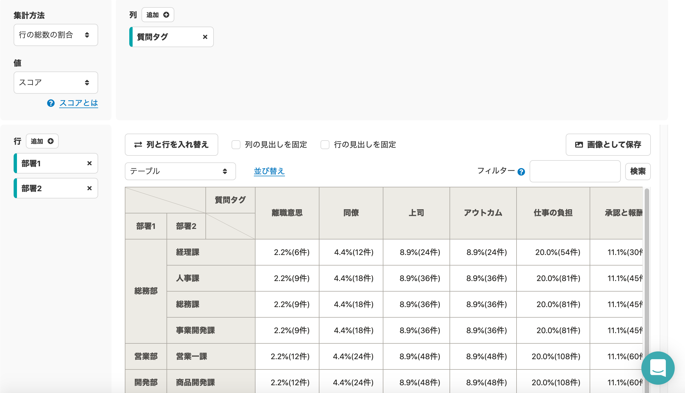

#### ［列の総数の割合］

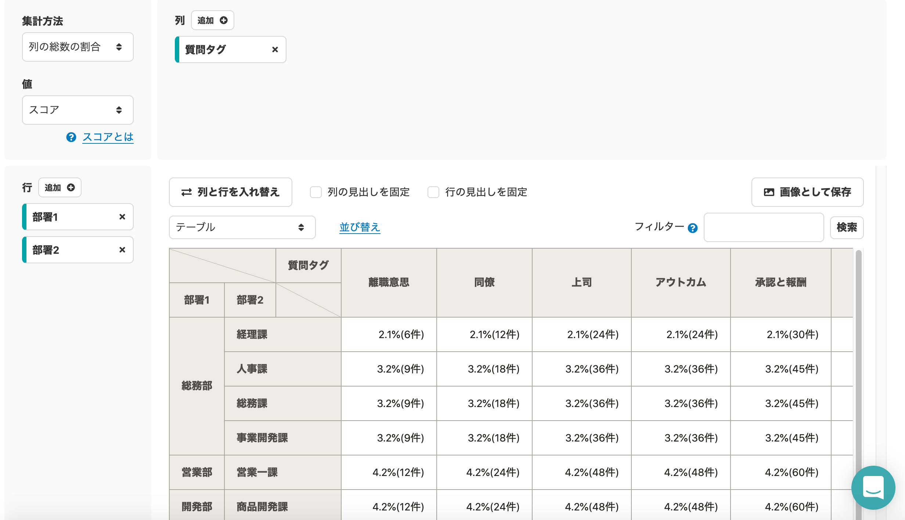

# 表示方法

集計結果を表示する方法を選択します。

### 3つの表示方法

表示方法には以下の3つがあります。

| テーブル | 行と列の基礎的な表 |
| --- | --- |
| ヒートマップテーブル |   設定した条件の値（しきい値）をもとに、セルに色をつけてテーブルを表示   |
| 折れ線グラフ | 折れ線グラフで表示 |

#### ［テーブル］

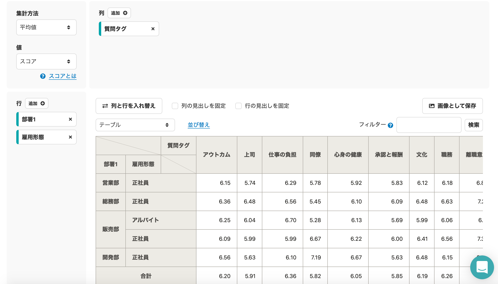

#### ［ヒートマップテーブル］

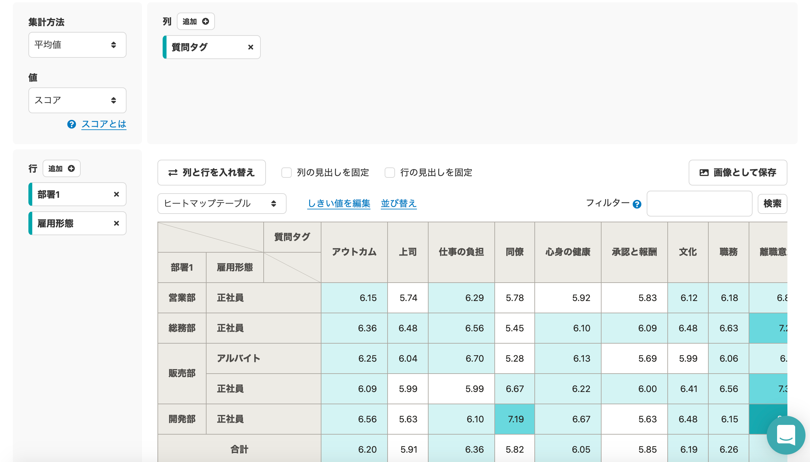

:::tips
しきい値とは、境目となる条件値のことです。
 **［しきい値を編集］** をクリックすると、 **［良いとする数値の範囲］［悪いとする数値の範囲］** が設定でき、該当するセルにはそれぞれ色がつきます。
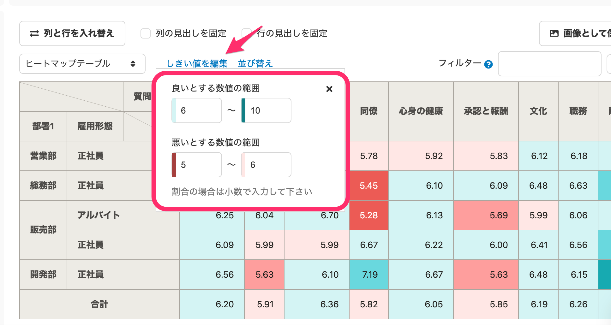
:::

#### ［折れ線グラフ］

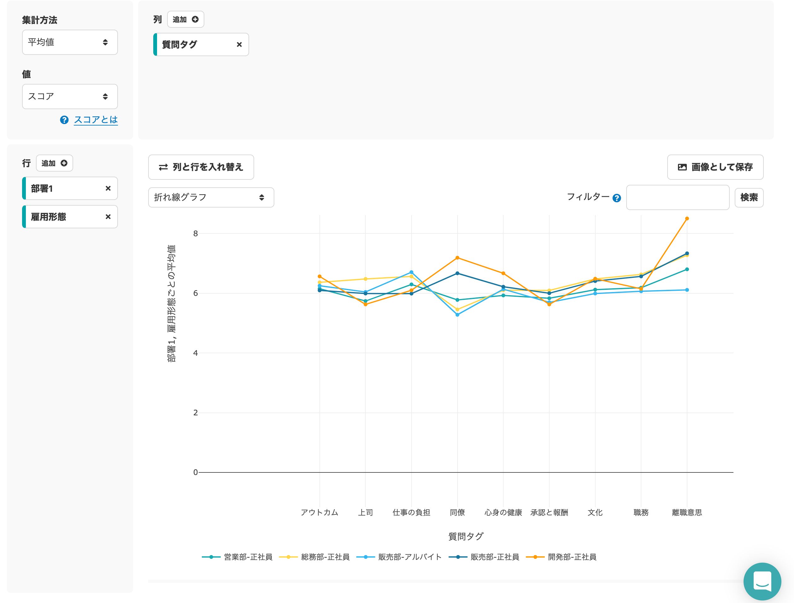

# フィルター

フィルターを利用すると、分析データの中から一致するものだけを分析対象にすることができます。

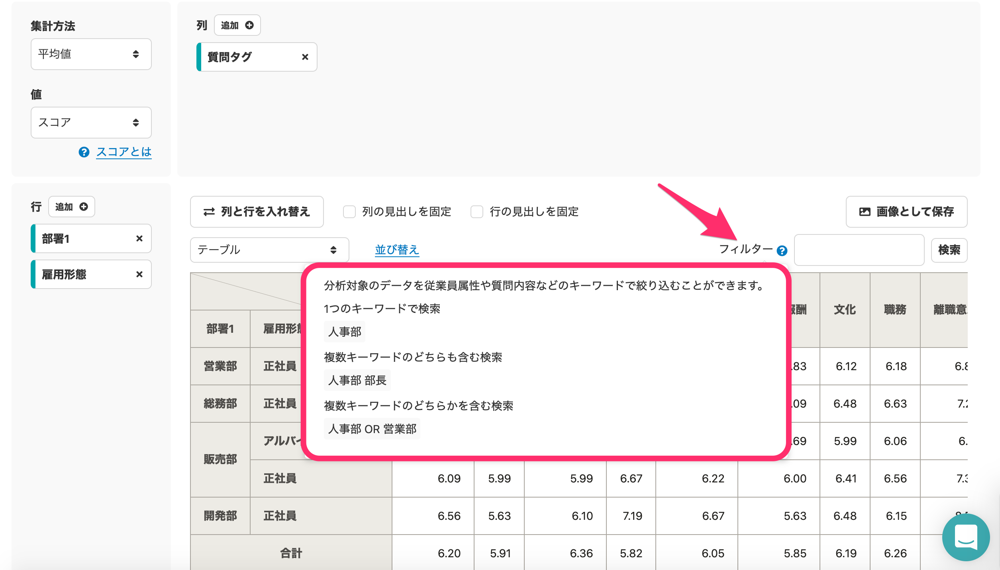

例えば、特定の従業員を更に深堀りしたい場合には、 **［フィルター］** に氏名などを入れることで、当該従業員だけのデータを閲覧できます。

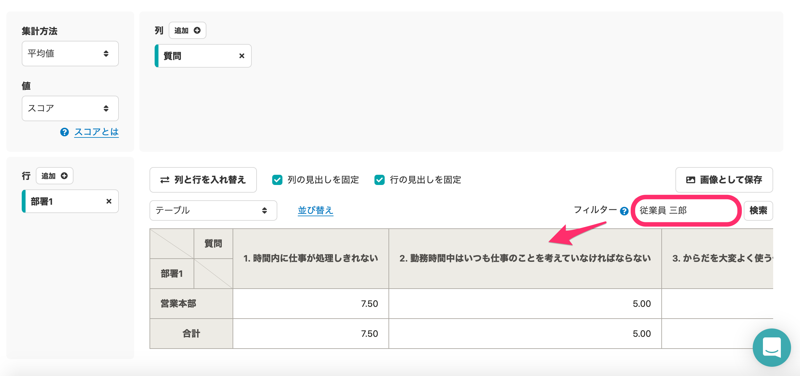

# 分析パターン

分析する際の条件を組み合わせたものを、「パターン」として保存できる機能です。

## ［パターンを切り替える］をクリック

 **［パターンを切り替える］** をクリックすると、分析パターンが左側に表示されます。

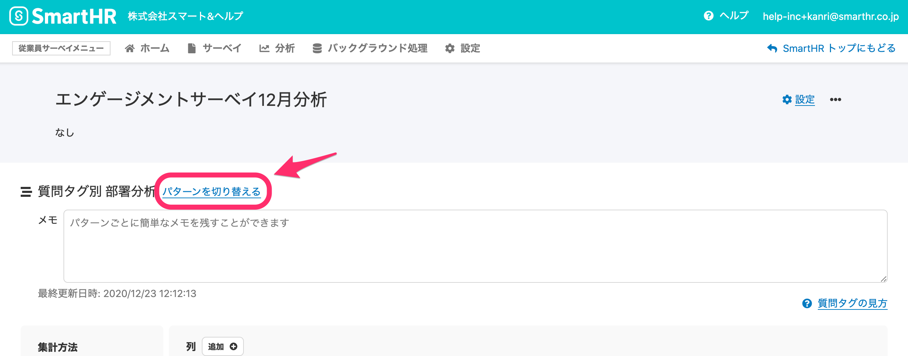

標準システムのエンゲージメントサーベイを使って分析を作成した場合は、あらかじめ複数の分析パターンが用意されています。

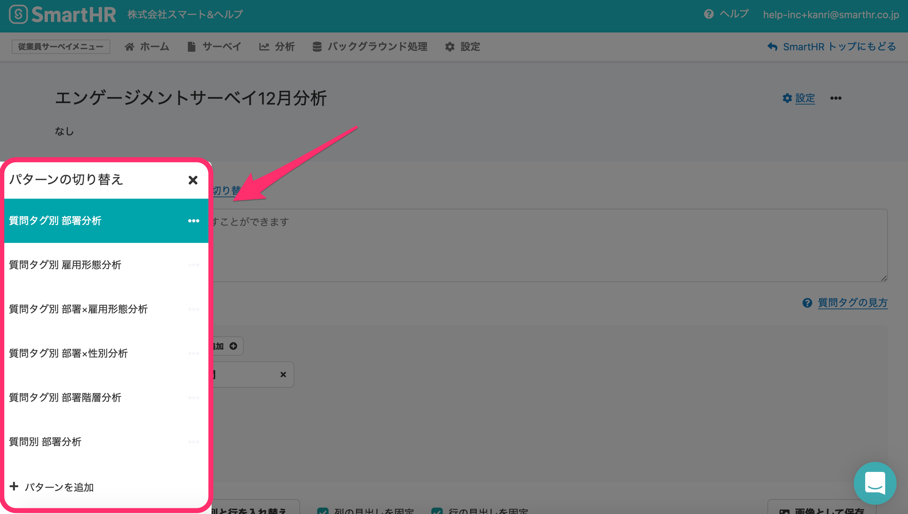

## パターンを追加でカスタマイズ

パターンを自分でカスタマイズして追加することができます。

 **［+パターンを追加］** をクリックし、 **［タイトル］** を入力して、 **［保存］** をクリックします。

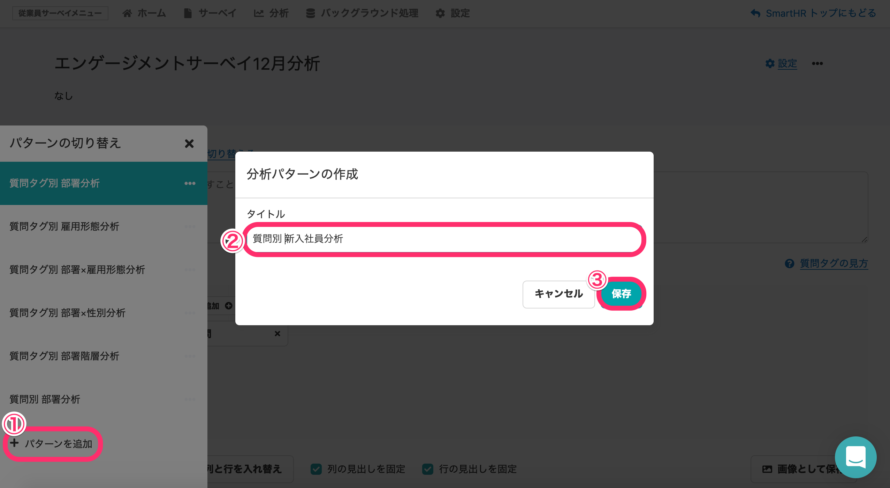

分析詳細画面に戻ると、 **［集計方法］** 、 **［値］** 、**表示方法** は初期設定になり、 **［列］［行］** は何も選択されていない状態になっています。

それぞれの項目に分析したい組み合わせや値を設定し、 **［保存］** をクリックすると独自のパターンが生成されます。

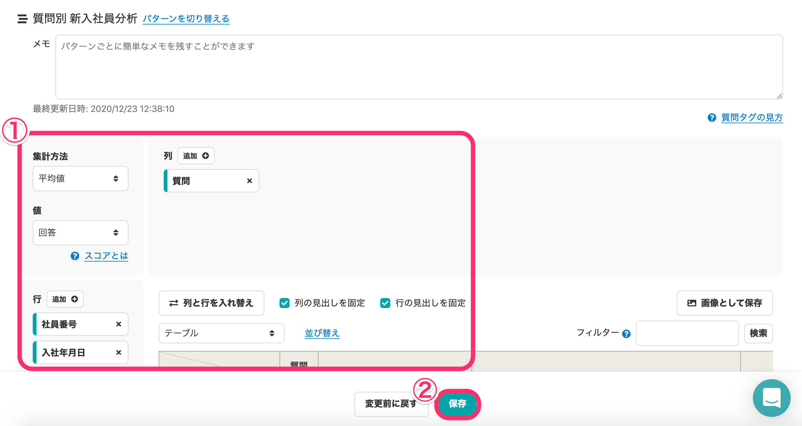
