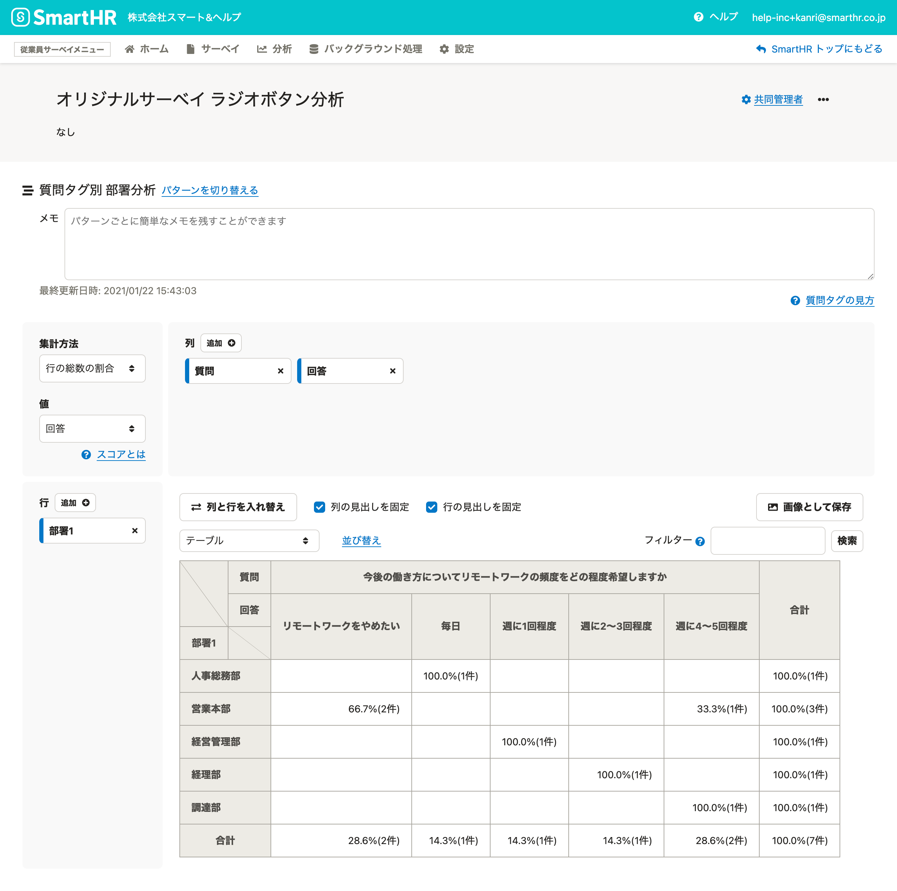
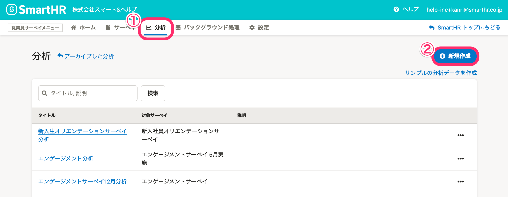
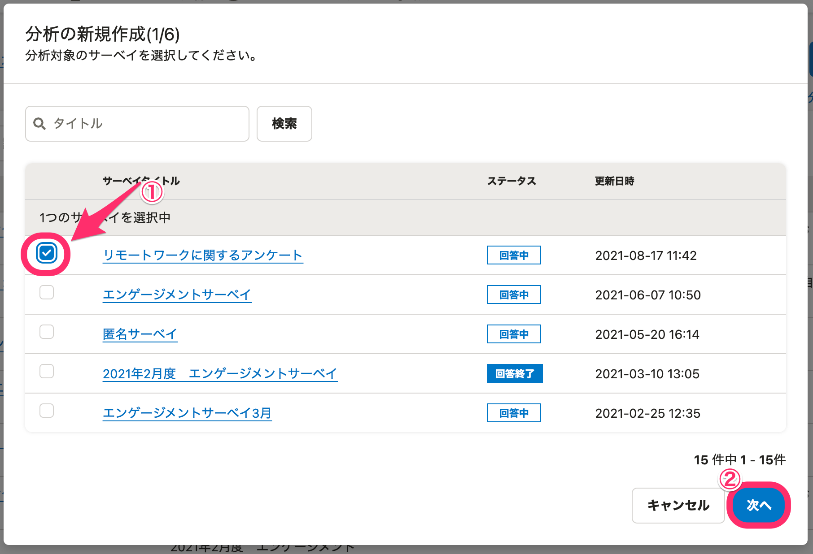
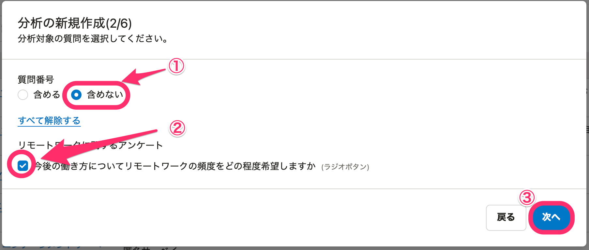
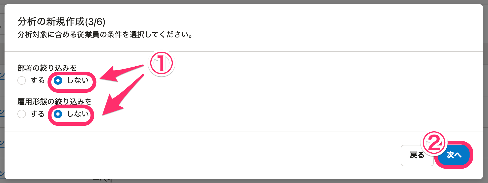
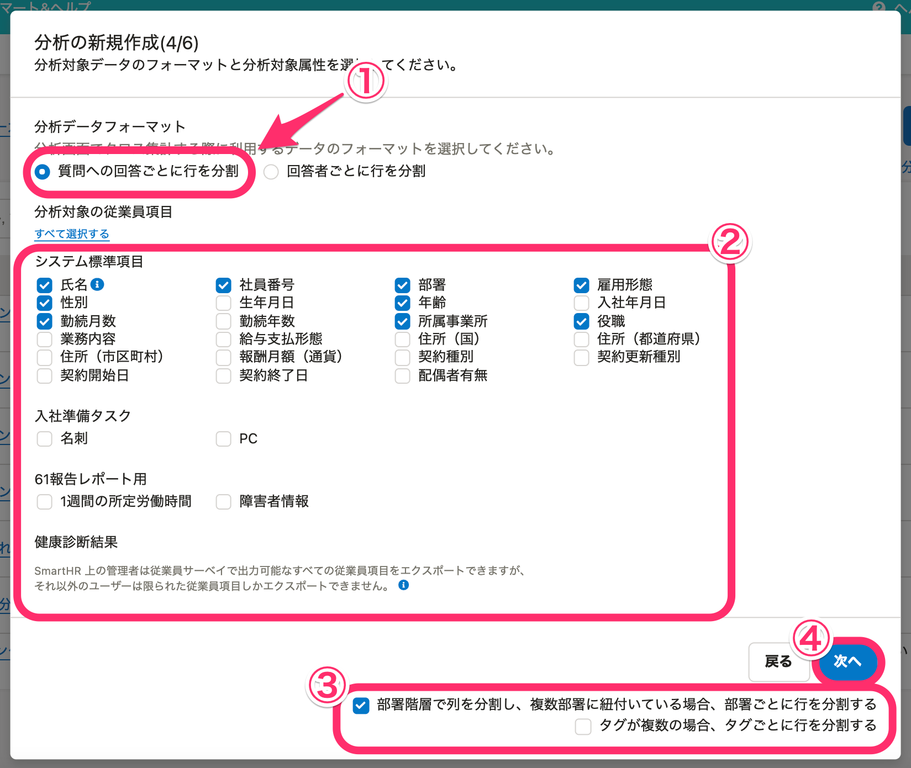
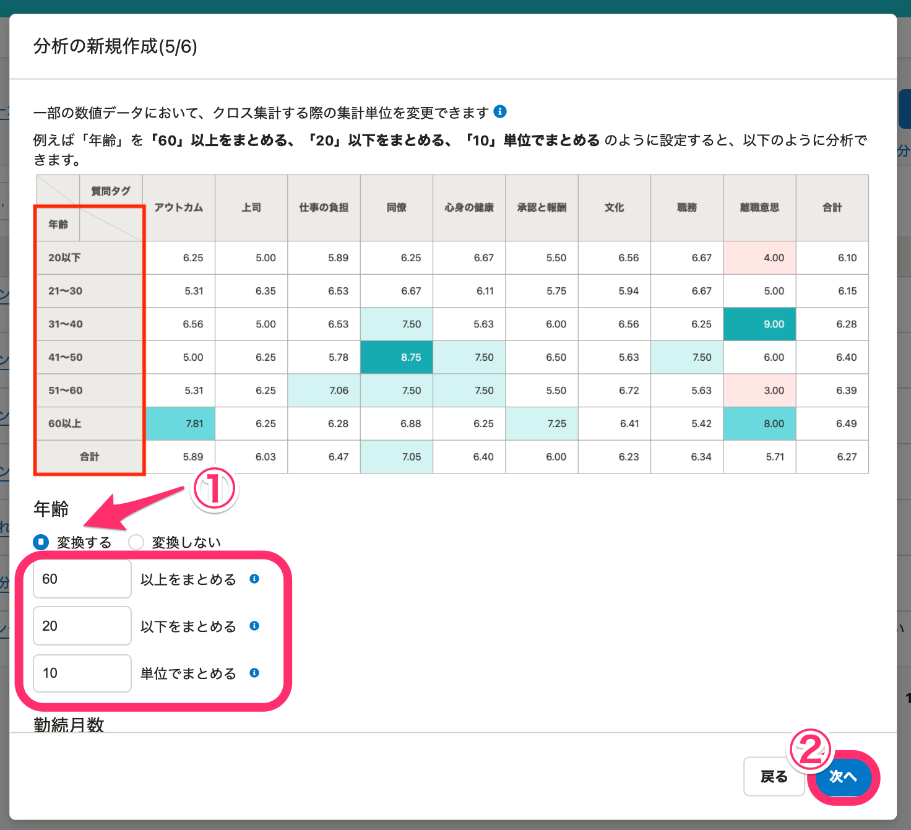
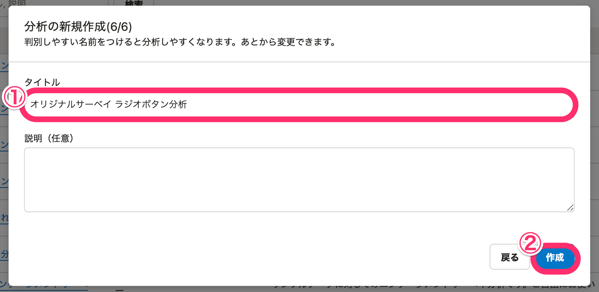

「ラジオボタン」の質問タイプを内包したオリジナルサーベイで、分析を作成する方法を説明します。

ラジオボタンの質問では、限られた選択肢からひとつの答えを選択するので、より具体的な分析結果が得られます。

なお、実施済みのサーベイがない場合は、サンプル分析の作成もできます。[サンプルの分析を作成する](https://knowledge.smarthr.jp/hc/ja/articles/360053607134)を参照してください。

# ラジオボタン分析の画面イメージ

# ラジオボタン分析の作成方法

## 1\. \[分析\] 画面で \[+ 新規作成\] をクリック

**\[従業員サーベイメニュー\]** から **\[分析\]** をクリックして、分析一覧画面を表示します。

画面右上の **\[＋新規作成\]** をクリックすると、 **\[分析の新規作成\]** 画面が表示されます。

## 2\. サーベイを選択

分析したいラジオボタン形式の質問を含むサーベイを選択します。

選択後、 **\[次へ\]** をクリックしてください。

## 3\. 質問番号と分析対象の質問を選択

**\[質問番号\]** は **\[含めない\]** を選択し、分析対象の質問は全てチェックを入れたままにします。

選択後、**\[次へ\]** をクリックしてください。

## 4\. 分析対象の従業員の条件を設定

**\[部署の絞り込み\]** ならびに **\[雇用形態の絞り込み\]** の項目で、 **\[しない\]** を選択します。

選択後、 **\[次へ\]** をクリックしてください。

## 5\. 分析データのフォーマットと項目を選択

分析データのフォーマット、分析対象の従業員項目、行の分割指定など、各設定項目を下記のとおりに選択します。

- **\[分析データフォーマット\]** ：**\[質問への回答ごとに行を分割\]** を選択します。
    
- **\[分析対象の従業員項目\]** ：**\[部署\] \[雇用形態\] \[性別\] \[年齢\] \[勤続月数\] \[所属事業所\] \[役職\]** にチェックを入れます。（カスタム項目は任意のものを選択します。）
    
- **\[部署階層で列を分割し、複数部署に紐付いている場合、部署ごとに行を分割する\]** にチェックを入れ、**\[タグが複数の場合、タグごとに行を分割する\]** のチェックは外します。
    

:::tips
クロス集計の対象としたいカスタム項目があれば、追加して構いません。
:::

選択後、**\[次へ\]** をクリックしてください。

## 6\. クロス集計する際の集計単位を決定

クロス集計で、年齢をある範囲でまとめて集計したい場合は、集計単位を設定します。

ここでは例として、年齢を10単位でまとめ、60歳以上と20歳以下をまとめる設定をしています。

設定したら、**\[次へ\]** をクリックしてください。

## 7\. 分析のタイトルと説明を入力

タイトルを入力したら、**\[作成\]**をクリックして完了です。

