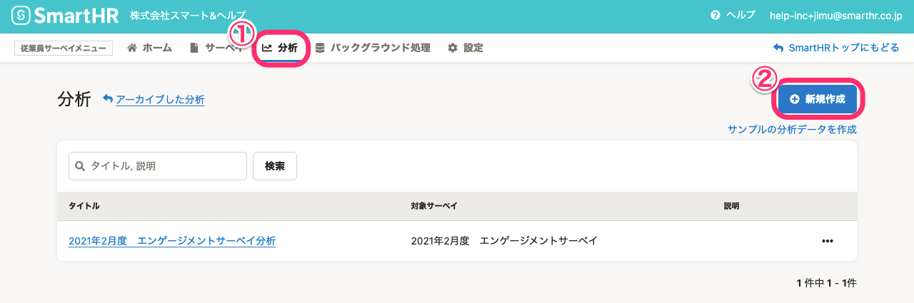
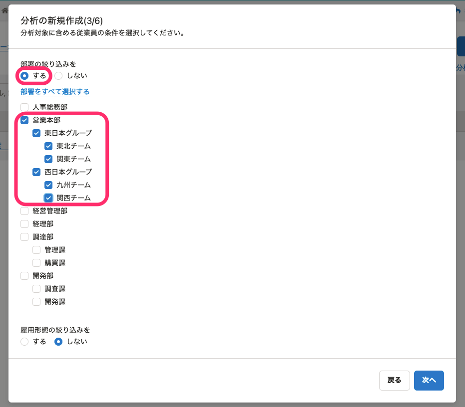
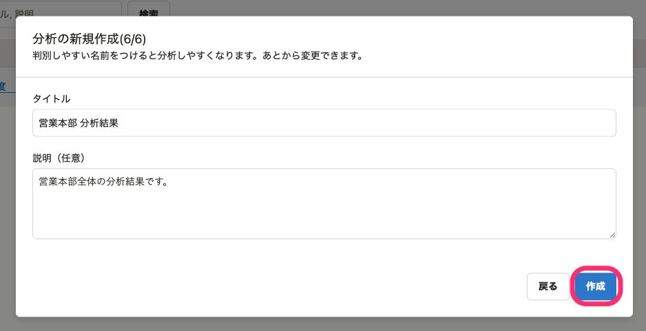
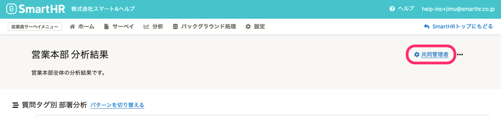
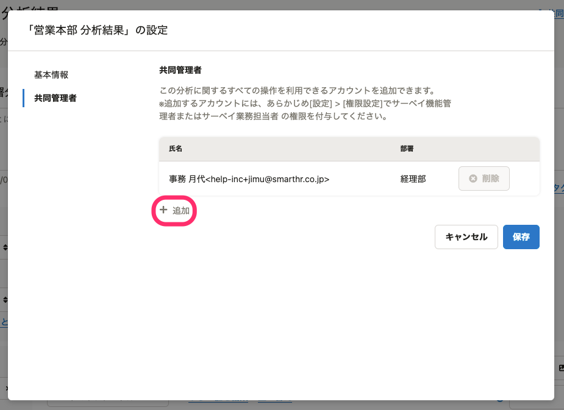

部門長やマネージャーなどに、担当する部署の分析のみを共有する場合の、分析の作成方法を説明します。

# 事前準備

分析を作成する前に、下記の準備をしてください。

- サーベイを実施し、回答が集まったことを確認する
- [従業員サーベイの権限を管理する](https://knowledge.smarthr.jp/hc/ja/articles/360049602014)を参照して、部門長やマネージャーに「サーベイ業務担当者」権限を付与する

# 1\. ［分析］画面で［＋新規作成］をクリックし、分析対象の質問の選択まで進む

[サーベイの分析を作成する](https://knowledge.smarthr.jp/hc/ja/articles/360053607174) の手順3まで操作を進めます。

# 2\. 分析対象の部署を選択

 **［部署の絞り込みを］** で **［する］** を選択し、分析対象の部署を選択します。

例えば、営業本部の部長に、営業本部全体の分析を共有する場合は、以下のようにチェックを入れます。

# 3\. 画面に沿って設定を進め、［作成］をクリック

画面に沿って、分析対象の従業員項目の設定などを行ない、最後に **［作成］** をクリックします。

あわせて[サーベイの分析を作成する](https://knowledge.smarthr.jp/hc/ja/articles/360053607174)を参照してください。

:::tips
部門長やマネージャーに部署の傾向だけを共有したい場合は、［氏名］や［社員番号］などの個人を特定できる従業員項目を除外して分析を作成します。匿名ではないサーベイも、傾向だけを共有できます。
分析に含める従業員項目は、 **［分析の新規作成(4/6)］** ダイアログの **［分析対象の従業員項目］** で選択します。
:::

# 4\. ［共同管理者］ダイアログで部門長・マネージャーを共同管理者に追加

部門別の分析が作成されたら、 **［共同管理者］** をクリックします。

分析を共有したい従業員（部門長やマネージャー）を共同管理者に追加します。

部門長やマネージャーに、分析を共有した旨を連絡します。

他の部署の分析を作成する場合は、手順1から操作を繰り返してください。
