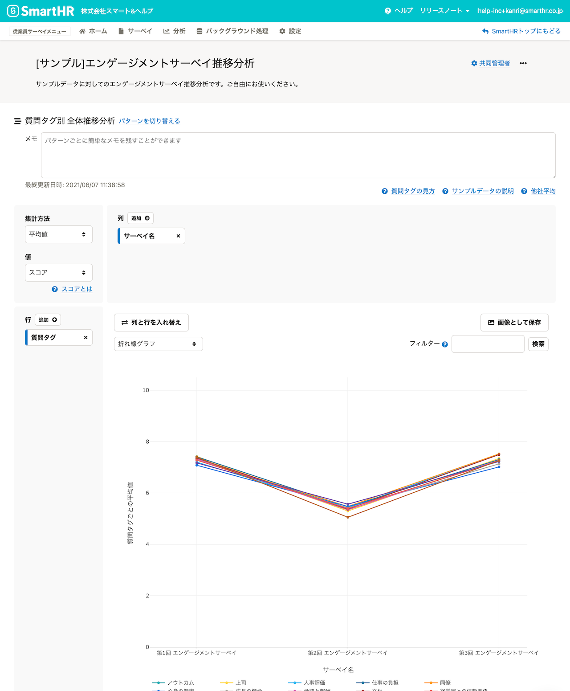
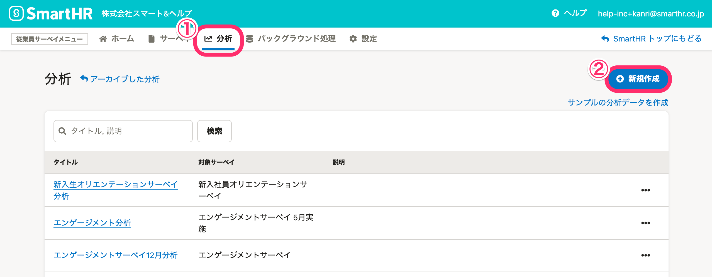
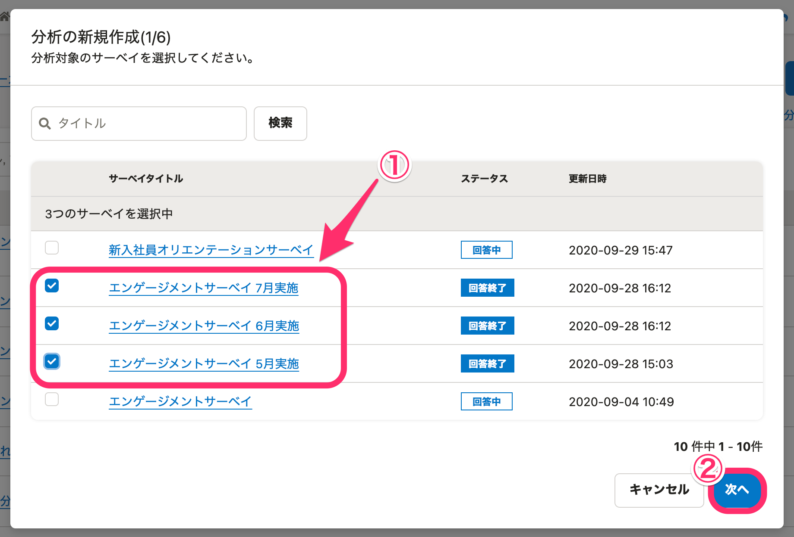
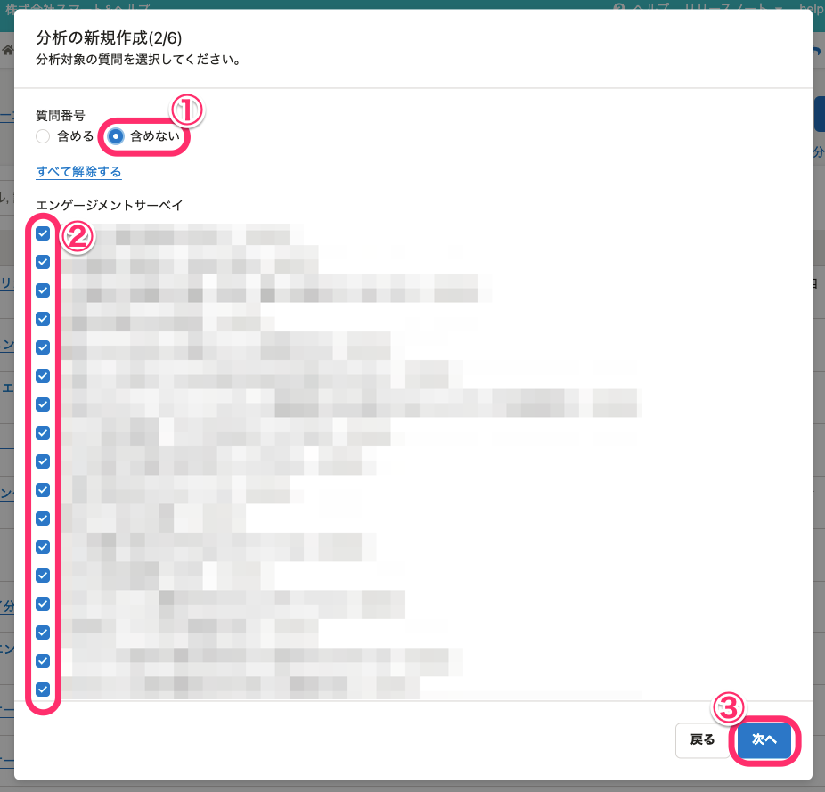
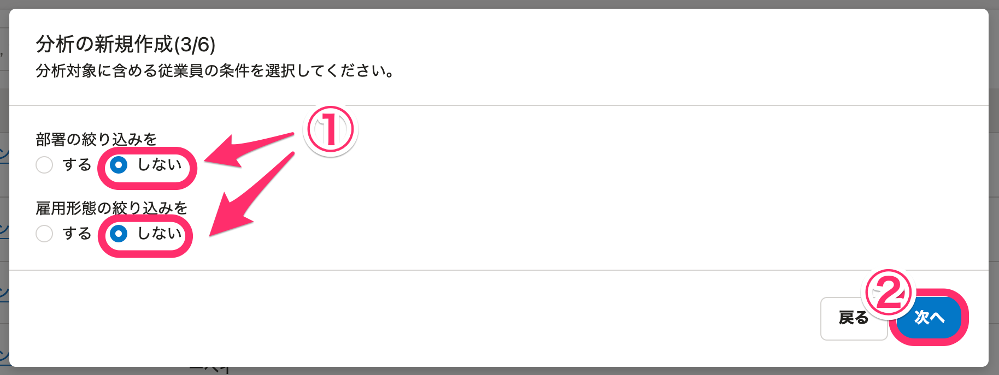
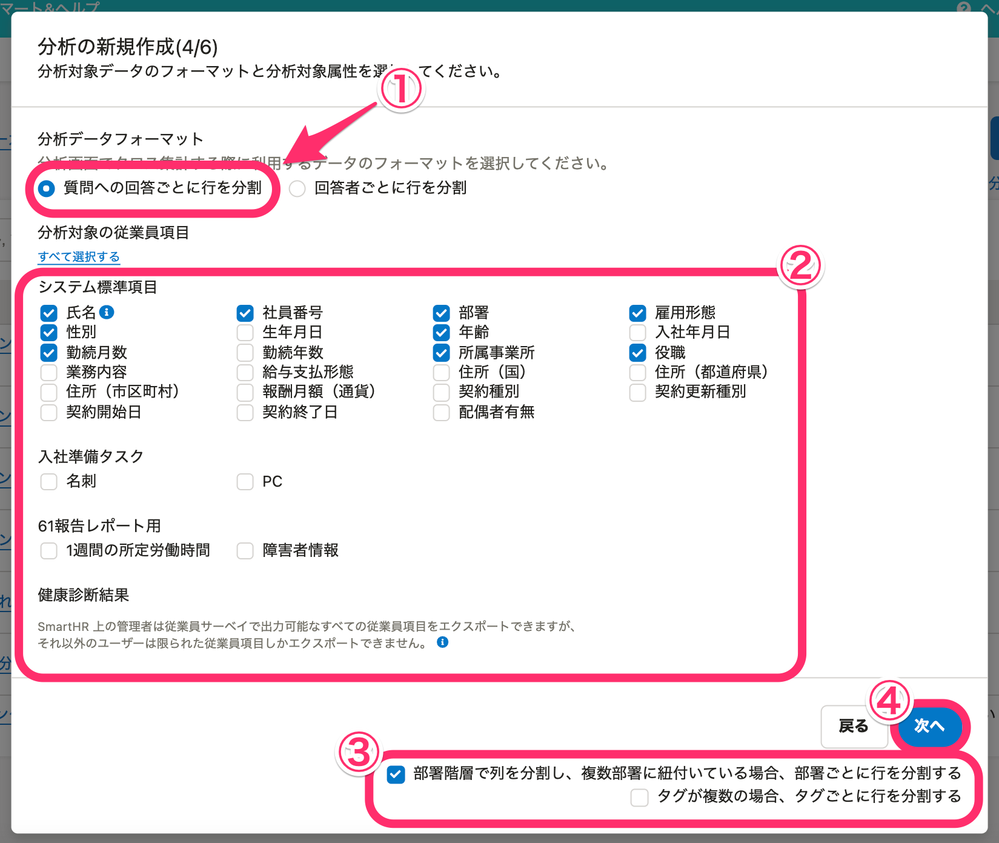
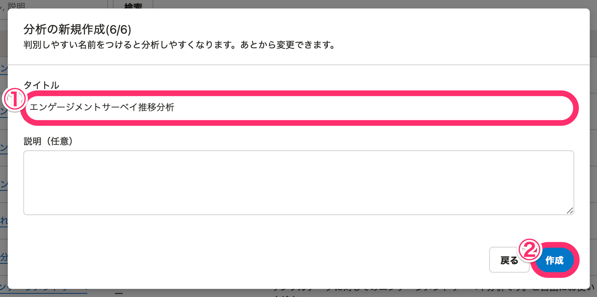

プリセットサーベイの「エンゲージメントサーベイ」を複数回実施したものを組み合わせ、推移分析を行なう方法を説明します。

定期的にエンゲージメント調査を実施して結果を分析すると、変化の傾向を把握できます。

なお、実施済みのサーベイがない場合は、サンプル分析の作成もできます。[サンプルの分析を作成する](https://knowledge.smarthr.jp/hc/ja/articles/360053607134)を参照してください。

# エンゲージメントサーベイ推移分析の画面イメージ

# エンゲージメントサーベイ推移分析の作成方法

## 1\. ［分析］画面で［+ 新規作成］をクリック

 **［従業員サーベイメニュー］** から **［分析］** をクリックして、分析一覧画面を表示します。

画面右上の **［＋新規作成］** をクリックすると、 **［分析の新規作成］** ダイアログが表示されます。

## 2\. エンゲージメントサーベイを選択

分析したい実施済みのエンゲージメントサーベイをすべて選択します。

選択後、 **［次へ］** をクリックしてください。

## 3\. 質問番号と分析対象の質問を選択

 **［質問番号］** は **［含めない］** を選択し、分析対象の質問はすべてチェックを入れたままにします。

選択後、 **［次へ］** をクリックしてください。

## 4\. 分析対象の従業員の条件を設定

 **［部署の絞り込みを］** と **［雇用形態の絞り込みを］** で、 **［しない］** を選択します。

選択後、 **［次へ］** をクリックしてください。

## 5\. 分析データのフォーマットと項目を選択

分析データのフォーマット、分析対象の従業員項目、行の分割指定など、各設定項目を下記のとおりに選択します。

-  **［分析データフォーマット］** ： **［質問への回答ごとに行を分割］** を選択します。
-  **［分析対象の従業員項目］** ： **［部署］、［雇用形態］、［性別］、［年齢］、［勤続月数］、［所属事業所］、［役職］** にチェックを入れます。（カスタム項目は任意のものを選択します。）
-  **［部署階層で列を分割し、複数部署に紐付いている場合、部署ごとに行を分割する］** にチェックを入れ、 **［タグが複数の場合、タグごとに行を分割する］** のチェックは外します。

:::tips
クロス集計の対象としたいカスタム項目があれば、追加して構いません。
:::

選択後、 **［次へ］** をクリックしてください。

## 6\. クロス集計する際の集計単位を決定

 **［年齢］** の **［変換する］** を選択し、 **［60以上をまとめる］、［**  **20以下をまとめる］、［**  **10単位でまとめる］** と設定します。

設定したら、 **［次へ］** をクリックしてください。

## 7\. 分析のタイトルと説明を入力

タイトルを入力したら、 **［作成］** をクリックして完了です。

