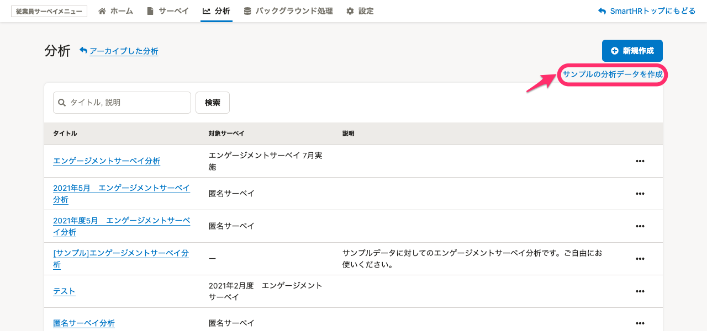
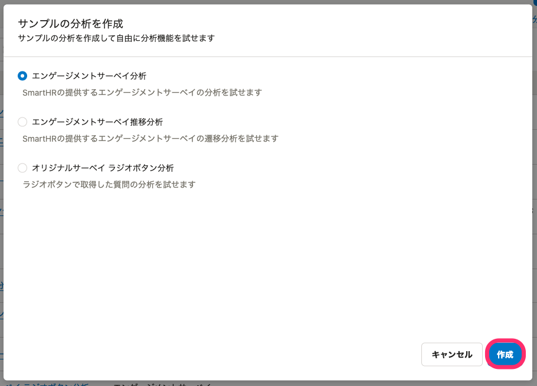
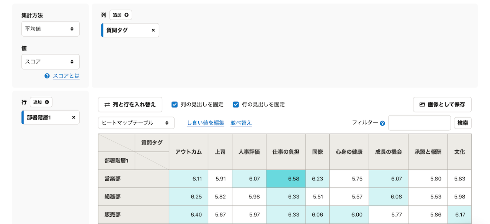
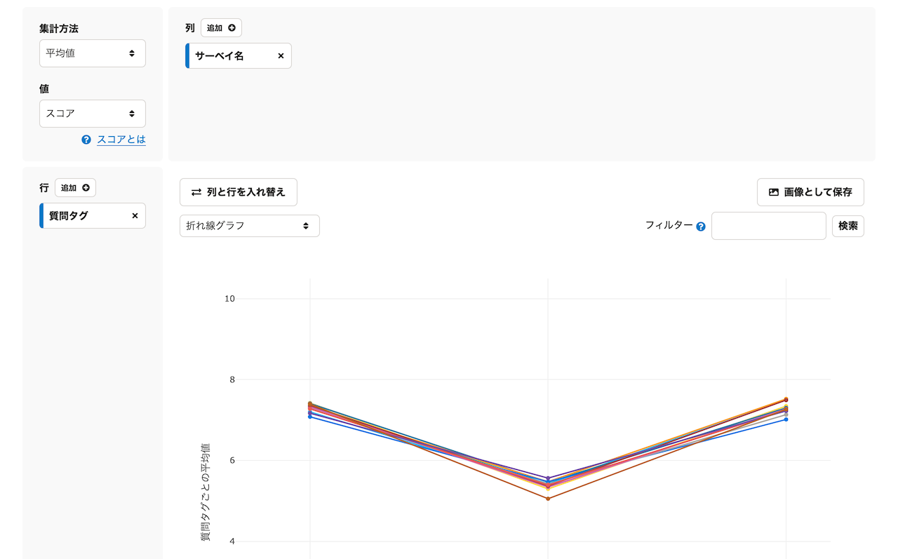
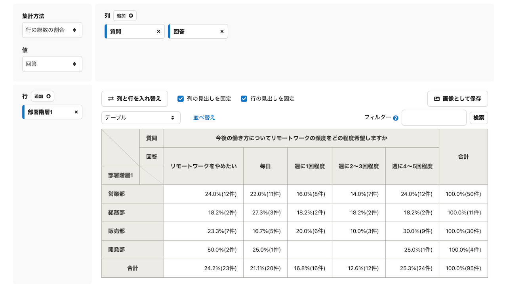

# サンプルの分析とは

従業員サーベイ機能では、分析サンプルのデータを作成して分析機能の使い方を試すことができます。

ここでは3つの分析サンプルの作成について説明します。

サーベイの分析作成については、[サーベイの分析を作成する](https://knowledge.smarthr.jp/hc/ja/articles/360053607174)を参照してください。

# サンプルの分析の作成手順

## 1\. ［分析］タブ >［サンプルの分析データを作成］をクリック

 **［分析］** タブを開き、画面右の **［サンプルの分析データを作成］** をクリックすると、 **［サンプルの分析を作成］** ダイアログが表示されます。

## 2\. 試したいサンプルの分析を選択

 **［サンプルの分析を作成］** ダイアログで、試したいサンプルの分析を選択します。

-  **［エンゲージメントサーベイ分析］** ： プリセットサーベイの一つ「エンゲージメントサーベイ」の分析を試すことができます。
-  **［エンゲージメントサーベイ推移分析］** ： 「エンゲージメントサーベイ」を3回実施した場合の分析を試すことができます。
-  **［オリジナルサーベイ ラジオボタン分析］** ： 「オリジナルサーベイ」でラジオボタンの質問を作成した場合の分析を試すことができます。

サンプルの種類を選択し、 **［作成］** をクリックすると、サンプルの分析が生成されます。

# 3種類のサンプルの分析

## \[サンプル\]エンゲージメントサーベイ分析

作成方法は、[エンゲージメントサーベイ分析を作成する](https://knowledge.smarthr.jp/hc/ja/articles/360060082234)を参照してください。

## \[サンプル\]エンゲージメントサーベイ推移分析

作成方法は、[エンゲージメントサーベイ推移分析を作成する](https://knowledge.smarthr.jp/hc/ja/articles/360060309654)を参照してください。

## \[サンプル\]オリジナルサーベイ ラジオボタン分析

作成方法は、[ラジオボタン分析を作成する](https://knowledge.smarthr.jp/hc/ja/articles/1500001792702)を参照してください。

