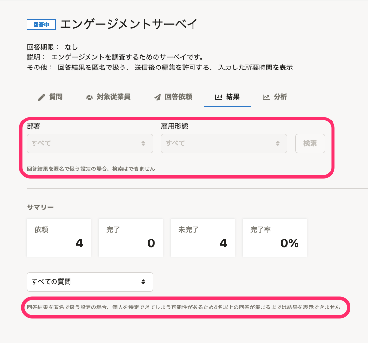
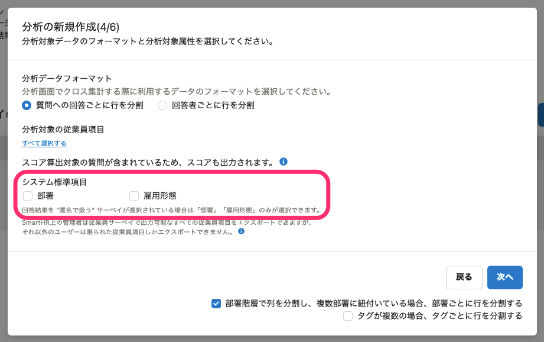
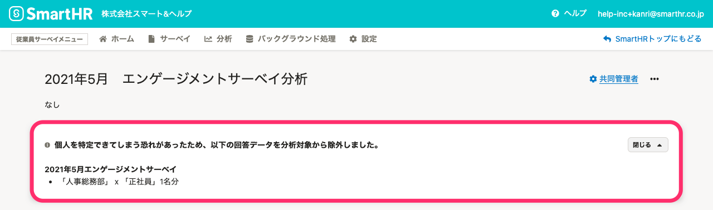
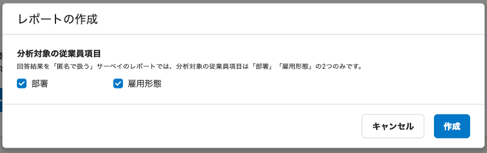
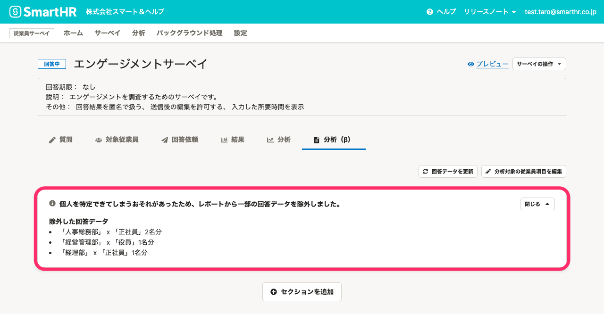
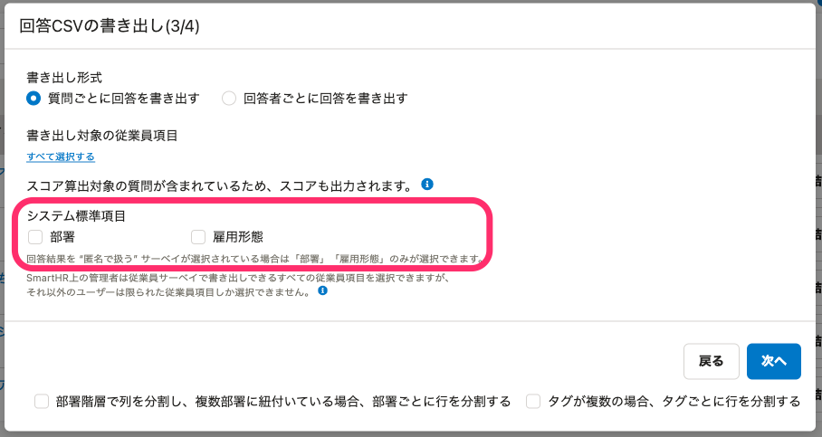
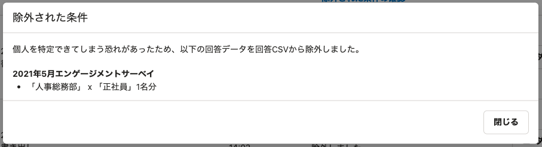

# A. 個人を特定できないようにするため、結果の閲覧や分析、回答CSVの書き出しなどに制限があるサーベイです

「匿名で扱う」サーベイでは、回答と回答者の社員番号・氏名やメールアドレスなど、個人を特定する情報を取得することなく、サーベイを実施できます。

個人の特定を防ぐために、対象の従業員が3名以下となる場合に回答の閲覧や分析の作成などが制限されます。

匿名で扱うための設定方法は、[回答の取り扱い方法（匿名かどうか）を設定する](https://knowledge.smarthr.jp/hc/ja/articles/6530342573081/)を参照してください。 

## 通常のサーベイと「匿名で扱う」サーベイの違い

通常のサーベイと、「匿名で扱う」サーベイの違いは下記のとおりです。

- 通常のサーベイでは、回答結果をSmartHRに登録されている従業員情報と紐付けられます。回答者個人・部署・雇用形態など、複数の情報を組み合わせて分析したい場合は、匿名として扱わないことをおすすめします。
- 「匿名で扱う」サーベイでは、回答者の社員番号・氏名やメールアドレスなど、個人を特定する情報を取得しません。部署と雇用形態のみを取得します。

| 操作 | 通常のサーベイ | 「匿名で扱う」サーベイ |
| --- | --- | --- |
| 結果の閲覧 |   - 回答者が3名以下でも閲覧できる。 - 部署や雇用形態で回答を絞り込める。   |   - 回答者が4名以上の場合に閲覧できる。 - 部署や雇用形態で回答を絞り込めない。   |
| 分析 |   - すべての従業員項目を分析、レポート、回答CSVに含められる。 - すべてのデータが対象。   |   - 従業員項目のうち、［部署］と［雇用形態］のみを分析、レポート、回答CSVに含められる。 - 該当する従業員が3名以下になるデータは、対象から除外される。   |
| レポート |
| 回答CSVの書き出し |

## 「匿名で扱う」サーベイの制限の例

「匿名で扱う」サーベイの各画面での制限の例を示します。

### 結果の例

［ **部署］** や **［雇用形態］** での絞り込みができず、回答が4名分以上集まらないと結果が閲覧できません。

### 分析の例

従業員項目のうち、 **［部署］** と **［雇用形態］** のみを分析の対象に選択できます。

該当する従業員が3名以下になるデータは分析から除外されます。

分析画面では、下記のように除外されたデータの区分と人数が表示されます。

### レポートの例

従業員項目のうち、 **［部署］** と **［雇用形態］** のみを分析の対象に選択できます。

該当する従業員が3名以下になるデータはレポートから除外されます。

レポート画面では、下記のように除外されたデータの区分と人数が表示されます。

### 回答CSVの書き出しの例

従業員項目のうち、［部署］と［雇用形態］のみを出力の対象に選択できます。

該当する従業員が3名以下になるデータは出力対象から除外されます。

 **［バックグラウンド処理］** 画面で **［除外された条件の確認］** をクリックすると、下記のように除外されたデータの区分と人数が表示されます。

