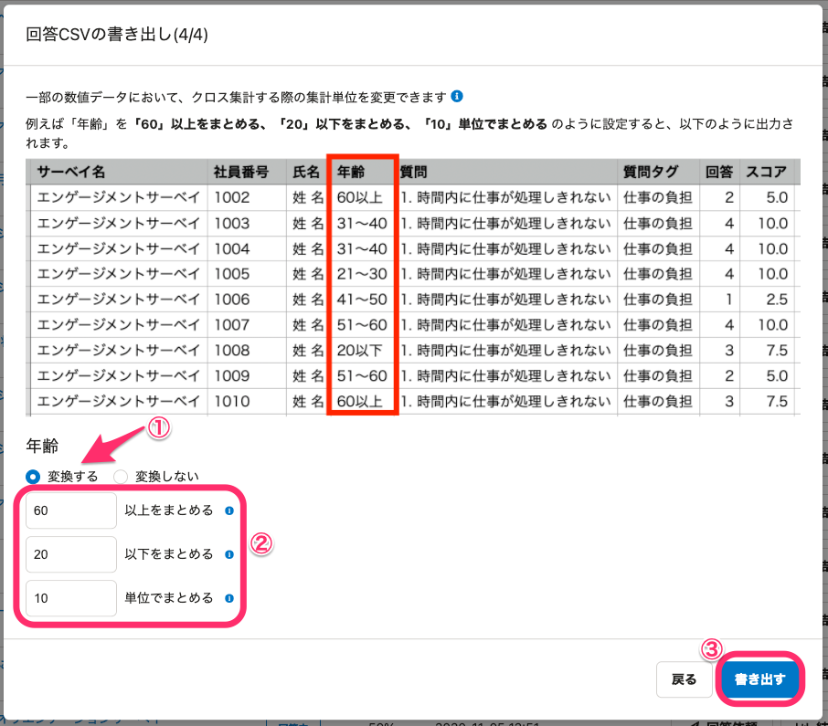
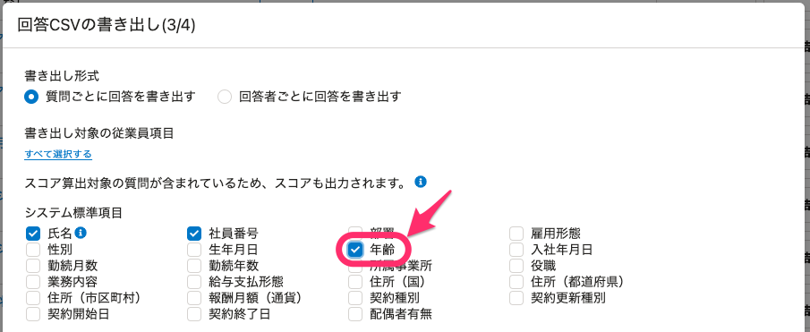
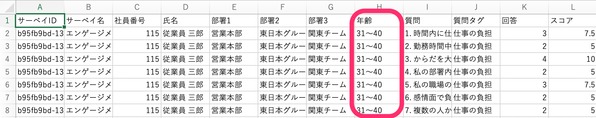
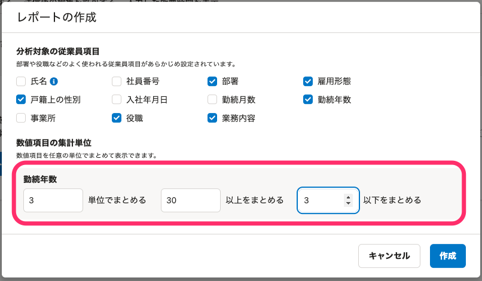
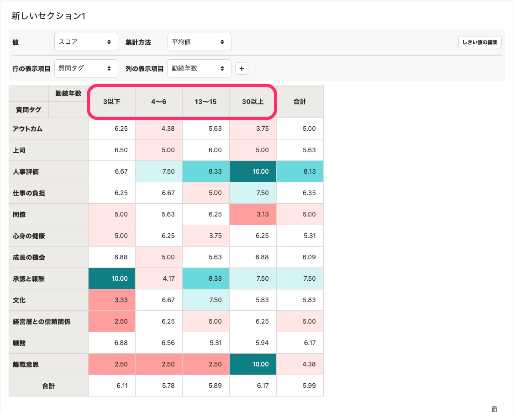
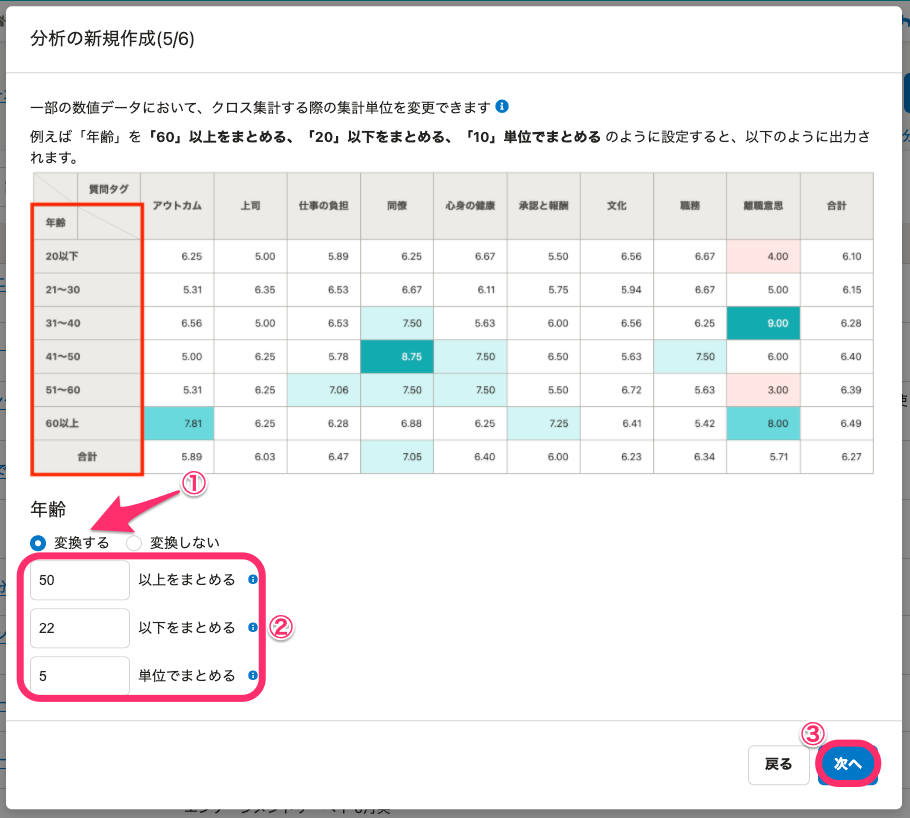
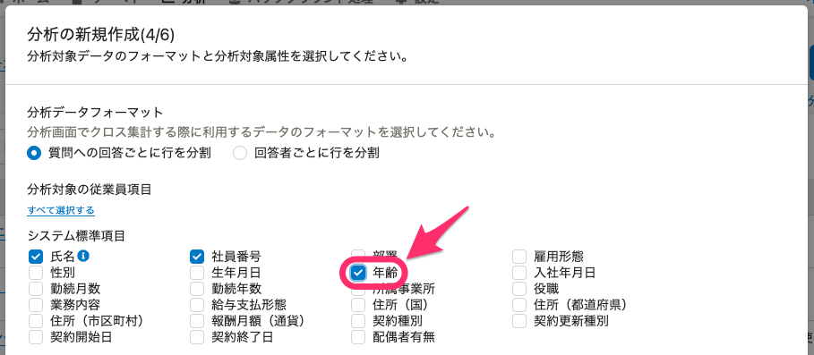
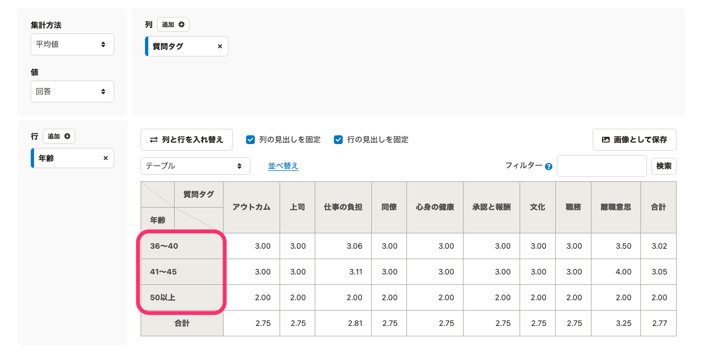

# A. サーベイの回答CSV書き出しやレポート・分析の作成時に、数値をまとめる設定をします。

サーベイの回答CSVを書き出す際や、レポートや分析を作成する際に、回答者の属性（年齢、勤続年数など）をサーベイの結果や分析の集計項目として設定できます。

また、年齢を20代30代などの10年単位でまとめる以外にも、任意の単位でグループ分けできます。

## 回答CSVを書き出す場合

[サーベイの回答をCSVに書き出す](https://knowledge.smarthr.jp/hc/ja/articles/1500000846242)を参照し、「サーベイ回答結果の書き出し」項目の手順4.（回答と合わせて取得したい回答者属性を選択）まで操作し、画面は **［回答CSVの書き出し(4/4)］** へ進めます。

サンプル画像下にある **［年齢］** の **［変換する］** にチェックを入れると、クロス集計する際の集計単位を入力する欄が表示されます。

まとめる数値を入力して、 **［書き出す］** をクリックします。

例：60歳以上と20歳以下をまとめ、集計単位を10歳ずつにする場合

:::alert
 **［回答CSVの書き出し(3/4)］** で、 **［書き出し対象の従業員項目］** の **［年齢］** にチェックを入れないと、集計項目単位の変換設定ができません。

:::

書き出された結果は、 **［バックグラウンド処理］** からダウンロードしたCSVファイルで確認できます。

## レポートの場合

レポートの作成時および作成後に、数値項目の集計単位を設定できます。

- レポート作成時： **［分析対象の従業員項目を変更する］** にチェックを入れ、 **［＋新規レポート作成］** をクリックする
- レポート作成後：レポート画面で、 **［分析対象の従業員項目を変更］** をクリックする

 **［分析対象の従業員項目］** で数値項目を選択すると、クロス集計する際の集計単位を入力する欄が表示されます。

まとめる数値を入力して、 **［作成］** または **［保存］** をクリックします。

例：勤続年数を30年以上と3年以下をまとめ、集計単位を3年ずつにする場合

レポート画面で **［列の表示項目］** で **［勤続年数］** を選択すると、設定した数値で集計項目が表示されます。

## 分析を新規作成する場合

以下のヘルプページを参照し、「分析を新規作成する」項目の手順4.（分析対象にしたい従業員の条件を選択）まで操作し、画面は **［分析の新規作成(5/6)］** へ進めます。

:::related
[サーベイの分析を作成する](https://knowledge.smarthr.jp/hc/ja/articles/360053607174)
:::

サンプル画像下にある **［年齢］** の **［変換する］** にチェックを入れると、クロス集計する際の集計単位を入力する欄が表示されます。

まとめる数値を入力して、 **［次へ］** をクリックします。

例：50歳以上と22歳以下をまとめ、集計単位を5歳ずつにする場合

:::alert
 **［分析の新規作成(4/6)］** で、 **［分析対象の従業員項目］** の **［年齢］** にチェックを入れないと、集計項目単位の変換設定ができません。

:::

分析の新規作成の操作画面を最後まで進めたら、 **［分析］** タブで作成したものを確認します。

分析詳細画面で、 **［行］** や **［列］** から **［年齢］** を選択すると、設定した数値で集計項目が表示されます。

