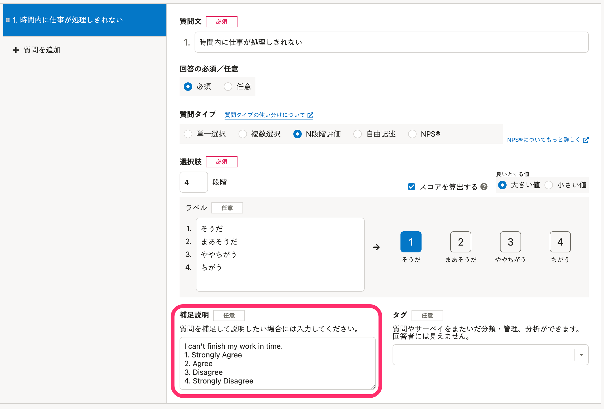
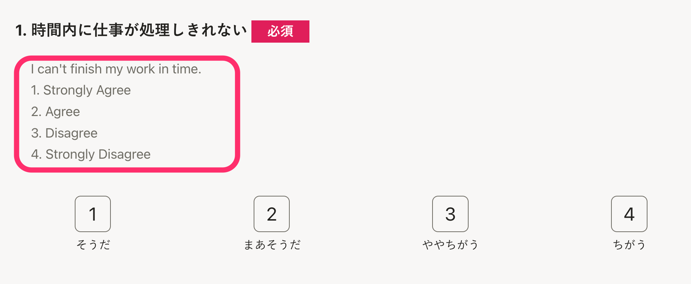

# A. ［補足説明（任意）］に翻訳した質問と選択肢を入力してください。

質問の **［補足説明（任意）］** に翻訳した質問と選択肢を入力すると、日本語と併記して翻訳も表示できます。

翻訳はお客さま自身でご準備ください。

## 設定方法

事前に、翻訳した質問と選択肢を準備してください。

翻訳対象のサーベイの **［質問］** 画面を開き、各質問の **［補足説明（任意）］** に翻訳した質問と選択肢を入力します。

選択肢を入力する場合は、選択肢の番号なども入力します。

従業員側では、以下のように表示されます。

日本語と翻訳の両方が表示されるため、事前に従業員にサーベイの見かたを説明してください。

:::tips
エンゲージメントサーベイなどのプリセットサーベイは多言語表示に対応しているため、上記の設定をしなくても翻訳できます。
詳しくは、下記のヘルプページをご覧ください。
[多言語化対応について](https://knowledge.smarthr.jp/hc/ja/articles/360035659594)
[多言語表示が正しく表示されない場合の対応方法は？](https://knowledge.smarthr.jp/hc/ja/articles/360056003974)
:::
