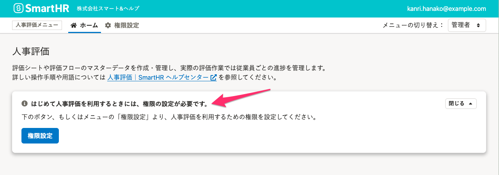
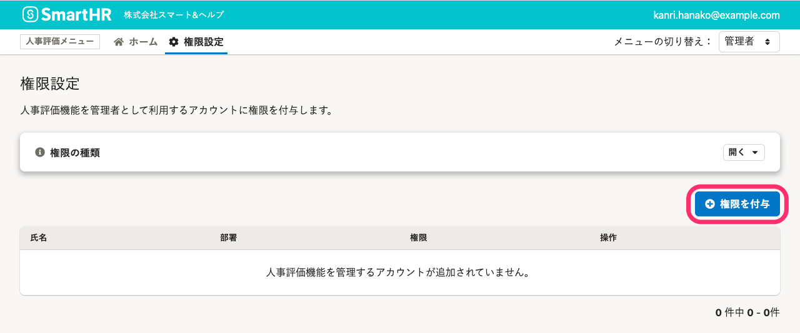
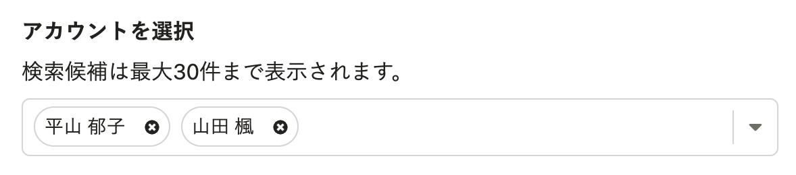
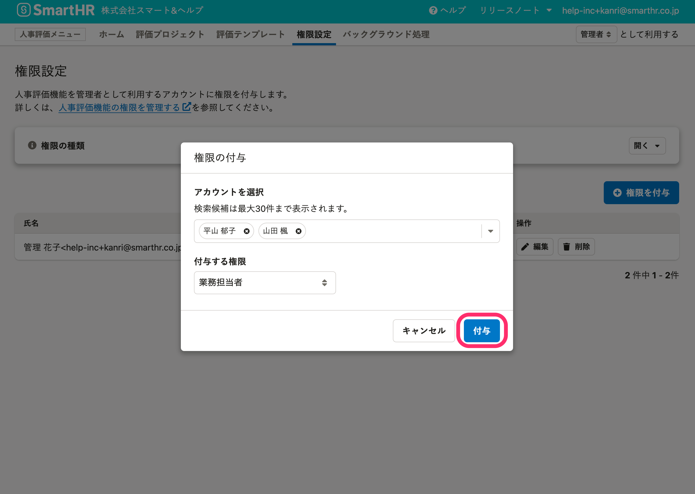
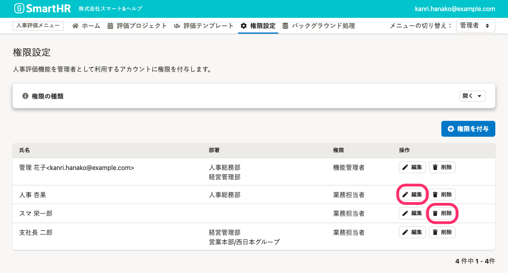

人事評価機能を管理者として利用する権限について説明します。

# 人事評価機能を管理できる2つの権限

人事評価には、 **「評価機能管理者」** 、 **「評価業務担当者」** の2種類の管理者権限があります。

**SmartHR基本機能での権限に関わらず**、SmartHRに登録されている**すべてのアカウントに人事評価の権限を付与できます**。また、**基本機能の管理者権限アカウントに対しても、必要な設定**です。

いずれかの権限を持つと、評価テンプレート、評価プロジェクトの作成などの操作ができるようになります。

:::alert
### 利用開始時、人事評価機能の管理権限はいずれのアカウントにも付与されていません
人事評価機能では、人事評価の主担当者が労務担当者とは限らないことを考慮し、SmartHR基本機能の管理者アカウントには **［人事評価メニュー］** の **［**  **権限設定］** に関する操作権限のみ付与しています。
初回利用時には、SmartHR基本機能の管理者権限を持つアカウントが権限設定を操作してください。

:::

## 「評価機能管理者」／「評価業務担当者」／「SmartHR管理者」の違い

それぞれの権限に可能な操作は、下記のとおりです。

| 可能な操作 | 評価機能 管理者 | 評価業務 担当者 | SmartHR基本機能 管理者 |
| --- | --- | --- | --- |
| 評価テンプレートの作成・更新 | ◯ | ◯ | ― |
| 評価プロジェクトの作成・管理 | ◯ | ◯ | ― |
| 評価シートの閲覧・更新 | ◯ | ◯ | ― |
| 人事評価機能の権限設定 | ◯ | ― | ◯ |

:::tips
この記事の説明は、**評価者・評価共有者**としての権限設定ではありません。
従業員を評価者や評価共有者に指定すると、評価シートの閲覧や更新ができるようになります。
詳しくは、 [評価シートの閲覧・編集権限を設定する](https://knowledge.smarthr.jp/hc/ja/articles/4407128385689/) を参照してください。
:::

# 人事評価の管理者権限をアカウントに付与する

人事評価の管理者、業務担当者として機能を利用する権限は、以下の手順でSmartHRのアカウントに付与します。

## 1\. ［人事評価メニュー］の［権限設定］をクリック

人事評価機能に移動し、 画面上部 **［人事評価メニュー］** の **［権限設定］** をクリックします。

## 2\. 画面右下の［+ 権限を付与］をクリック

 **［権限設定］** 画面右下の **［+ 権限を付与］** をクリックして、 **［権限の付与］** 画面を表示します。

## 3\. 付与する権限を選択し、「付与」をクリック

権限を付与したいSmartHRアカウントを検索し、選択します。

:::tips
アカウントは、氏名またはメールアドレスで検索できます。
候補のアカウントをクリックして選択してください。
一度に複数のアカウントを選択できます。

:::

 **［付与する権限］** のプルダウンメニューから権限の種類を選択します。

［**付与**］をクリックすると、アカウントに権限が付与されます。

# アカウントの人事評価の管理者権限を変更・削除する

## 1\. 権限を変更したいアカウントの行の［編集］もしくは［削除］をクリック

 **［権限設定］** 画面の一覧にある、権限を変更したいアカウントの行の **［編集］** もしくは **［削除］** をクリックすると操作ダイアログが表示され、権限の変更もしくは、削除ができます。

