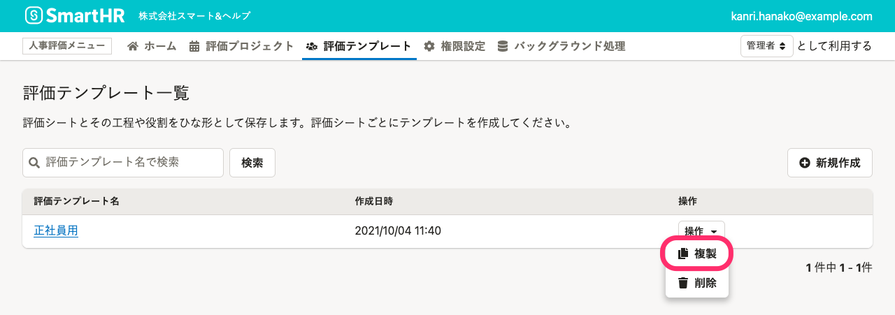

人事評価業務をマスターデータとしてまとめておく評価テンプレートに関して説明します。

# 評価テンプレートとは

評価テンプレートは、評価シート、評価フロー、評価ロールをひとまとめにしたひな形です。

ひな形として作成しておくことで、期ごとに評価シートや評価フローを作成する手間が省けます。

- **評価シート**：評価対象者や評価者に入力してほしい項目をまとめたものです。評価種目ごとに入力フォームを組み合わせて作成します。
- **評価フロー**：評価に必要な工程を**評価タスク**に分解し、**担当者**を決めます。評価フェーズごとにタスクを追加して作成します。
- **評価ロール**：評価に関わる従業員の役割を作成します。評価タスクでの担当者の指定や、評価シートの閲覧・編集権限設定に使います。

評価テンプレートの作成の前に、 [人事評価機能設定整理シート](https://smarthr.app.box.com/file/865658338514?s=jl5u4icm45s4ejdzdl8qud0bnmt7e71g)を使った評価業務の整理を済ませておくことをおすすめします。

# 評価テンプレートを作成する

## 1\. 評価テンプレート一覧画面で［  新規作成］をクリック

画面上部 **［人事評価メニュー］** の **［評価テンプレート］** をクリックして **［評価テンプレート一覧］** を表示します。

 **［  新規作成］** をクリックして、 **［評価テンプレートの作成］** 画面を表示します。

## 2\. 評価テンプレート名を入力し、［登録］をクリック

 **［評価テンプレート名］** を入力して、 **［登録］** をクリックします。

:::tips
評価テンプレート名は人事評価機能の管理にのみに使われ、従業員が使用する**評価シートには表示されません。**
管理するうえでわかりやすい名前を付けて構いません。
:::

 **［評価テンプレートの作成］** 画面が自動的に閉じられ、評価テンプレートが作成されます。

 **［評価テンプレート詳細］** 画面の、**評価シート**の設定画面が表示されます。

- [**評価シート**](https://knowledge.smarthr.jp/hc/ja/articles/4407133507481)
- [**評価フロー**](https://knowledge.smarthr.jp/hc/ja/articles/4407059455641/)
- [**評価ロール**](https://knowledge.smarthr.jp/hc/ja/articles/4406859637657/)

以上の基本設定を済ませ、 **［評価シート項目の必須設定］** 、 **［評価ロールの閲覧・編集権限設定］** 、 **［評価対象者の表示項目設定］** をしてください。

:::related
[評価シートの項目に入力必須設定をする](https://knowledge.smarthr.jp/hc/ja/articles/4409696582041)
[評価シートの閲覧・編集権限を設定する](https://knowledge.smarthr.jp/hc/ja/articles/4407128385689)
[評価シートの評価対象者の情報を変更する](https://knowledge.smarthr.jp/hc/ja/articles/4407502065689)
:::

# 評価テンプレートを複製する

:::tips
### 評価テンプレートのコピー機能を利用して、効率よく評価テンプレートを作成する
評価テンプレートを複製すると、テンプレートで設定済みの以下の情報をコピーします。
- 評価シート
- 評価フロー
- 評価ロール
- 評価シート項目の必須設定
- 評価ロールの閲覧・編集権限設定
- 評価対象者の表示項目設定
設定内容が一部重複する評価テンプレートを作成する場合は、複製したテンプレートを編集して利用すると、効率よく評価テンプレートを作成できます。
:::

## 1\. ［操作▼］メニューから［複製］をクリック

 **［評価テンプレート一覧］** 画面で任意の評価テンプレートの行の **［操作▼］** をクリックし、プルダウンメニューから **［複製］** をクリックします。

 **［評価テンプレート詳細］** 画面から操作する場合は、画面右の **［その他の操作▼］** をクリックし、プルダウンメニューから **［複製］** をクリックします。

## 2\. ［評価テンプレートの複製］画面で、［複製］をクリック

 **［評価テンプレートの複製］** 画面の内容を確認し、 **［複製］** をクリックします。

バックグラウンドで複製が実行されます。

進捗は、 **［バックグラウンド処理一覧］** 画面で確認できます。

しばらく経って、 **［評価テンプレート一覧］** 画面を再読み込みすると、 **［{複製元評価テンプレート名}のコピー］** という名前で評価テンプレートが複製されます。

# 評価テンプレート名を編集する

## 1\. ［その他の操作▼］メニューから［編集］をクリック

画面上部 **［人事評価メニュー］** の **［評価テンプレート］** をクリックして **［評価テンプレート一覧］** を表示します。

 **［評価テンプレート一覧］** から任意の評価テンプレートをクリックして評価テンプレート詳細画面を表示したら、画面右の **［その他の操作▼］** をクリックし、プルダウンメニューから **［編集］** をクリックして、 **［評価テンプレート名の編集］** 画面を表示します。

## 2\. 評価テンプレート名を編集し、［更新］をクリック

 **［評価テンプレート名］** を編集し、 **［更新］** をクリックします。

 **［評価テンプレートの編集］** 画面が自動的に閉じられ、評価テンプレート名が更新されます。

# 評価テンプレートを削除する

:::alert
評価プロジェクトに取り込み済みの評価テンプレートは削除できません。
:::

## 1\. ［その他の操作▼］メニューから［  削除］をクリック

 **［評価テンプレート一覧］** 画面で任意の評価テンプレートの行の **［操作］** をクリックし、プルダウンメニューから **［  削除］** をクリックして、 **［評価テンプレートの削除確認］** 画面を表示します。

 **［評価テンプレート詳細］** 画面からは、画面右の **［その他の操作▼］** をクリックし、プルダウンメニューから **［  削除］** をクリックします。

## 2\. ［評価テンプレートの削除確認］画面で、［  削除］をクリック

削除する評価テンプレートを確認し、 **［  削除］** をクリックします。
