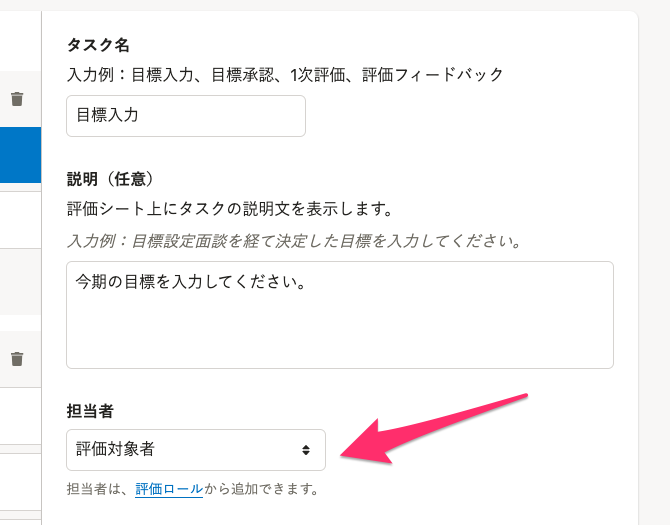
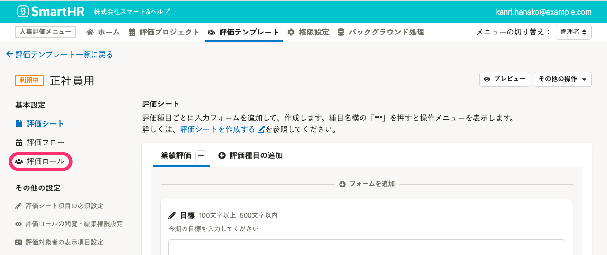
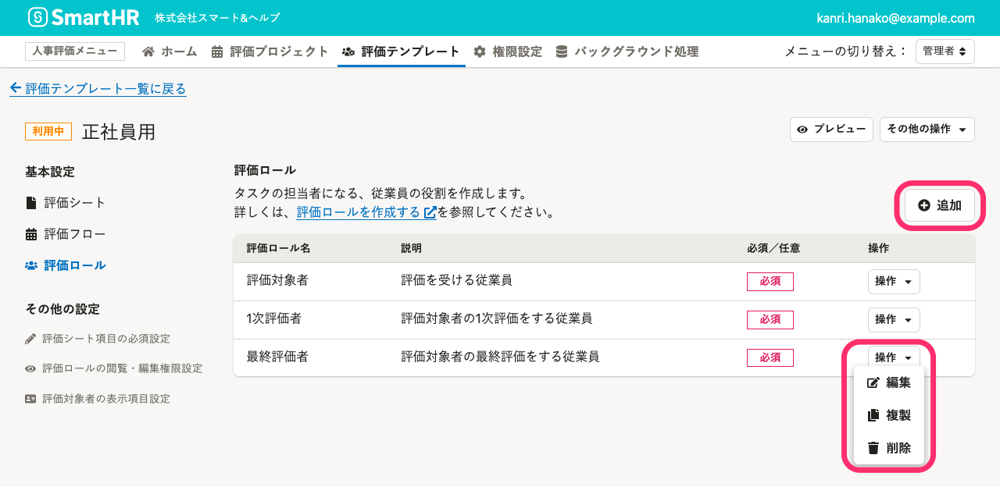
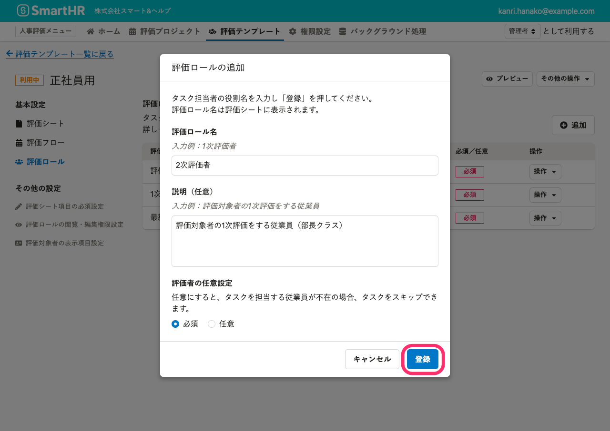

評価テンプレートの中にある評価ロールを設定する手順を説明します。

# 評価ロールとは

評価ロールとは、評価業務に関わる従業員の役割のことです。

評価フローの中の、**タスク**の**担当者**になる従業員の役割ごとに作成します。

:::related
[評価フローを作成する](https://knowledge.smarthr.jp/hc/ja/articles/4407059455641/)
:::

# 1.［評価テンプレート］の基本設定［評価ロール］をクリック

画面上部 **［人事評価メニュー］** の **［評価テンプレート］** をクリックして **［評価テンプレート一覧］** を表示します。

評価テンプレートの作成が済んでいない場合は、[評価テンプレートを管理する](https://knowledge.smarthr.jp/hc/ja/articles/4407070408473/) を参照し、評価テンプレートを作成してください。

 **［評価テンプレート一覧］** から任意の評価テンプレートをクリックして評価テンプレートの設定画面を表示したら、画面左の基本設定 **［評価ロール］** をクリックします。

評価ロールには、以下のロールがプリセットされています。

- 評価対象者
- 1次評価者
- 最終評価者

必要に応じて、編集、削除してください。（評価対象者は編集できません。）

# 2\. 評価ロールを設定する

評価ロールを新規作成するには **［+追加］** をクリックします。

既存の評価ロールを編集するには **［操作▼］** メニューから操作してください。

## 評価ロールを追加する

評価ロール一覧の右上の **［+追加］** をクリックして、 **［評価ロールの追加］** 画面を表示します。

 **［評価ロール名］** 、 **［説明］** （任意）を入力して、 **［登録］** をクリックします。

:::tips
### 評価者の任意設定とは
評価者が不在であるなどの理由で、評価フローのタスクをスキップしたい場合に使用する設定です。
評価プロジェクトで設定者を設定するときに、この評価ロールに従業員を紐付けなければ、この評価ロールが担当者のタスクをスキップできます。
[評価者と評価共有者を設定する](https://knowledge.smarthr.jp/hc/ja/articles/4407133726745/)
[Q. 部署によっては評価者が不在のため、工程を省略しています。どうしたら良いですか？](https://knowledge.smarthr.jp/hc/ja/articles/4407269996953)
:::

## 評価ロールを複製して追加する

複製したい評価ロールの **［操作▼］** メニューから **［複製］** をクリックして、 **［評価ロールの複製］** 画面を表示します。

設定内容を編集し、 **［複製］** をクリックします。

## 評価ロールを編集する

編集したい評価ロールの **［操作▼］** メニューから **［編集］** をクリックして、 **［評価ロールの編集］** 画面を表示します。

設定内容を編集し、 **［更新］** をクリックします。

## 評価ロールを削除する

削除したい評価ロールの **［操作▼］** メニューから **［削除］** をクリックして、 **［評価ロールの削除確認］** 画面を表示します。

削除する評価ロールを確認し、 **［削除］** をクリックします。
