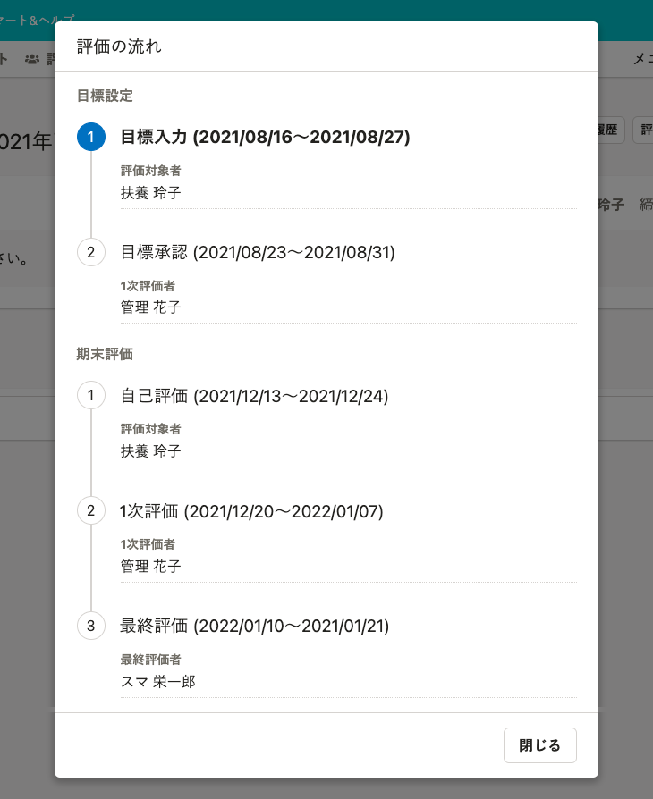
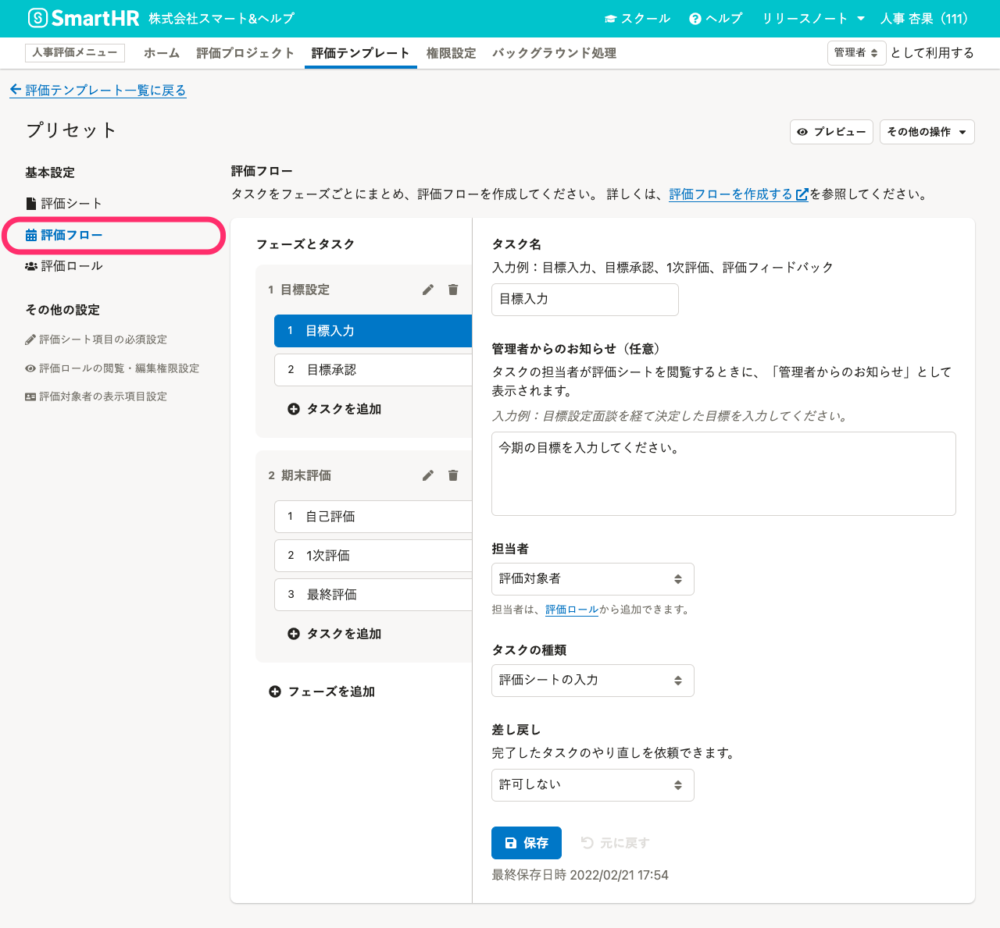
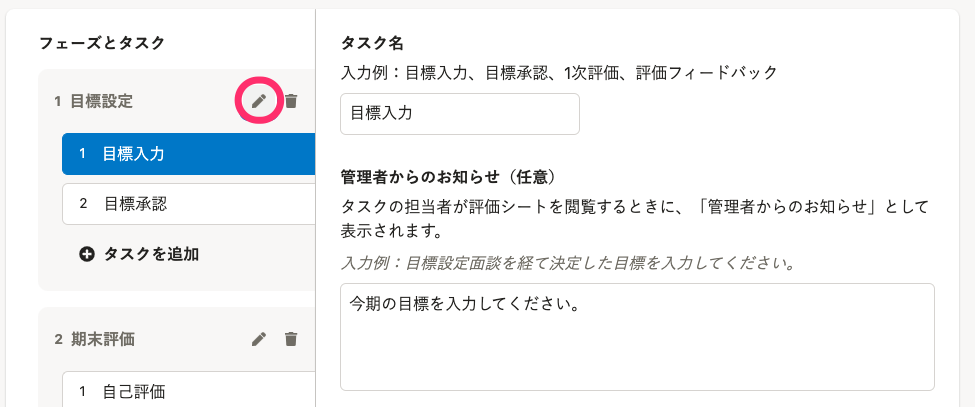
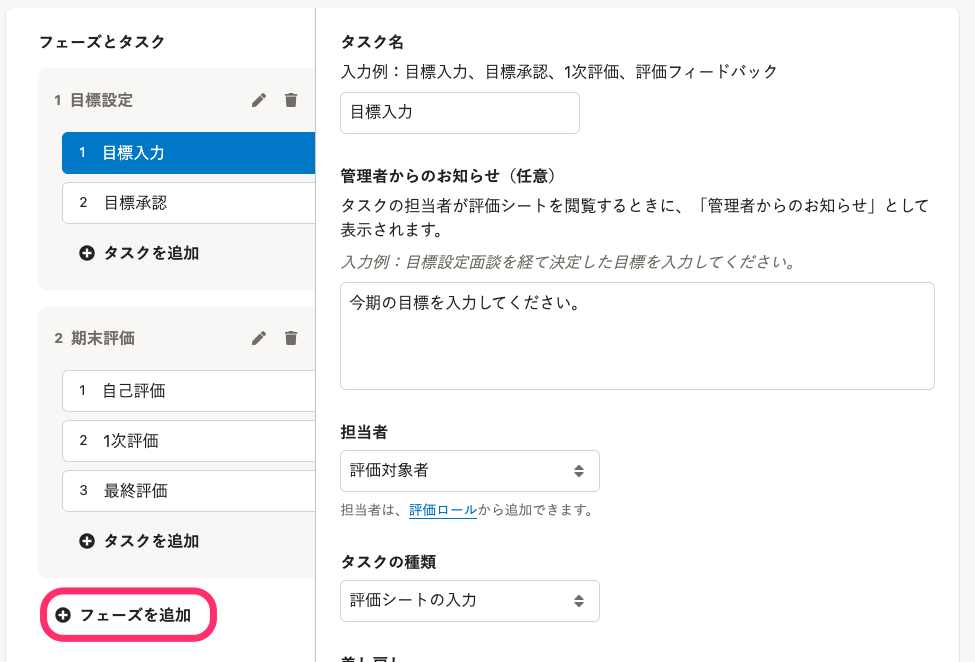
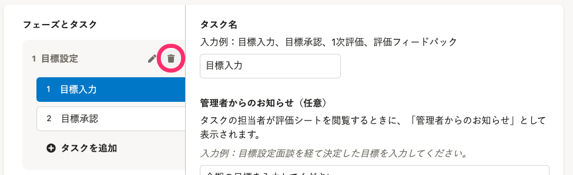
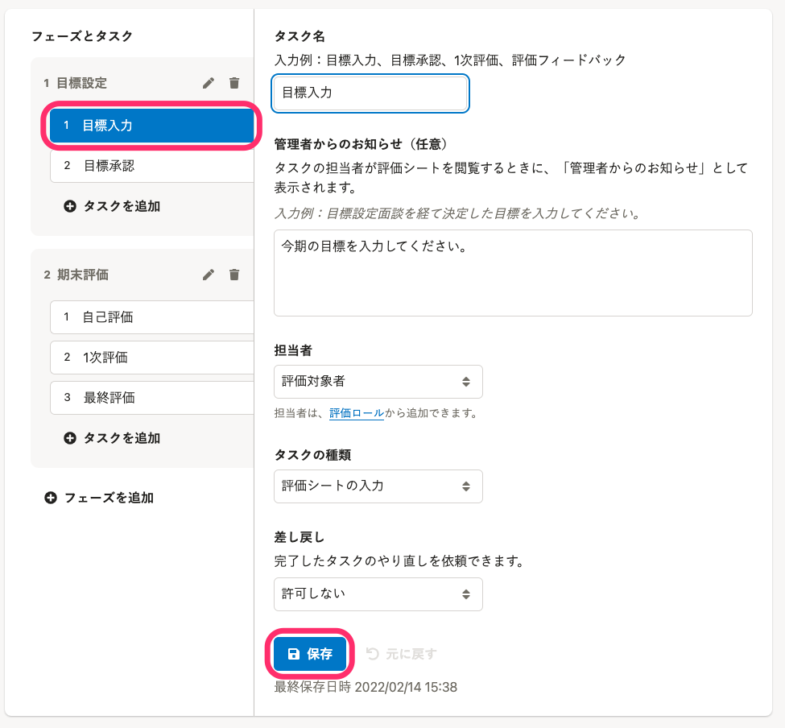
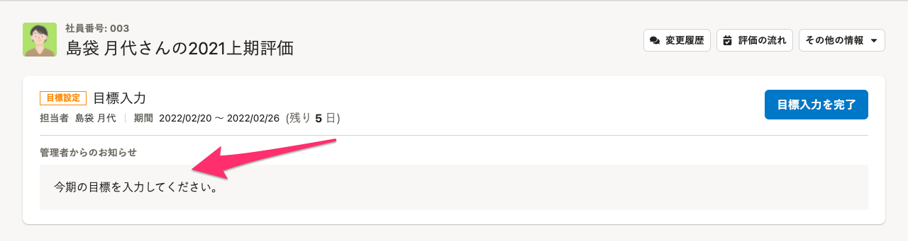
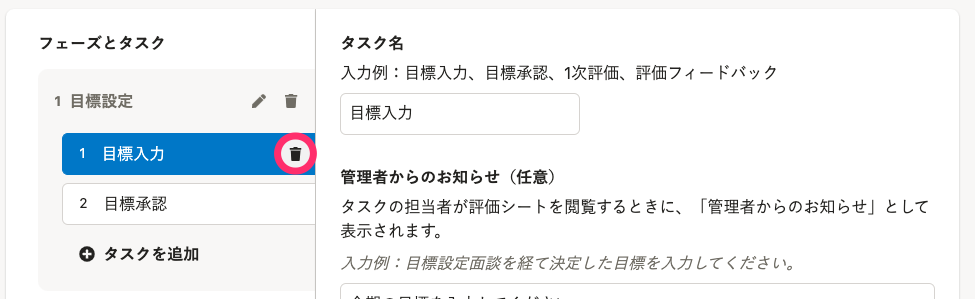

評価テンプレートの中にある評価フローを設定する手順を説明します。

# 評価フローとは

評価フローとは、評価シートを評価対象者と評価者が入力または承認していく順番のこと、つまり評価の工程です。

従業員画面の評価シートでは［**評価の流れ**］としてタスクごとのスケジュールや担当者を確認できます。

評価フローは、複数の**フェーズ**と**タスク**から成り立ちます。

- **フェーズ**：評価業務における局面（目標設定や期末評価など）のことです。 フェーズは1つ以上のタスクから成り立ちます。
- **タスク**：評価業務における業務の最小単位（「評価対象者が目標を入力する」「評価者が目標を承認する」など）のことです。

# 1.［評価テンプレート］の基本設定［評価フロー］をクリック

画面上部 **［人事評価メニュー］** の **［評価テンプレート］** をクリックして **［評価テンプレート一覧］** を表示します。

評価テンプレートの作成が済んでいない場合は、[評価テンプレートを管理する](https://knowledge.smarthr.jp/hc/ja/articles/4407070408473/) を参照し、評価テンプレートを作成してください。

 **［評価テンプレート一覧］** から任意の評価テンプレートをクリックして評価テンプレートの設定画面を表示したら、画面左の基本設定 **［評価フロー］** をクリックします。

評価フローには、フェーズとタスクが以下のとおりプリセットされています。

- 目標設定
    - 目標入力（評価対象者が評価シートの入力をする）
    - 目標承認（1次評価者が入力内容を承認する）
- 期末評価
    - 自己評価（評価対象者が評価シートの入力をする）
    - 1次評価（1次評価者が評価シートの入力をする）
    - 最終評価（最終評価者が評価シートの入力をする）

必要に応じて、編集、削除してください。

# 2\. フェーズを設定する

**フェーズの入れ替えはできません。**

フェーズ名を変更する、もしくはフェーズごと削除して作り直してください。

## フェーズ名を編集する

フェーズ名の横の をクリックして、 **［フェーズ名の編集］** 画面を表示します。

名前を入力し、 **［更新］** をクリックします。

## フェーズを追加する

 **［＋フェーズを追加］** をクリックして、 **［フェーズの追加］** 画面を表示します。

名前を入力し、 **［追加］** をクリックします。

## フェーズを削除する

フェーズ名横の をクリックして、 **［フェーズの削除確認］** 画面を表示します。

削除するフェーズを確認し、 **［削除］** をクリックします。

# 3\. タスクを設定する

 **［フェーズとタスク］** に表示されている **［タスク名］** をクリックすると、タスクが切り替わります。

タスクごとに

- タスク名
- 管理者からのお知らせ（任意）
- 担当者
- タスクの種類
- 差し戻し

を設定します。

## 3-1. ［タスク名］と［管理者からのお知らせ］を入力する

 **［タスク名］** と **［管理者からのお知らせ］** を入力します。

:::tips
管理者からのお知らせは、タスクの担当者が評価シートを閲覧するときに、評価シートの上に表示されます。
評価シートのどの項目を入力、確認して欲しいか、何を参照して欲しいかなどを入力してください。

:::

## 3-2. ［担当者］と［タスクの種類］を設定する

 **［担当者］** と **［タスクの種類］** をそれぞれプルダウンから選択します。

**担当者**の選択肢には、**テンプレートに追加済みの評価ロール**が表示されます。
プリセットの評価ロール以外の担当者を設定したい場合には、[評価ロールの作成](https://knowledge.smarthr.jp/hc/ja/articles/4406859637657)を済ませておいてください。

**タスクの種類**の選択肢は、下記が表示されます。

- 評価シートの入力
- 入力内容の承認や確認

:::tips
### タスクの種類と担当者は、評価シートの閲覧・編集権限とは連動していません。
タスクの種類と担当者は、評価の進捗管理に利用します。
それぞれのタスクで、評価対象者や評価者が評価シートのどの項目を閲覧・編集できるかは、評価ロールの閲覧・編集権限で設定します。
詳しくは、 [評価シートの閲覧・編集権限を設定する](https://knowledge.smarthr.jp/hc/ja/articles/4407128385689)を参照してください。
:::

## 3-3. 差し戻しに関する設定をする

［**差し戻し**］は、完了済みのタスクの担当者に対して、タスクのやり直しをリクエストできるようになる設定です。

プルダウンから、どのタスクまで差し戻しするかを選択します。

## 3-4. ［保存］をクリック

タスクの設定がすべて終わったら、 **［保存］** をクリックします。

## タスクを削除する

タスク名の右端にマウスカーソルを合わせると表示される をクリックして、 **［タスクの削除確認］** 画面を表示します。

削除するタスクを確認し、 **［削除］** をクリックします。

