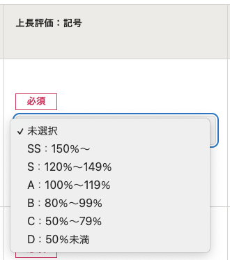

評価テンプレートの中にある評価シートを設定する手順を説明します。

# 評価シートとは

評価シートとは、評価対象者や評価者に入力してほしい**評価項目**を収集するためのものです。

評価項目は、評価の種類（業績評価、コンピテンシー評価など）ごとに**評価種目**としてまとめます。

## 評価シートの構成要素

評価シートは、タスクの担当者が評価シートを記入するための**入力フォーム**と、評価シートに説明や添付ファイルを添えるための**表示フォーム**を使用して作成します。

また、複数のフォームを**表組み**を使ってレイアウトできます。

:::related
[評価シートを表組みを使ってレイアウトする](https://knowledge.smarthr.jp/hc/ja/articles/4407441717657)
:::

### 入力フォーム

入力フォームは、評価シートを記入するためのフォームです。**テキスト入力**、**数値入力**、**選択肢入力**の3種類があります。

#### テキスト入力

定性目標や評価の理由など、自由記述の入力に利用します。

入力できる文字数は、未設定の場合、最大999,999字です。

URLを入力すると、評価シートの閲覧時にはハイパーリンクに変換されます。

#### 数値入力

金額や達成率など、数値での入力に利用します。
小数点以下2桁まで入力できます。入力できる数値は、未設定の場合、最大値99,999,999、最小値-99,999,999です。

#### 選択肢入力

評語など、選択肢での入力に利用します。

追加できる選択肢は30個まで、選択肢の文字数は最大100文字です。

### 表示フォーム

表示フォームは、評価シートに情報を埋め込むためのフォームです。**固定テキスト**と**添付ファイル**の2種類があります。

管理者が評価シート上で従業員に提供したい情報の入力に使います。

#### 固定テキスト

評価種目や表組み全体に対する説明文は、固定テキストを使います。

URLはハイパーリンクに変換されます。

#### 添付ファイル

計算表や評価制度の説明文書など、一律に配布したいファイルを添付できます。

1つのフォームで、10MB以内のファイルを最大3つ登録できます。

# 1.［評価テンプレート］の基本設定［評価シート］をクリック

画面上部 **［人事評価メニュー］** の **［評価テンプレート］** をクリックして **［評価テンプレート一覧］** を表示します。

評価テンプレートの作成が済んでいない場合は、[評価テンプレートを管理する](https://knowledge.smarthr.jp/hc/ja/articles/4407070408473/) を参照し、評価テンプレートを作成してください。

 **［評価テンプレート一覧］** から任意の評価テンプレートをクリックして、 **［評価テンプレート詳細］** 画面を表示します。

評価テンプレート詳細画面のデフォルトは、 **［評価シートの設定］** 画面です。

評価シートには、 **［業績評価］** がプリセットとして設定されています。

- 目標（テキスト入力）
- 目標に対する評価（表組み）
    - 自己評価（選択肢入力）
    - 自己評価コメント（テキスト入力）
    - 1次評価（選択肢入力）
    - 1次評価コメント（テキスト入力）
    - 最終評価（選択肢入力）
    - 最終評価コメント（テキスト入力）

必要に応じて、編集、削除してください。

# 2\. 評価種目を設定する

## 評価種目を追加する

評価シート上の **［＋評価種目の追加］** をクリックして、 **［評価種目の追加］** 画面を表示します。

 **［評価種目名］** を入力して、 **［登録］** をクリックします。

## 評価種目名を編集する

編集したい評価種目の **［  ］** メニューから **［編集］** をクリックして、 **［評価種目名の編集］** 画面を表示します。

設定内容を編集し、 **［更新］** をクリックします。

## 評価種目を削除する

編集したい評価種目の **［  ］** メニューから **［削除］** をクリックして、 **［評価種目の削除確認］** 画面を表示します。

削除する評価種目を確認し、 **［削除］** をクリックします。

## 評価種目を並べ替える

従業員が評価シートを表示した時、一番左にある評価種目が表示されます。

入力を促したい順番に評価種目を並べておくことをおすすめします。

編集したい評価種目の **［  ］** メニューから **［右へ移動］** 、もしくは **［左へ移動］** をクリックして、並べ替えます。

# 3\. フォームを設定する

## フォームを追加する

 **［＋フォームを追加］** をクリックして、 **［フォームの追加］** 画面を表示します。

 **［フォームの追加］** 画面の左側に並んだ **［テキスト入力］** 、 **［数値入力］** 、 **［選択肢入力］** 、 **［固定テキスト］** 、 **［ファイル添付］** 、 **［表組み］** をクリックすると、追加するフォームが切り替わります。

使用したいフォームを選択し、 **［項目名］** 、 **［説明］** （任意）、その他必要な設定を入力して、 **［登録］** をクリックします。

:::tips
### 表組みの見え方
表組みを使うと、表の中にそれぞれ好きなフォームを配置できます。
詳しい使い方は、[評価シートを表組みを使ってレイアウトする](https://knowledge.smarthr.jp/hc/ja/articles/4407441717657) を参照してください。
#### 列ごとに同じフォームを並べた場合

#### 列ごとに同じタスクで使うフォームを並べた場合

:::

## フォームを複製して追加する

編集したいフォームの右下にある **［  複製］** をクリックすると、複製元のフォームの下に **［{項目名}のコピー］** という名前のフォームが追加されます。

## フォームを編集する

編集したいフォームの右下にある **［  編集］** をクリックして、 **［フォームの編集］** 画面を表示します。

使用したいフォームを **［フォームの編集］** 画面でクリックするだけで、フォームが変更できます。（項目名は引き継がれます。）

その他必要な設定を入力して、 **［更新］** をクリックします。

## フォームを削除する

削除したいフォームの右下にある **［  削除］** をクリックして、 **［フォームの削除確認］** 画面を表示します。

削除するフォームを確認し、 **［削除］** をクリックします。

## フォームを並べ替える

移動したいフォームをドラッグアンドドロップして、並び替えできます。

もしくは、移動したいフォーム右下にマウスカーソルを合わせると表示される **［  ］** 、もしくは **［  ］** をクリックすると、1つ上、もしくは1つ下に移動します。

