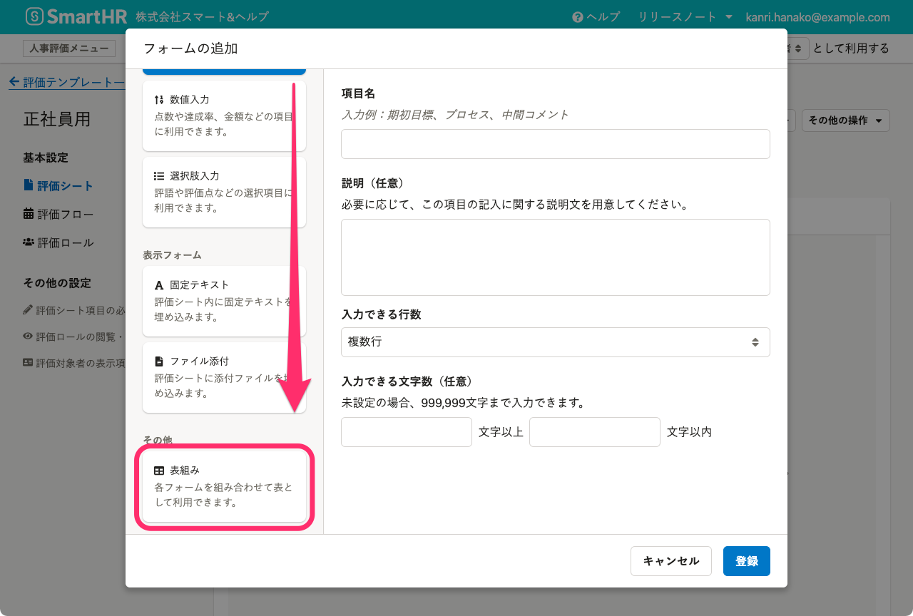
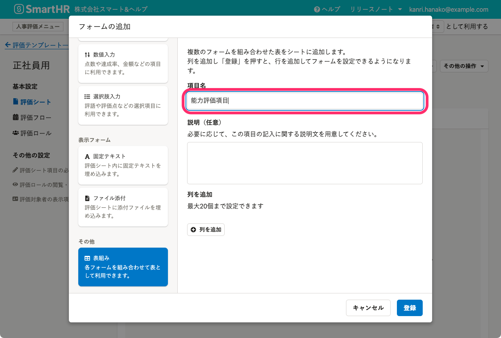
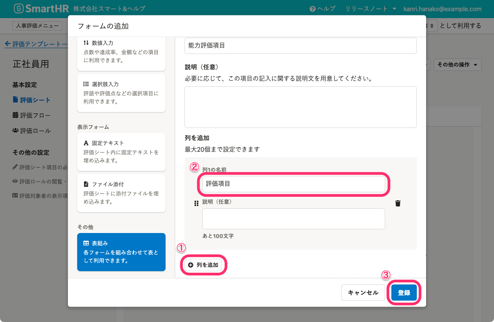
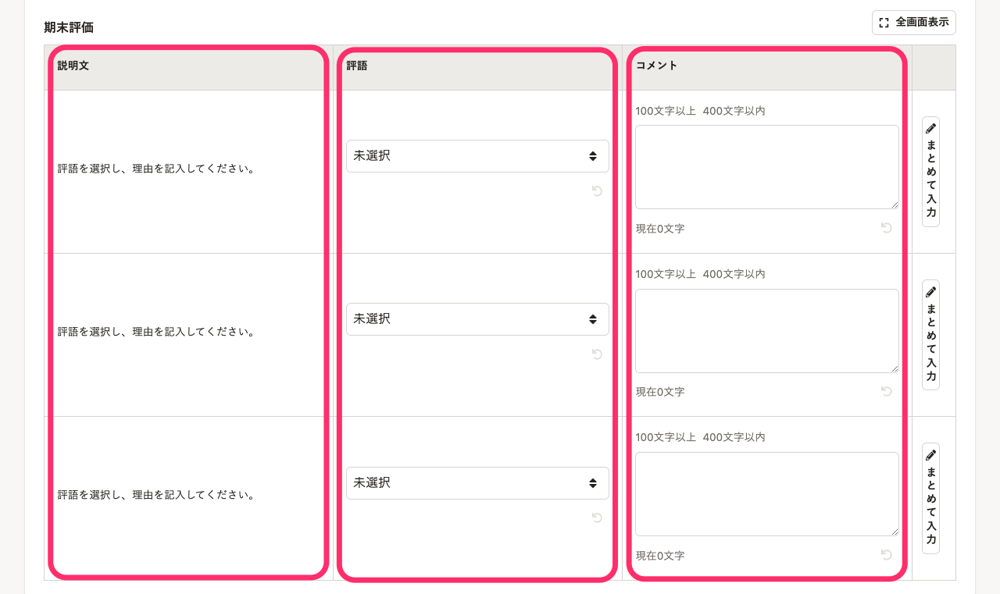
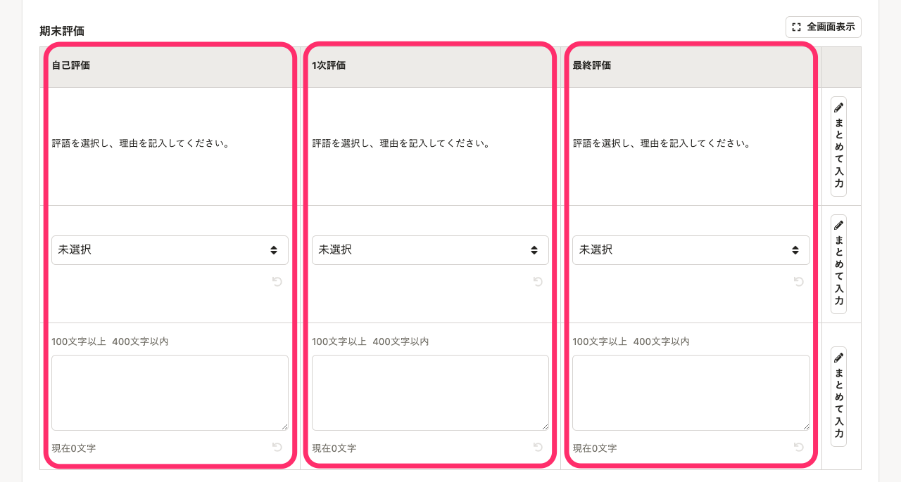
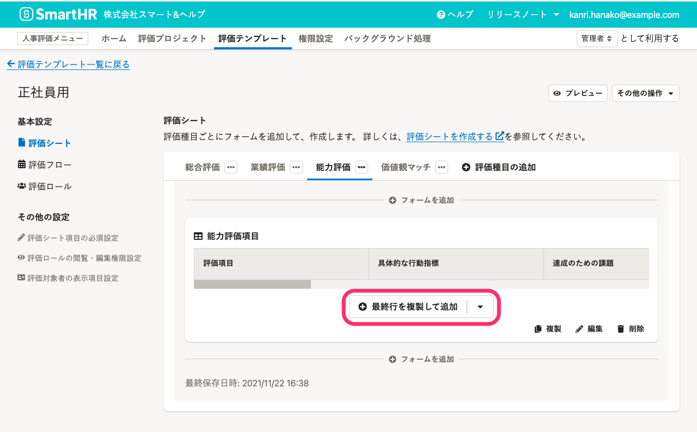
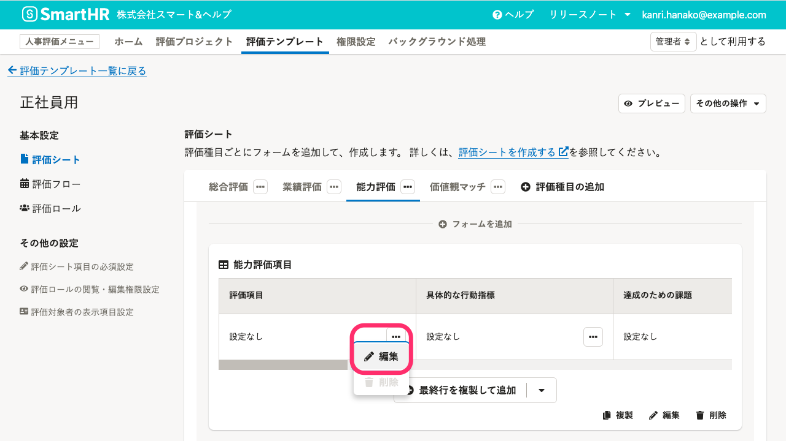
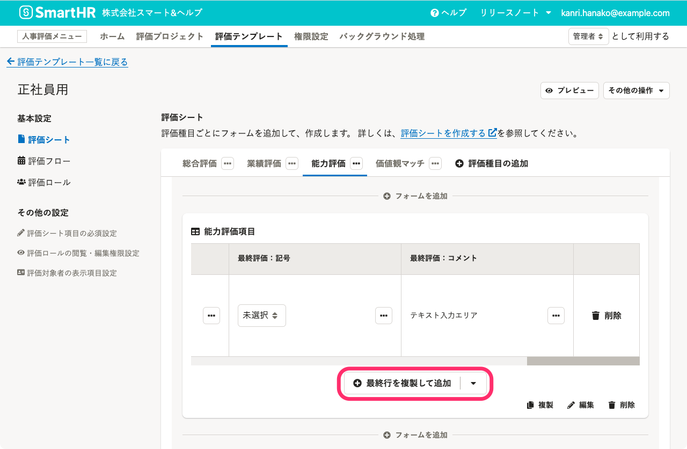
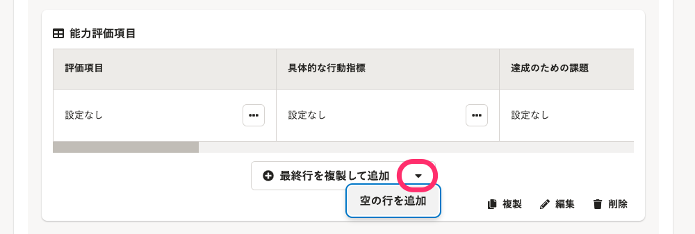

評価シートの項目を表組みを使ってレイアウトする手順を説明します。複数の評価項目を表（テーブル）にした評価シートを作成したい場合に参考にしてください。

基本的な評価シートの作成手順は、[評価シートを作成する](https://knowledge.smarthr.jp/hc/ja/articles/4407133507481)を参照してください。

# 1\. ［フォームの追加］画面で、［表組み］をクリック

評価シートの作成・編集画面で、 **［フォームを追加］** をクリックして、 **［フォームの追加］** 画面を開きます。 **［フォームの追加］** 画面の左側、フォームタイプの選択エリアをスクロールして、一番下にある **［表組み］** をクリックします。

# 2\. ［項目名］に表の名前を入力

 **［項目名］** に表の名前を入力します。

# 3.［  列の追加］をクリックして名前を入力し、［登録］をクリック

表組みでは、**列を追加した数だけフォームを横に並べられます。**

 **［列の追加］** をクリックして、複数の項目をまとめるグループを追加します。項目のグループの名前を **［列の名前］** に入力します。

必要な列を追加し終えたら、 **［登録］** をクリックします。

:::tips
### 評価シートでの表組みの見え方
列のまとめ方は、好みに合わせてください。
参考として、同じフォームを列にまとめたケースと同じタスクを列にまとめたケースの見え方を紹介します。
#### 列ごとに同じフォームを並べた場合

#### 列ごとに同じタスクで使うフォームを並べた場合

:::

# 4\. ［ 最終行を複製して追加］をクリック

 **［  最終行を複製して追加］** をクリックして、行を追加します。

# 5.［  ］ > ［  編集］をクリックして、［フォームの設定］画面を表示

項目のごとに、 **［  ］**  >  **［  編集］** をクリックして、 **［フォームの設定］** 画面を表示します。

 **［フォームの設定］** 画面で、任意のフォームを設定してください。

2行目以降は **［ 最終行を複製して追加］** をクリックすると最終行を複製するので、フォームの設定の手間が省けます。

フォームを未設定の行を追加したい場合は、 **［ ］**  >  **［空の行を追加］** をクリックしてください。

