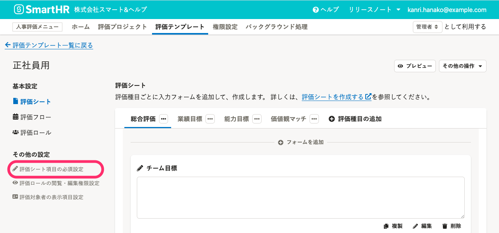
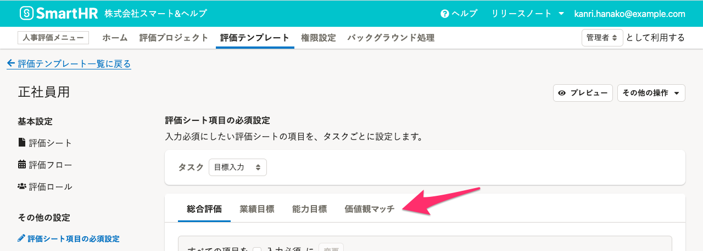
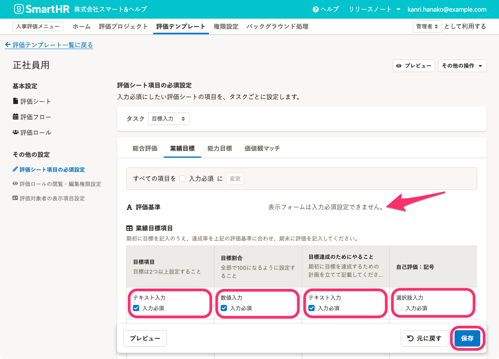

評価シートの評価項目に、入力必須を設定する手順を説明します。

# 1\. 評価テンプレート詳細画面で［評価シート項目の必須設定］をクリック

画面上部 **［人事評価メニュー］** の **［評価テンプレート］** をクリックし、評価テンプレート一覧で編集したい**評価テンプレート名**をクリックして、評価テンプレート詳細画面を開きます。

画面左の **［その他の設定］** にある **［評価シート項目の必須設定］** をクリックします。

# 2.［タスク］を選択

入力必須にしたい評価シートの項目をタスクごとに設定していきます。

 **［タスク］** をプルダウンから選択します。

# 3\. 入力必須にしたい項目にチェックを入れ［保存］をクリック

評価シートの**評価種目タブ**を切り替えます。

入力必須にしたい項目の **［入力必須］** のチェックボックスを入力します。

**固定テキスト**と**添付ファイル**は表示フォームのため入力設定はできません。

チェックを終えたら、 **［保存］** をクリックします。評価種目ごとに保存してください。

