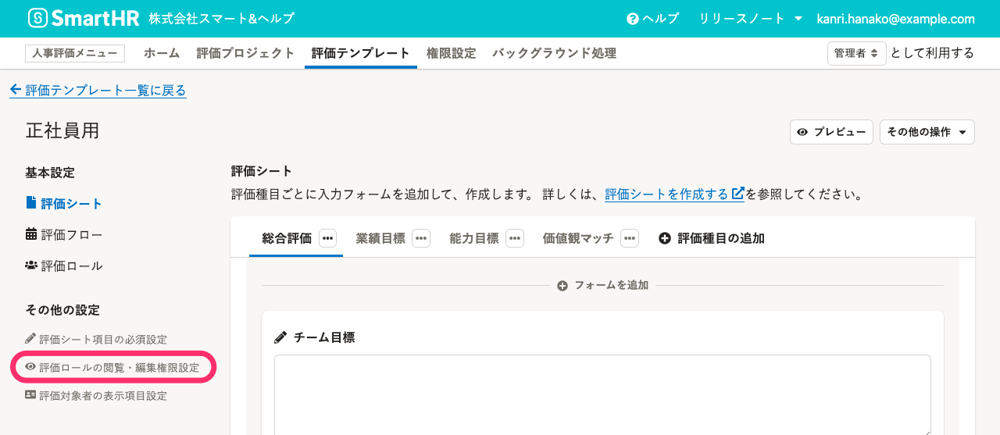
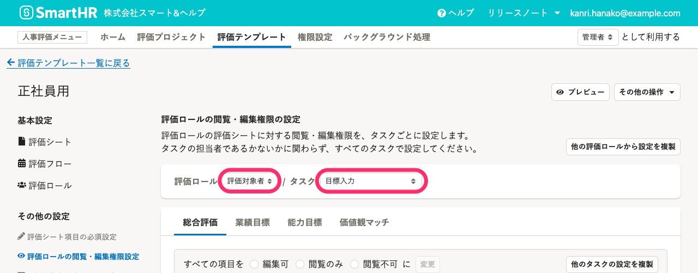
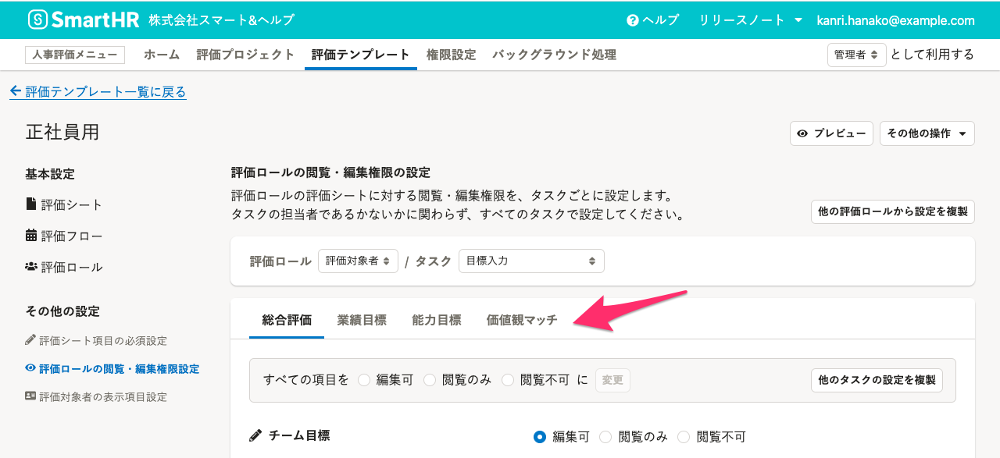
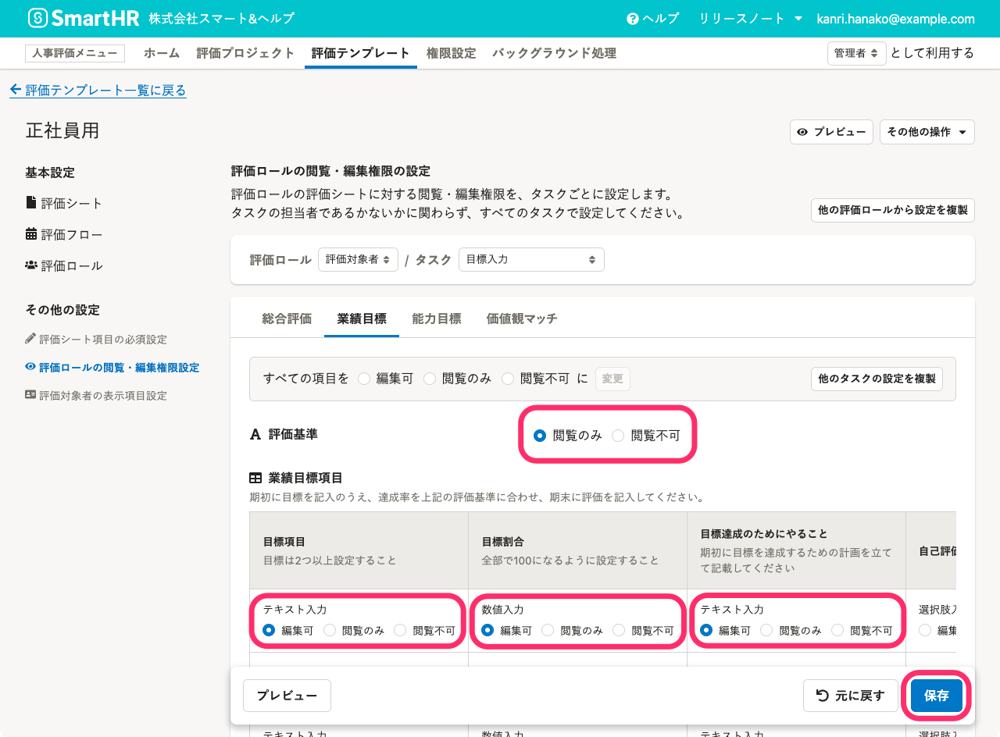
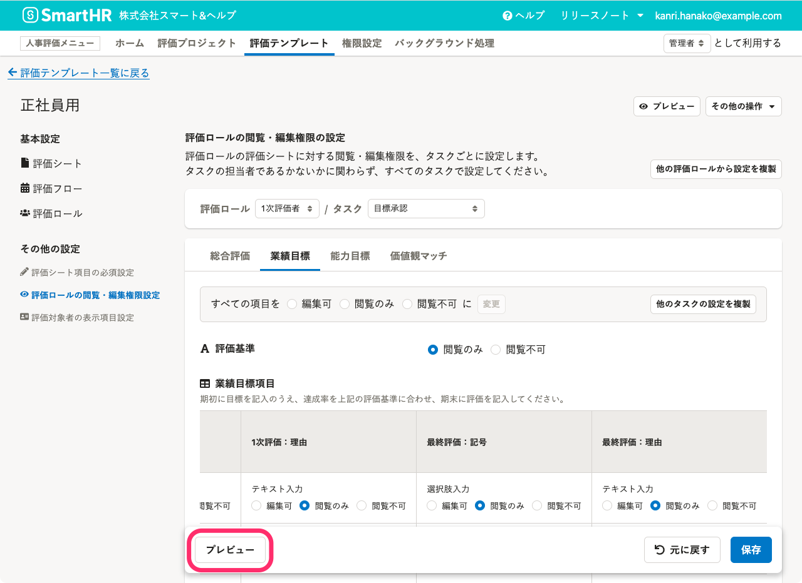
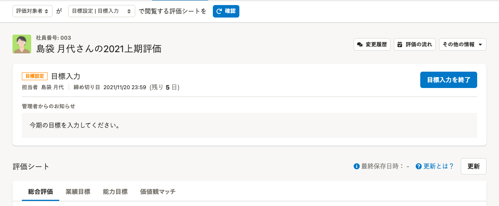
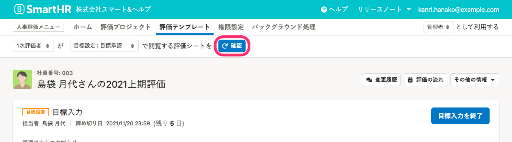
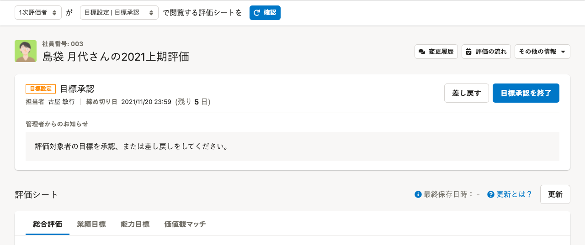

評価シートの閲覧・編集権限を設定する手順を説明します。

あるタスクのときに評価シートのどの項目が閲覧・編集できるかの権限を、評価ロールごとに設定していきます。

評価ロールがタスクの担当者であるかないかに関わらず、すべてのタスクで設定してください。

# 1\. 評価テンプレート詳細画面で［評価ロールの閲覧・編集権限設定］をクリック

画面上部 **［人事評価メニュー］** の **［評価テンプレート］** をクリックし、評価テンプレート一覧で編集したい**評価テンプレート名**をクリックして、評価テンプレート詳細画面を開きます。

画面左の **［その他の設定］** にある **［評価ロールの閲覧・編集権限設定］** をクリックします。

# 2.［評価ロール］と［タスク］を選択

 **［評価ロール］** 、 **［タスク］** をプルダウンから選択します。

### すべてのタスク終了後とは？

評価終了後にアーカイブしておく評価シートの閲覧・編集権限を設定するために、作成した評価フローとは別に **［すべてのタスク終了後］** という項目を設けています。

過去の評価情報の運用ルールに合わせて、このときの閲覧・編集権限も設定してください。

# 3\. 項目に対して評価ロールができる操作を選択し［保存］をクリック

評価シートの**評価種目タブ**を切り替えます。

各項目に対して **［編集可］** 、 **［閲覧のみ］** 、 **［閲覧不可］** を選択します。

項目のうち、表示フォームの**固定テキスト**と**添付ファイル**は **［閲覧のみ］** または **［閲覧不可］** しか選択できません。

また、**担当者になっているタスク**の場合、**入力必須項目**に対しては **［編集可］** しか選べないようになっています。入力必須項目は、 **［評価シート項目の必須入力設定］** で設定できます。

:::related
[評価シートの項目に入力必須設定をする](https://knowledge.smarthr.jp/hc/ja/articles/4409696582041)
:::

選択を終えたら、 **［保存］** をクリックします。評価種目ごとに保存してください。

:::tips
## 効率よく設定するには？
閲覧・編集権限の設定は、評価ロール×タスク×評価種目の分だけ、それぞれ必要です。効率よく設定するためのいくつかの機能を紹介します。
### ［他の評価ロールから設定を複製］
評価ロールに設定したすべて内容を丸ごと複製して適用します。
ただし、担当者になっているタスクの入力必須項目に対しては、複製は適用されず、「編集可」が設定されます。
### ［他のタスクの設定を複製］
同じ評価ロールに他のタスクで設定した内容を複製して適用します。複製される範囲は、評価種目ごとです。
任意のタスクでの設定した内容を、評価種目に含まれるすべての項目でラジオボタンのまとめて選択します。
### ［すべての項目を 編集可/閲覧のみ/閲覧不可 に変更］
評価種目に含まれるすべての項目で、同じ内容でラジオボタンをまとめて選択します。
:::

# 4\. プレビュー画面で、［評価ロール］と［タスク］を選択

 **［プレビュー］** をクリックすると、別タブに評価シートのプレビュー画面が表示されます。

 **［プレビュー］** をクリックして表示されるプレビュー画面は常に**評価対象者が最初のタスクのとき**の状態です。

任意の **［評価ロール］** と **［タスク］** をプルダウンから選択のうえ **［確認］** をクリックし、プレビュー画面を切り替えて、評価シートの見え方を確認します。

例）［確認］を押した後に表示される、［1次評価者］が［目標承認］のタスクで閲覧する評価シートのプレビュー画面

