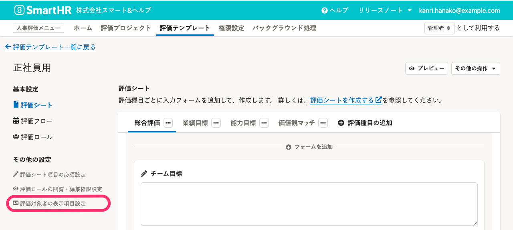
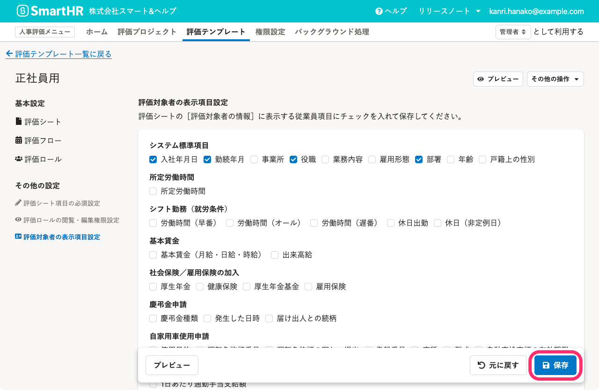
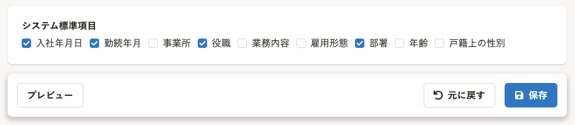

評価シートに表示する評価対象者の情報を設定する手順を説明します。

# 1\. 評価テンプレート詳細画面で［評価対象者の表示項目設定］をクリック

画面上部 **［人事評価メニュー］** の **［評価テンプレート］** をクリックし、評価テンプレート一覧で編集したい**評価テンプレート名**をクリックして、評価テンプレート詳細画面を開きます。

画面左の **［その他の設定］** にある **［評価対象者の表示項目設定］** をクリックします。

# 2\. 従業員項目を選択して［保存］をクリック

表示したい従業員項目のチェックボックスを選択して、 **［保存］** をクリックします。

従業員項目は**最大30個**まで選択できます。

## 評価シートに表示できる従業員項目

### システム標準項目

システム標準項目は、以下の項目です。

- 入社年月日
- 勤続年月
- 事業所
- 役職
- 業務内容
- 雇用形態
- 部署
- 年齢
- 戸籍上の性別

初期設定は **［入社年月日］** 、 **［勤続年月］** 、 **［役職］** 、 **［部署］** を選択しています。

### カスタム従業員項目

カスタム従業員項目は、SmartHR基本機能に登録済みのすべての項目が対象です。

:::alert
評価シートの評価対象者の情報は、評価機能管理者、評価業務担当者ならびに、評価対象者、評価者、評価共有者が閲覧できます。
この設定で評価対象者の情報として選択すると、**SmartHR基本機能の権限で閲覧権限のない従業員項目も評価シート上で閲覧できる**ので、設定には注意してください。
詳しくは、 [Q. 人事評価機能の管理者権限を付与すると、SmartHR内の従業員情報も閲覧できるようになってしまいますか？](https://knowledge.smarthr.jp/hc/ja/articles/4407500859545) を参照してください。
:::
