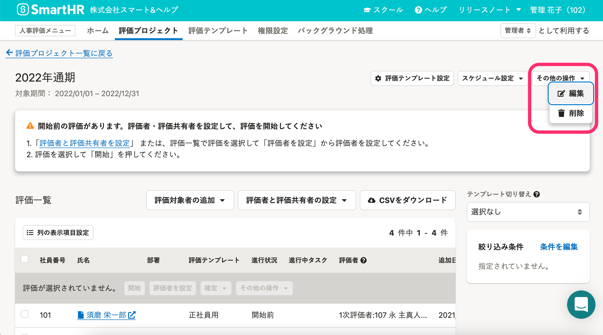

# 評価プロジェクトとは

評価プロジェクトでは、任意の評価対象期間の従業員の評価を管理します。

評価プロジェクト詳細画面では、従業員ごとのタスクの進捗管理や、評価の確定（＝評価シートの入力内容の保護）などを操作できます。

# 評価プロジェクトを作成する

## 1\. 評価プロジェクト一覧画面で［  新規作成］をクリック

画面上部 **［人事評価メニュー］** の **［評価プロジェクト］** をクリックして **［評価プロジェクト］** 一覧画面を表示します。

 **［  新規作成］** をクリックして、 **［評価プロジェクトの作成］** 画面を表示します。

## 2\. ［評価プロジェクト名］と［対象期間］を入力し、［登録］をクリック

 **［評価プロジェクト名］** と **［対象期間］** を入力して、 **［登録］** をクリックします。

 **［評価プロジェクトの作成］** 画面が自動的に閉じられ、評価プロジェクト詳細画面が表示されます。

評価プロジェクト名は、従業員が使用する**評価シートに表示されます。**

:::tips
### 対象期間とスケジュールの違い
評価プロジェクト作成時に設定する「対象期間」は、一般的に評価期間や査定期間と呼ばれる、評価の対象となる期間を指します。
一方、評価テンプレートを取り込んだ後に設定する「スケジュール」は、評価期間に入る前の目標設定や評価期間を終えた後の評価フィードバックなどのタスクも含めた日程のことです。
:::

# 評価プロジェクトを編集する

評価プロジェクト作成後も、評価プロジェクト名と対象期間を更新できます。

## 1\. ［その他の操作▼］メニューから［編集］をクリック

**評価プロジェクト詳細画面**右の **［その他の操作▼］** をクリックし、プルダウンメニューから **［編集］** をクリックして、 **［評価プロジェクトの編集］** 画面を表示します。

## 2\. ［評価プロジェクト名］または［対象期間］を編集し、［更新］をクリック

 **［評価プロジェクト名］** または **［対象期間］** を編集し、 **［更新］** をクリックします。

# 評価プロジェクトを削除する

## 1\. ［その他の操作▼］メニューから［  削除］をクリック

 **［評価プロジェクト一覧］** 画面で任意の評価プロジェクトの行の **［操作▼］** をクリックし、プルダウンメニューから **［  削除］** をクリックして、 **［評価プロジェクトの削除確認］** 画面を表示します。

 **［評価プロジェクト詳細］** 画面からは、画面右の **［その他の操作▼］** をクリックし、プルダウンメニューから **［  削除］** をクリックします。

## 2\. ［評価プロジェクトの削除確認］画面で、［削除］をクリック

削除する評価プロジェクトを確認し、 **［削除］** をクリックします。
