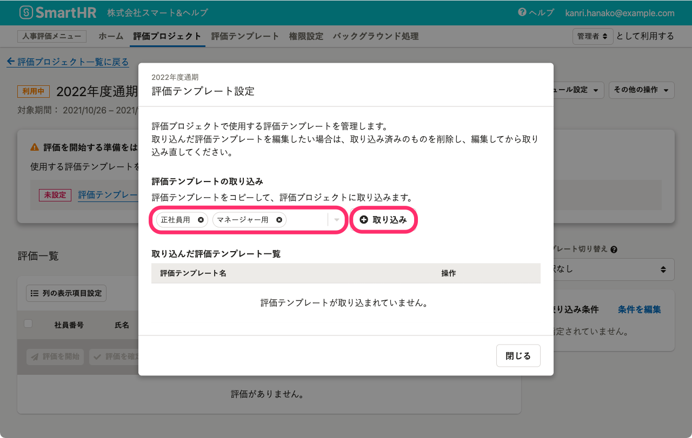
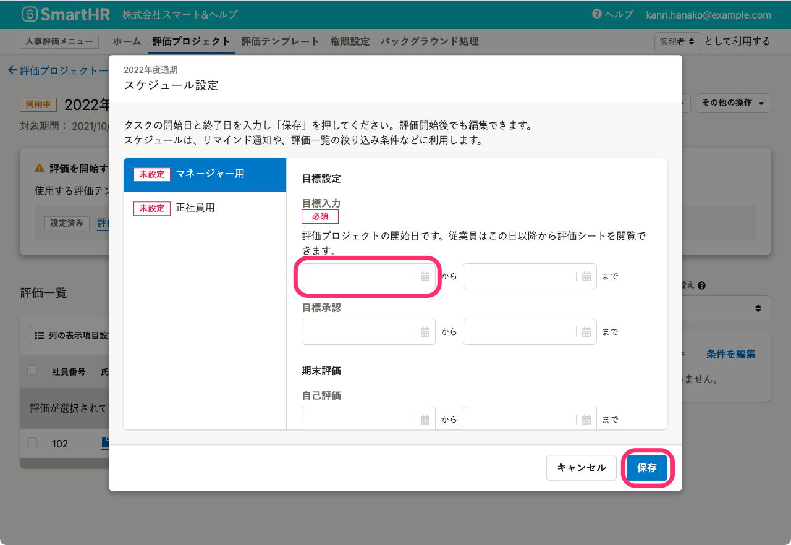
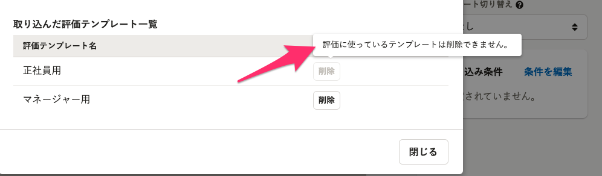

評価プロジェクト詳細画面で、評価テンプレートを取り込み、スケジュール設定をする手順について説明します。

# 1\. 評価プロジェクト詳細画面で［ 評価テンプレート設定］をクリック

画面上部 **［人事評価メニュー］** の **［評価プロジェクト］** をクリックして **［評価プロジェクト一覧］** 画面を表示します。

 **［評価プロジェクト一覧］** 画面で任意の評価プロジェクトをクリックして **［評価プロジェクト詳細］** 画面を表示します。

 **［評価プロジェクト詳細］** 画面右の **［ 評価テンプレート設定］** をクリックして、 **［評価テンプレート設定］** 画面を表示します。

:::related
[評価プロジェクトを管理する](https://knowledge.smarthr.jp/hc/ja/articles/4407126854553)
:::

# 2\. 評価テンプレートを選択し、［ 取り込み］をクリック

 **［評価テンプレート設定］** 画面で、評価テンプレートを選択し、 **［ 取り込み］** をクリックすると、テンプレートの取り込みを開始します。評価テンプレートは複数選択できます。

評価テンプレートの取り込みが完了すると、 **［取り込んた評価テンプレート一覧］** に表示されます。

:::tips
### 取り込んだ評価テンプレートを編集する
評価プロジェクトに取り込んだ後に、評価テンプレート（評価シート、評価ロール、評価フロー）を編集しても、更新内容は取り込んだテンプレートには反映されません。
取り込んだ評価テンプレートを編集したい場合は、 **［取り込んだ評価テンプレート一覧］** から **［編集］** をクリックして、編集してください。
詳しい操作手順は、[評価プロジェクトに取り込んだ評価テンプレートを編集する](https://knowledge.smarthr.jp/hc/ja/articles/4407403708697)を参照してください。
:::

# 3\. ［スケジュール設定］ をクリック

スケジュール設定画面で、取り込んだ評価テンプレートの評価フローにもとづいた日程を設定します。

 **［評価プロジェクト詳細］** 画面右の **［スケジュール設定］** をクリックして、 **［スケジュール設定］** 画面を表示します。

評価テンプレートを選択し、タスクごとに開始日と終了日を入力し、 **［保存］** をクリックします。

最初のタスクの開始日は、**評価プロジェクトの開始日**となり、評価対象者や評価者は**この日以降から評価シートを閲覧できるようになります。**

# 取り込んだ評価テンプレートを削除する

## ［  評価テンプレート設定］を開いて、取り込んだ評価テンプレート一覧で［削除］をクリック

 **［評価プロジェクト詳細］** 画面右の **［  評価テンプレート設定］** をクリックして、 **［評価テンプレート設定］** 画面を表示し、 **［取り込んだ評価テンプレート一覧］** で削除したいテンプレートの行の **［削除］** をクリックします。

評価に使っているテンプレートは削除できません。

評価一覧で評価を削除すると、取り込んだ評価テンプレートを削除できるようになります。

