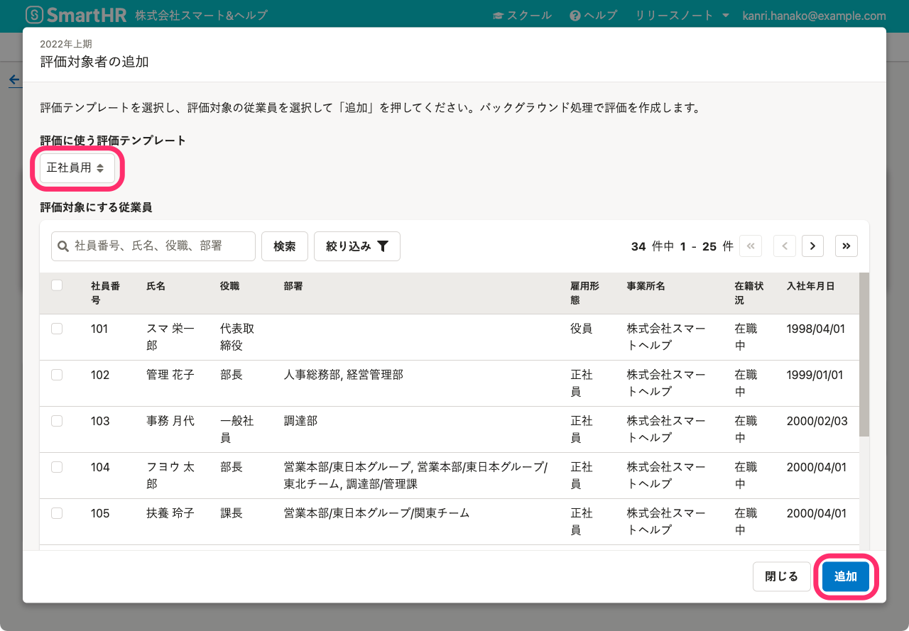
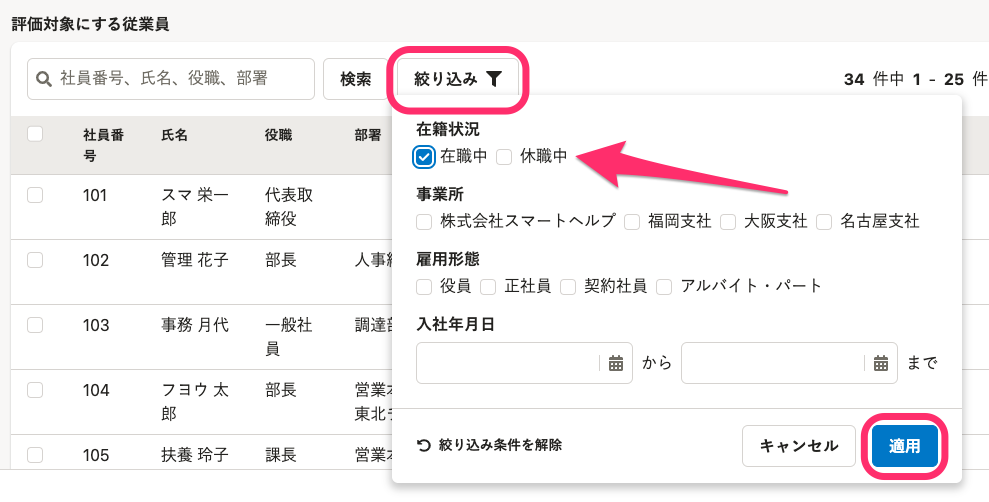

評価プロジェクト詳細画面で、評価対象者にしたい従業員を追加する手順を説明します。

# 評価を作成するには？

評価プロジェクトに評価対象者になる従業員を追加すると、従業員ごとの評価が作成され、評価一覧に追加されます。

[評価プロジェクトを作成](https://knowledge.smarthr.jp/hc/ja/articles/4407126854553-%E8%A9%95%E4%BE%A1%E3%83%97%E3%83%AD%E3%82%B8%E3%82%A7%E3%82%AF%E3%83%88%E3%82%92%E7%AE%A1%E7%90%86%E3%81%99%E3%82%8B#toc--2)し、[評価テンプレートの取り込みとスケジュール設定](https://knowledge.smarthr.jp/hc/ja/articles/4408433101593)を終えると、評価対象者を追加できるようになります。

# 評価対象者の追加方法は2種類

評価対象者の追加方法は2種類あります。

1.  従業員1人ずつ検索して追加する
2.  社員番号を使って従業員を一括追加する

このページでは、従業員1人ずつ検索して追加する手順を紹介します。

:::related
[評価対象者を一括追加する](https://knowledge.smarthr.jp/hc/ja/articles/4407128548889)
:::

# 1.［評価対象者の追加 ］>［従業員を検索して追加］をクリック

 **［評価プロジェクト］** 詳細画面で、評価一覧の上にある **［評価対象者の追加］** をクリックのうえ **［従業員を検索して追加］** をクリックして、 **［評価対象者の追加］** 画面を表示します。

# 2.評価対象にする従業員にチェックを入れて［追加］をクリック

**評価対象者は評価テンプレートごとに追加**します。

 **［評価対象者の追加］** 画面で、 **［評価に使う評価テンプレート］** （評価プロジェクトに取り込み済みのテンプレートがプルダウンメニューに表示されます）を選択します。

従業員リストから評価対象者にしたい従業員に**チェック**を入れて、 **［追加］** をクリックすると、バックグラウンド処理で評価を作成します。

:::tips
### 休職中の従業員を追加するには？
評価対象者の追加画面で表示される従業員リストは、初期値として **［在職中］** の従業員を絞り込んで表示しています。（SmartHR基本機能の従業員リスト同様）
在籍状況が、操作日時点で **［休職中］** の従業員を追加するには、 **［絞り込み］** をクリックし、 **［休職中］** にチェックを入れて **［適用］** をクリックすると、リストに表示されます。

:::
