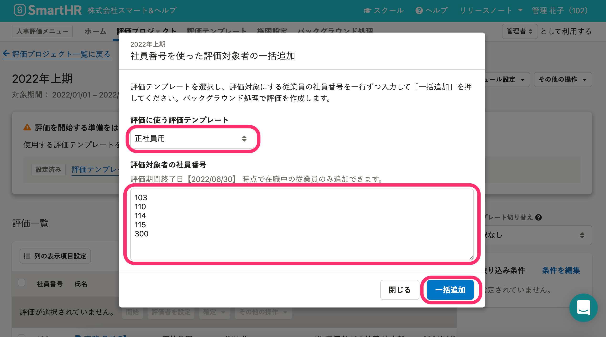

評価プロジェクト詳細画面で、評価対象者にしたい従業員を一括追加する手順を説明します。

# 評価を作成するには？

評価プロジェクトに評価対象者になる従業員を追加すると、従業員ごとの評価が作成され、評価一覧に追加されます。

[評価プロジェクトを作成](https://knowledge.smarthr.jp/hc/ja/articles/4407126854553-%E8%A9%95%E4%BE%A1%E3%83%97%E3%83%AD%E3%82%B8%E3%82%A7%E3%82%AF%E3%83%88%E3%82%92%E7%AE%A1%E7%90%86%E3%81%99%E3%82%8B#toc--2)し、[評価テンプレートの取り込みとスケジュール設定](https://knowledge.smarthr.jp/hc/ja/articles/4408433101593)を終えると、評価対象者を追加できるようになります。

# 評価対象者の追加方法は2種類

評価対象者の追加方法は2種類あります。

1.  従業員1人ずつ検索して追加する
2.  社員番号を使って従業員を一括追加する

このページでは、社員番号を使って一括追加する手順を紹介します。

:::related
[評価プロジェクトに従業員を追加する](https://knowledge.smarthr.jp/hc/ja/articles/4407446089497)
:::

# 1.［評価対象者の追加］>［社員番号を使って追加］をクリック

 **［評価プロジェクト］** 詳細画面で、評価一覧の上にある **［評価対象者の追加］** をクリックのうえ **［社員番号を使って追加］** をクリックして、 **［社員番号を使った評価対象者の一括追加］** 画面を表示します。

# 2\. 評価テンプレートを選択し、社員番号を入力して、［一括追加］をクリック

**評価対象者は評価テンプレートごとに追加します。**

 **［社員番号を使った評価対象者の一括追加］** 画面で、 **［評価に使う評価テンプレート］** （評価プロジェクトに取り込み済みのテンプレートがプルダウンメニューに表示されます）を選択します。

 **［評価対象者の社員番号］** のテキストエリアに、評価対象者にしたい従業員の社員番号を一行ずつ入力し、 **［一括追加］** をクリックすると、バックグラウンド処理で評価を作成します。

:::tips
### 社員番号リストは、従業員リストのダウンロード機能を利用すると便利です
社員番号は、SmartHR基本機能の「従業員リスト」のダウンロードファイルからコピーアンドペーストすると便利です。

従業員リストの操作とデータのダウンロードについては、下記のヘルプページを参照してください。
- [フィルタ機能を使って、条件に合致する従業員リストを表示させる](https://knowledge.smarthr.jp/hc/ja/articles/360040965373)
- [従業員情報、家族情報の登録データをダウンロードする](https://knowledge.smarthr.jp/hc/ja/articles/360026106394)
:::
