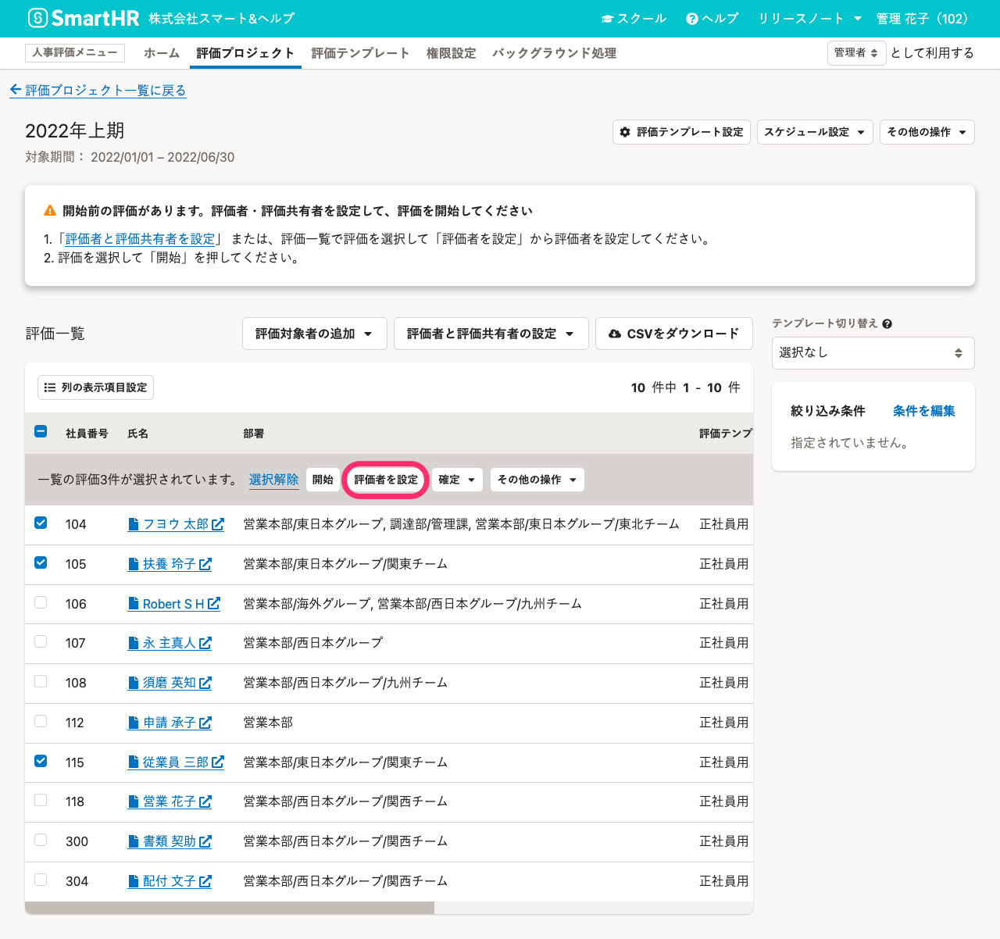
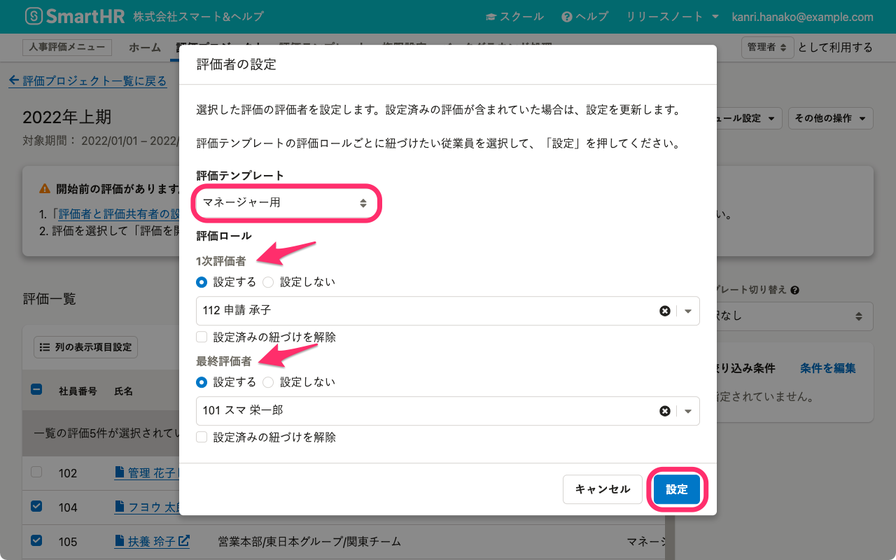

評価プロジェクト詳細画面で、評価者にしたい従業員を設定する手順を説明します。

# 評価対象者の設定方法は2種類

評価者の設定方法は2種類あります。

1.  評価対象者ごとに設定する
2.  CSVファイルを使って一括設定する

このページでは、評価対象者ごとに設定する手順を紹介します。

:::related
[評価者と評価共有者を設定する](https://knowledge.smarthr.jp/hc/ja/articles/4407133726745)
:::

# 1\. 評価を選択し、［評価者を設定］をクリック

**同じ評価ロールに同じ従業員を設定したい評価はまとめて設定できます。**

 **［評価プロジェクト］** 詳細画面の評価一覧で、評価者を設定したい評価にチェックを入れます。

上にある **［評価者を設定］** をクリックして、 **［評価者の設定］** 画面を表示します。

# 2\. 評価者にする従業員を選択して［設定］をクリック

 **［評価者の設定］** 画面で、 **［評価テンプレート］** （評価プロジェクトに取り込み済みのテンプレートがプルダウンメニューに表示されます）を選択します。

 **［評価ロール］** に表示された評価ロールごとに **［設定する］** を選択して、従業員を選択します。（ **選択できる従業員は評価ロールごとに1人だけです。）** 

 **［設定］** をクリックすると、バックグラウンド処理で評価者を設定します。

:::tips
### 評価者の従業員を削除するには？
 **［評価者の設定］** 画面で、設定を削除したい評価ロールのみ **［設定する］** を選択して、 **［設定済みの紐づけを解除］** にチェックを入れて **［設定］** をクリックします。
:::
