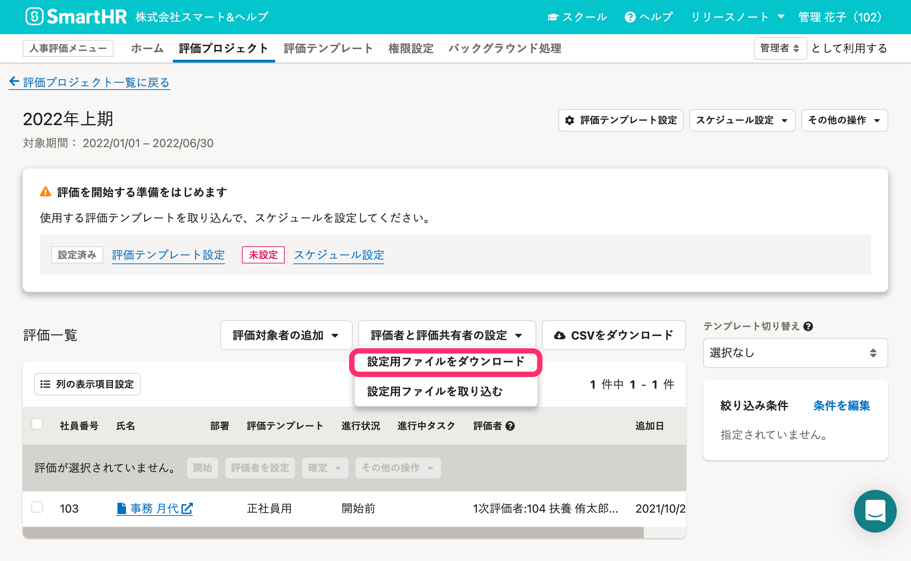
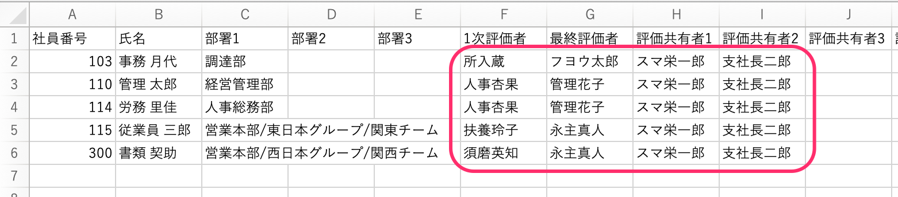
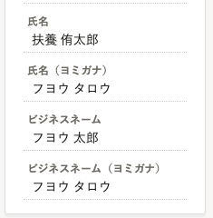
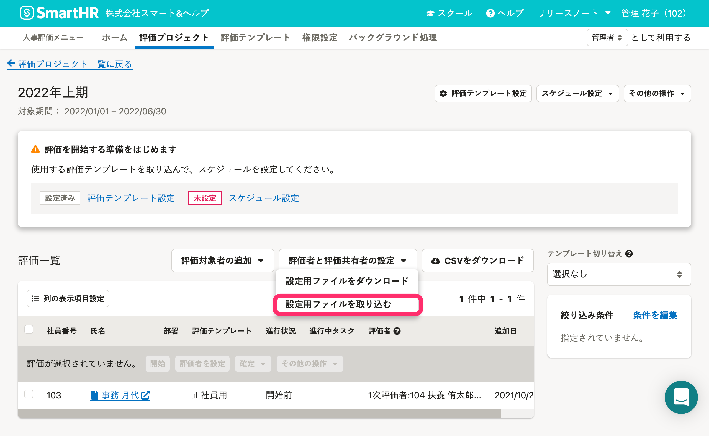
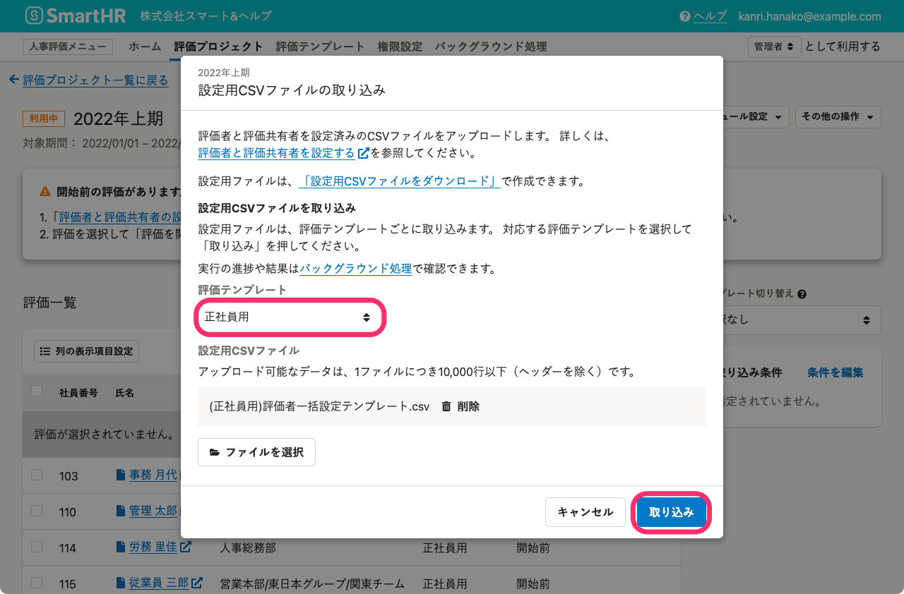
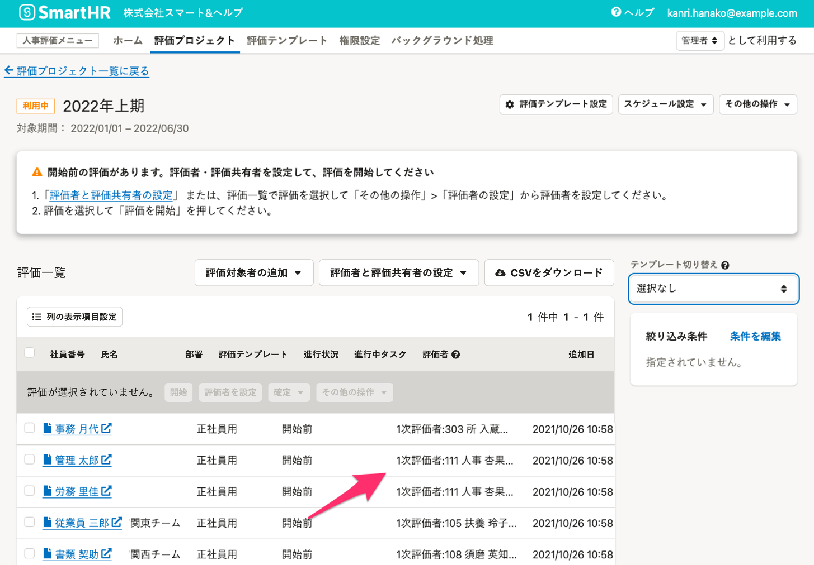
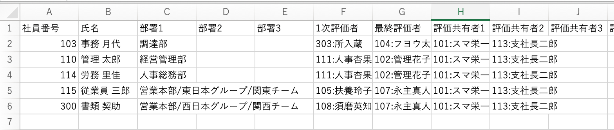
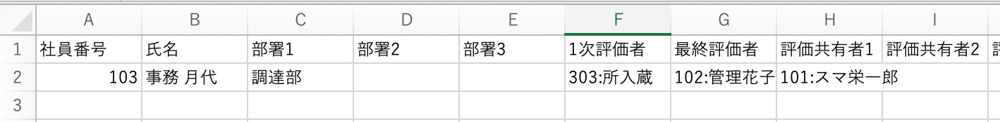

評価プロジェクト詳細画面で、評価者と評価共有者の一括設定・一括更新に使う設定ファイルの入手方法と、一括設定ならびに一括更新する手順を説明します。

# 評価共有者とは

フェーズに関わらず、終始、任意の評価対象者の評価シートを閲覧できる従業員のことです。閲覧範囲の設定はできません。

また、タスクを担当しないため、評価シートの内容の承認や差し戻しもできません。

:::alert
同じ評価内で、評価ロールと評価共有者を一人の従業員が掛け持つことはできません。
:::

# 評価者と評価共有者の設定用CSVファイルをダウンロードする

## 1.［評価者と評価共有者の設定］>［設定用ファイルをダウンロード］をクリック

 **［評価プロジェクト］** 詳細画面で、評価一覧の上にある **［評価者と評価共有者の設定］** ボタンをクリックのうえ **［設定用ファイルをダウンロード］** をクリックして、 **［設定用CSVファイルのダウンロード］** 画面を表示します。

## 2.［設定用CSVファイルの作成］をクリック

 **［設定用CSVファイルのダウンロード］** 画面で、 **［設定用CSVファイルを作成］** をクリックすると、評価者・評価共有者一括設定用ファイルの作成を受け付けます。

ファイルはバックグラウンド処理で作成されます。

## 3.［バックグラウンド処理］一覧から、CSVファイルをダウンロード

 **［バックグラウンド処理］** 一覧画面に移動して、処理名 **［評価者・評価共有者一括設定用ファイルの作成］** の行にある **［  ダウンロード］** をクリックすると、ZIPファイルをダウンロードします。

# 評価者と評価共有者を一括設定する

## 1\. ダウンロードした設定用CSVファイルを編集

ダウンロードしたZipファイルを展開します（[文字化けを防ぐため、OS標準の機能をご使用ください](https://knowledge.smarthr.jp/hc/ja/articles/360026265053)）。

設定用CSVファイルは**評価テンプレートごと**に作成され、評価対象者の社員番号、氏名（ビジネスネームを優先表示します）、部署のデータが記入してあります。

B列の評価対象者の氏名を確認し、F列目以降のヘッダーに記載されている評価者、評価共有者に紐付けたい従業員の氏名を入力してください。

:::tips
### ビジネスネームを使用している場合
人事評価では、従業員情報にビジネスネームの登録がある場合、**ビジネスネームを氏名として扱います**。
ビジネスネームの登録がある従業員は、**設定時にもビジネスネームを使用しないとエラーになる**ので気をつけてください。

### 評価者・評価共有者に同姓同名の従業員が在職している場合
同姓同名の従業員が在職している場合には、同じセルの中に「**000:姓 名**」のように社員番号と氏名を : でつないで入力してください。
:::
:::related
[Q. 展開（解凍）したファイル名が文字化けしてしまったら？](https://knowledge.smarthr.jp/hc/ja/articles/360026265053)
[Q. 設定ファイルから、社員番号の先頭の「0」が消えてしまう場合はどうすれば良いですか？](https://knowledge.smarthr.jp/hc/ja/articles/360026107354/)
:::

## 2.［評価者と評価共有者の設定］>［設定用ファイルを取り込む］をクリック

編集した設定ファイルをアップロードします。

 **［評価プロジェクト］** 詳細画面で、評価一覧の上にある **［評価者と評価共有者の設定］** ボタンをクリックのうえ **［設定用ファイルを取り込む］** をクリックして、 **［設定用CSVファイルの取り込み］** 画面を表示します。

## 3\. 評価テンプレートを選択し、［取り込み］をクリック

 **［設定用CSVファイルの取り込み］** 画面で、**評価で使っている評価テンプレートを選択**のうえ、ファイルをアップロードして **［取り込み］** をクリックすると、評価者・評価共有者の一括設定を受け付けます。

評価者と評価共有者の設定はバックグラウンド処理で実行されます。

設定が終わると、 **［評価一覧］** に表示されます。

# 評価者と評価共有者を一括変更する

## 1\. 設定用ファイルをダウンロードする

 **［評価プロジェクト］** 詳細画面の **［設定用ファイルをダウンロード］** ボタンからCSVファイルを作成し、ダウンロードします。

## 2\. 変更する場合はセルを上書き、削除する場合はセルを空白に

設定用CSVファイルには、評価対象者の社員番号、氏名（ビジネスネームを優先表示します）、部署と、**設定済みの評価者、評価共有者**のデータが入力されています。

評価者、評価共有者それぞれのセルを更新します。

- 変更したい場合は、セルを**上書き**
- 削除したい場合は、セルを**空白**

:::tips
一括変更に使用する設定用ファイルは、評価者・評価共有者を変更したい評価の行だけを残して編集したものを使用しても構いません。

:::

## 3\. 編集した設定用ファイルを取り込む

 **［評価プロジェクト］** 詳細画面の **［設定用ファイルを取り込む］** ボタンからCSVファイルを取り込みます。

設定が終わると、 **［評価一覧］** に表示されます。
