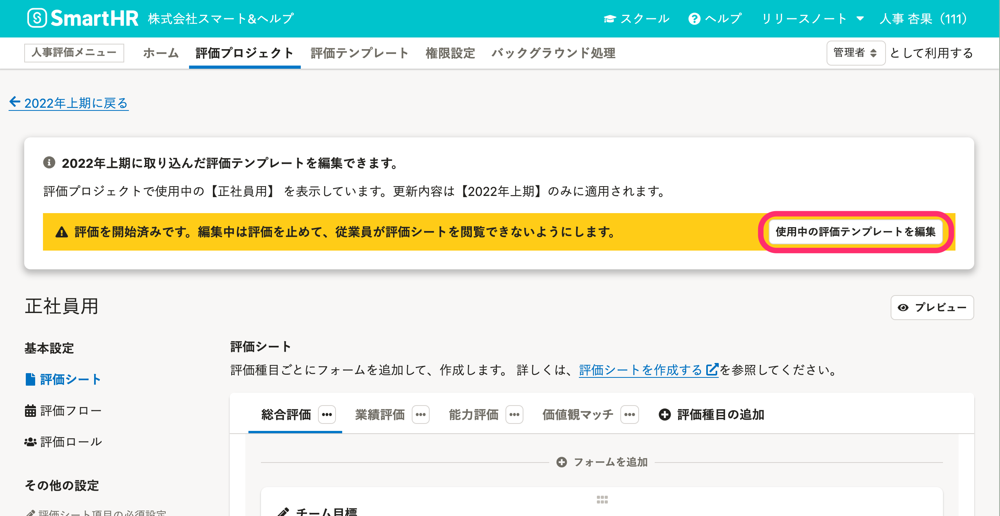
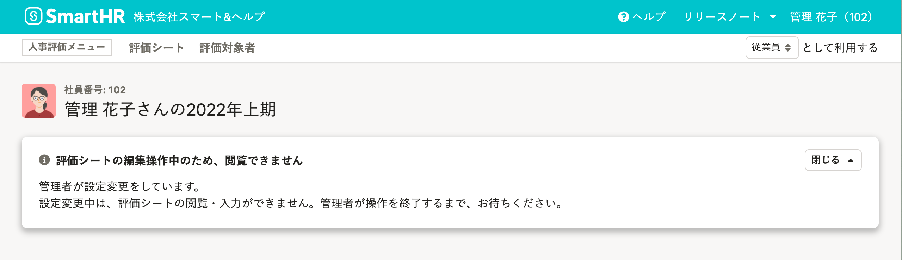
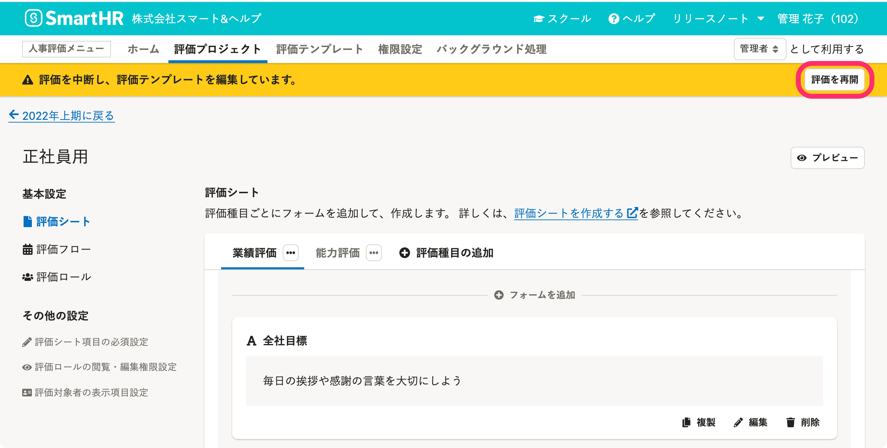
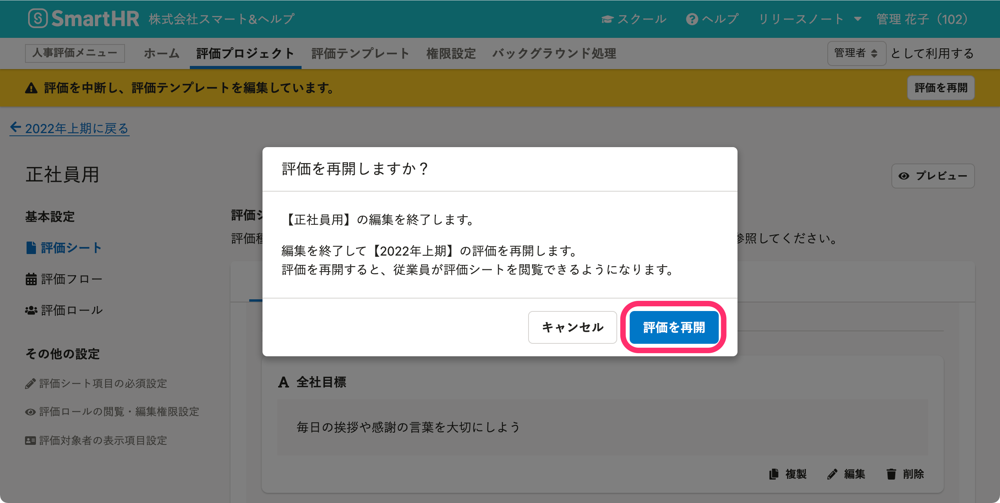

 **［評価プロジェクト詳細画面］** で、取り込み済み評価テンプレートを編集する手順を説明します。

# 1\. 評価プロジェクト詳細画面で［ 評価テンプレート設定］をクリック

 **［評価プロジェクト詳細］** 画面右の **［ 評価テンプレート設定］** をクリックして、 **［評価テンプレート設定］** 画面を表示します。

# 2\. 取り込んだ評価テンプレート一覧の、［ 編集］をクリック

 **［評価テンプレート設定］** 画面の **［取り込んだ評価テンプレート一覧］** の中から、編集したい評価テンプレートの **［ 編集］** をクリックすると、評価プロジェクト詳細画面とは別の新しいタブにテンプレート編集画面が表示されます。

# 3\. 別タブに表示されたテンプレート編集画面を操作

別タブに表示されたテンプレート編集画面を操作します。

編集操作は、[評価ロールを作成する](https://knowledge.smarthr.jp/hc/ja/articles/4406859637657)、[評価フローを作成する](https://knowledge.smarthr.jp/hc/ja/articles/4407059455641)、[評価シートを作成する](https://knowledge.smarthr.jp/hc/ja/articles/4407133507481)の各ページを参照してください。

:::tips
## 評価の開始前は、評価テンプレートと同様にすべての項目を更新できます。
ただし、変更内容は取り込み済みテンプレートだけに反映されます。
評価テンプレートにも編集内容を反映させたい場合は、取り込み済み評価テンプレートは削除して、編集した評価テンプレートを再度取り込んでください。
:::

# 評価の開始後に評価テンプレートを編集する

すでに評価を開始済みの場合、評価シートを利用している従業員に影響がでないように操作を制限しています。

## 3-1. ［使用中の評価テンプレートを編集］をクリック

編集しようとしている評価テンプレートを使った評価がすでに開始済みの場合は、 **［評価を開始済みです。編集中は評価を止めて、従業員が評価シートを閲覧できないようにします。］** というアラートが表示されます。

 **［使用中の評価テンプレートを編集］** をクリックすると、**評価を中断して**、評価テンプレートを編集できるようになります。

編集操作中は、画面上部に黄色の帯と **［評価を中断し、評価テンプレートを編集しています。］** と表示されます。

この表示は［**使用中の評価テンプレートを編集**］をクリックした管理者以外のすべての管理者に表示されます。

### テンプレート編集中に従業員に表示される画面

編集中は、従業員は評価シートを閲覧できません。

評価シートを開くと **［評価シートの編集操作中のため、閲覧できません］** と表示されます。

## 3-2. 編集を終えたら、［評価を再開］をクリック

編集を終えたら、 **［評価を再開］** をクリックします。

 **［評価を再開しますか？］** という確認画面が表示されるので、 **［評価を再開］** をクリックします。

## 評価開始後に評価テンプレート編集で操作できる項目

評価開始後に評価テンプレート編集をして設定内容を更新できる項目は以下の通りです。

**評価ロールの設定は、評価開始後は更新できません。**

### 評価シートの編集

- **評価種目の並び替え**
- **フォームの並び替え**

- **評価シートへの項目追加**
    - 評価種目
    - テキスト入力フォーム
    - 数値入力フォーム
    - 選択肢入力フォーム
    - 固定テキストフォーム
    - ファイル添付フォーム
    - 表組み

- **追加済み項目の編集**
    - 評価種目名
    - フォームの種類の変更
        - ただし、従業員がすでに評価シートに記入していた場合には、編集できないようになります。
    - テキスト入力フォームの各項目（項目名、説明、入力できる行数、入力できる文字数）
    - 数値入力フォーム（項目名、説明、入力できる数値）
    - 選択肢入力フォーム（項目名、説明、選択肢の項目）
        - ただし、従業員がすでに評価シートに記入していた場合には、 **［従業員がすでに記入済みのため、選択肢の設定方法、並べ替え、項目の編集はできません。］** と表示され、**選択肢の項目は編集できない**ようになります。
    - 固定テキストフォーム（項目名、説明、埋め込みテキスト）
    - ファイル添付フォーム（項目名、説明、ファイル）
    - 表組み
        - 表組みのセルに配置した各フォームの編集できる条件は、項目ごとに適用されます。

-  **追加済み入力フォームの削除（** ただし、従業員がすでに評価シートに記入していた場合には、 **［従業員がすでに記入済みのため、〇〇は削除できません。］** と表示され、削除できないようになります。）
    - 評価種目名
    - テキスト入力フォーム
    - 数値入力フォーム
    - 選択肢入力フォーム
    - 表組みのセルに配置した入力フォーム

- **追加済み表示フォームの削除**
    - 固定テキストフォーム
    - ファイル添付フォーム

- **評価シート項目の必須設定**

- **評価ロールの閲覧・編集権限設定**

- **評価対象者の表示項目設定**

:::related
[【一覧】評価開始後に、編集できる評価シートの項目](https://knowledge.smarthr.jp/hc/ja/articles/4415764299673/)
:::

### 評価フローの編集

- フェーズ名
- タスク
    - タスク名
    - 説明
    - 差し戻し先

**フェーズの追加・削除、タスクの追加・削除はできません。**
