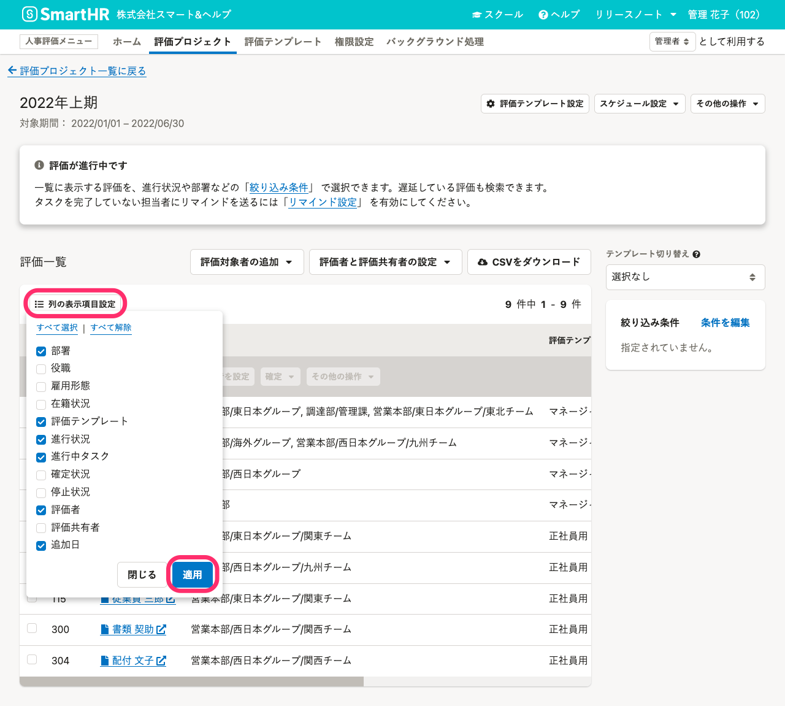
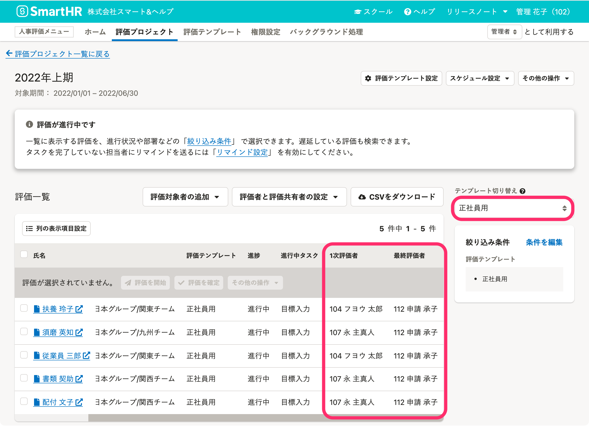

評価プロジェクト画面の［評価一覧］の使い方を説明します。

# 評価一覧とは

評価一覧とは、従業員ごとの評価のリストです。

評価は評価テンプレートごとに作成されるので、同じ従業員の評価が複数表示されるケースもあります。

# 評価一覧の表示を切り替える

評価一覧で表示する項目を設定できます。

## 評価一覧の表示項目

- 部署
- 役職
- 雇用形態
- 在籍状況
- 評価テンプレート
- 進行状況
- 進行中タスク
- 確定状況
- 停止状況
- 評価者
- 評価共有者
- 追加日

## 設定方法

評価一覧上部の **［列の表示項目設定］** をクリックして、表示したい項目名にチェックを入れて **［適用］** をクリックしてください。

:::tips
### 評価者の表示を「1次評価者」「最終評価者」など作成した評価ロール別に表示するには？
評価一覧の表示項目に評価ロール名を表示するには、一覧に表示する評価をテンプレートごとにする必要があります。
評価一覧の右側にある **［テンプレート切り替え］** のプルダウンリストから任意の評価テンプレート名を選択してください。

:::

# 評価一覧に表示する評価を絞り込む

評価一覧にフィルタを適用して、表示する評価を変更できます。

## 絞り込み条件

- 評価テンプレート
- 評価の状態
    - 進行状況
    - 進行中のタスク（期限が過ぎたタスク、タスクを指定）
    - 確定状況
    - 停止状況
- 評価対象者
    - 社員番号
    - 氏名
    - 事業所
    - 部署
    - 役職
    - 雇用形態
    - 在籍状況
- 評価者氏名
- 評価共有者氏名

## 設定方法

評価一覧の右側にある **［絞り込み条件］** の **［条件を編集］** をクリックして、 **［絞り込み条件の設定］** 画面を表示します。

任意の条件を設定して **［適用］** をクリックしてください。
