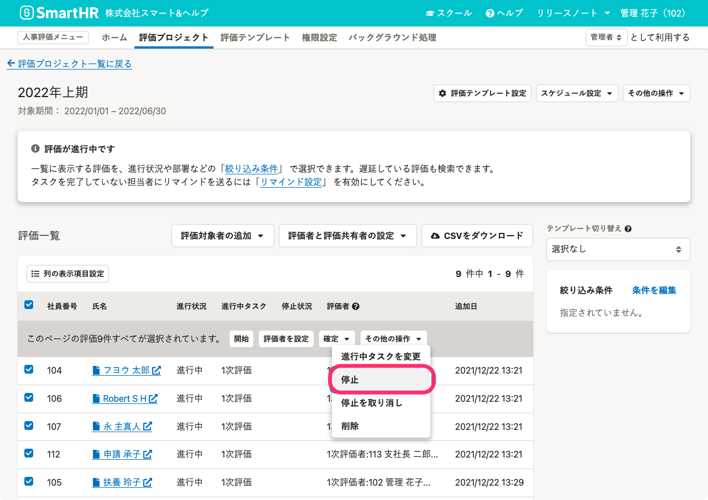
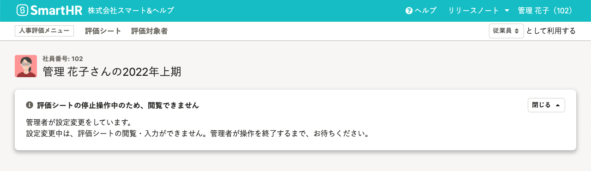
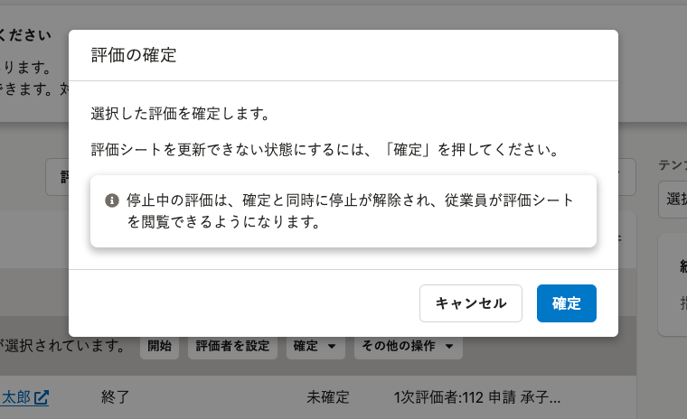

評価シートを一時的に編集できないようにする手順について説明します。

# 評価の停止とは

人事評価機能では、**進行中の評価を停止して、一時的に従業員が評価を操作できない状態にすること**を評価の停止といいます。

すべての評価を終えた後に評価シートのデータをロックする場合には、評価の確定をしてください。

:::related
[評価を確定する](https://knowledge.smarthr.jp/hc/ja/articles/4407450170905)
:::

## 評価の停止状況

評価一覧で評価の停止状況を表示するには、 評価一覧上部の **［列の表示項目設定］** で **［停止状況］** を選択してください。

評価が停止している場合には **［停止中］** と表示され、停止していない場合には何も表示されません。

評価一覧の表示項目の設定は、[評価一覧の使い方](https://knowledge.smarthr.jp/hc/ja/articles/4407446105497)を参照してください。

# 評価を停止する

## 1\. 評価一覧で停止したい評価を選択し、［停止］をクリック

画面上部 **［人事評価メニュー］** の **［評価プロジェクト］** をクリックすると **［評価プロジェクト］** 画面が表示されます。任意の評価プロジェクトをクリックすると、 **［評価プロジェクト詳細］** 画面が表示されます。

 **［評価一覧］** で停止したい評価にチェックを入れます。

 **［その他の操作  ］** をクリックして、プルダウンリストから **［停止］** をクリックします。

## 2\. 確認画面で［停止］をクリック

 **［評価を停止しますか？］** という確認画面で、 **［停止］** をクリックすると、評価が停止されます。

評価が停止されている間、従業員は評価シートを閲覧、編集できません。

### 停止中に従業員に表示される画面

停止中は、従業員は評価シートを閲覧できません。

評価シートを開くと **［評価シートの停止操作中のため、閲覧できません］** と表示されます。

:::alert
### 停止中の評価を確定すると、従業員が閲覧できるようになります
評価の確定をすると、評価の停止状態は解除されます。
評価の一括更新のために評価を停止していた場合、評価の停止中であっても確定をすると同時に、従業員が評価シートを閲覧できるようになるため、注意してください。

:::

# 評価の停止を解除する

## 1\. 評価一覧で停止を解除したい評価を選択し、［停止を取り消し］をクリック

 **［評価一覧］** で停止を解除したい評価にチェックを入れます。

 **［その他の操作  ］** をクリックして、プルダウンリストから **［停止を取り消し］** をクリックします。

## 2\. 確認画面で、［取り消し］をクリック

 **［評価停止を取り消しますか？］** という確認画面で、 **［取り消し］** をクリックすると停止が解除され、評価シートを閲覧、編集できるようになります。
