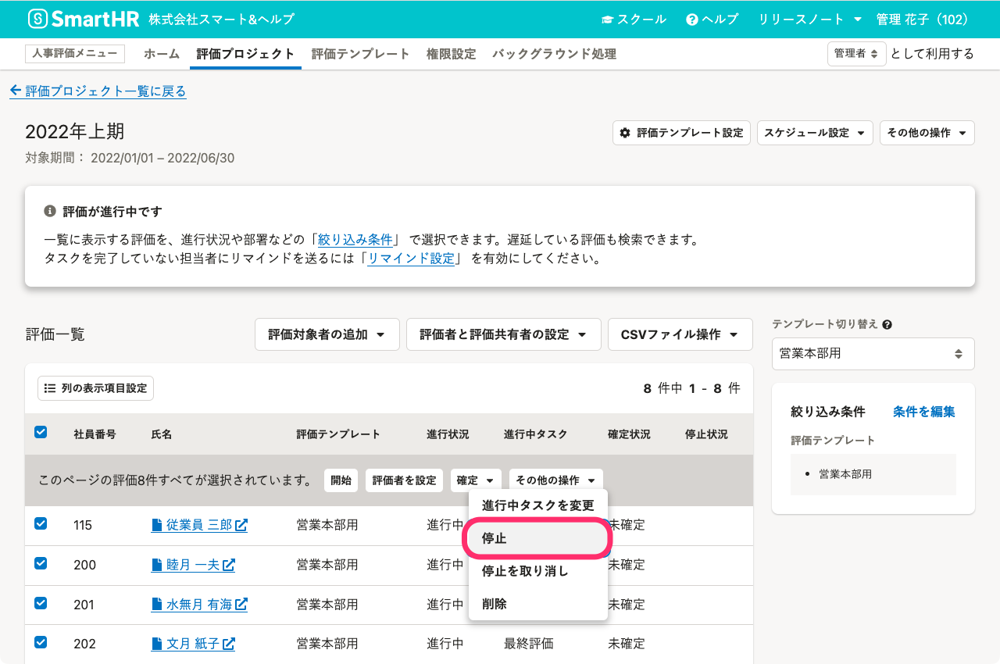
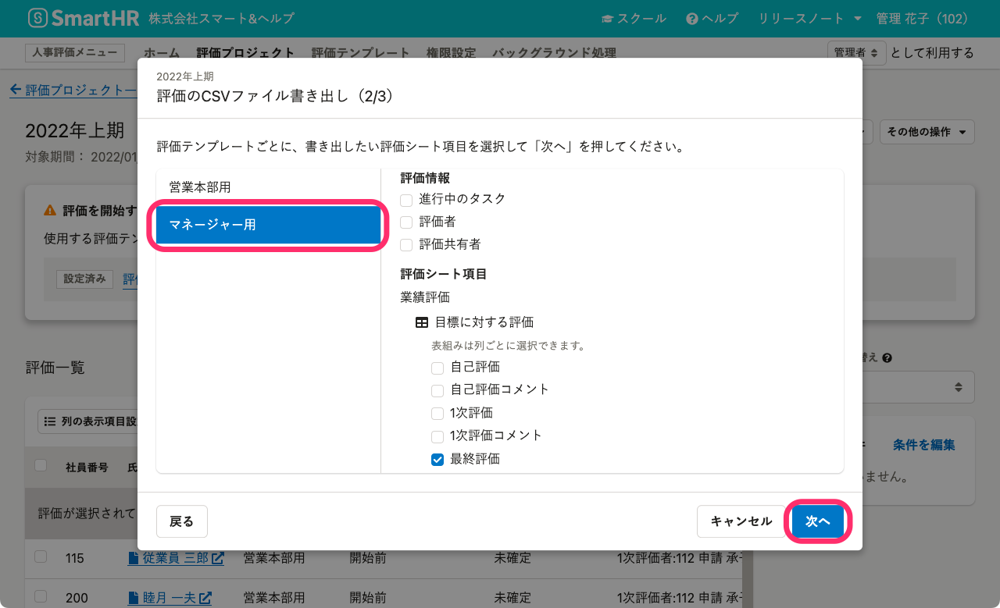
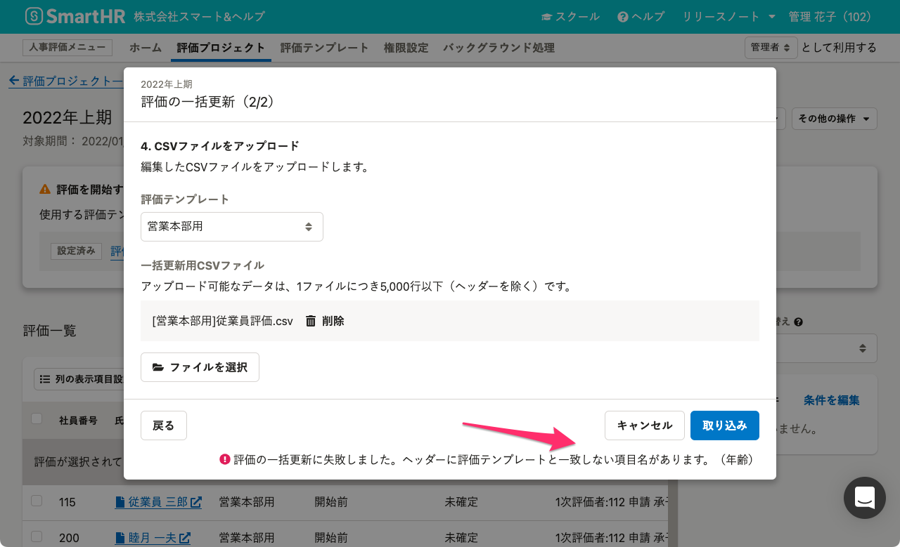
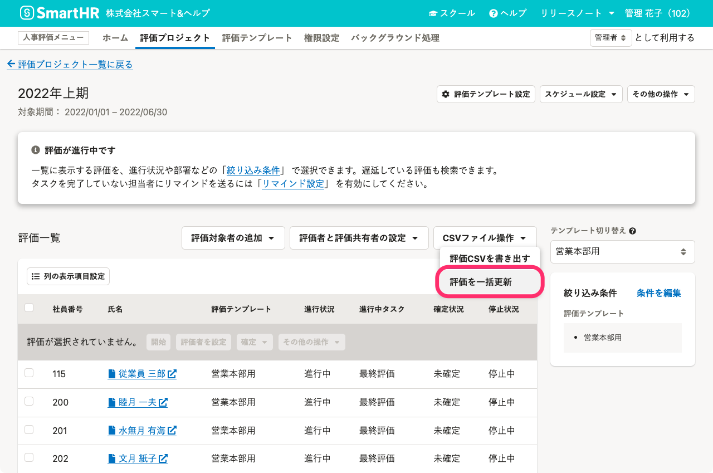
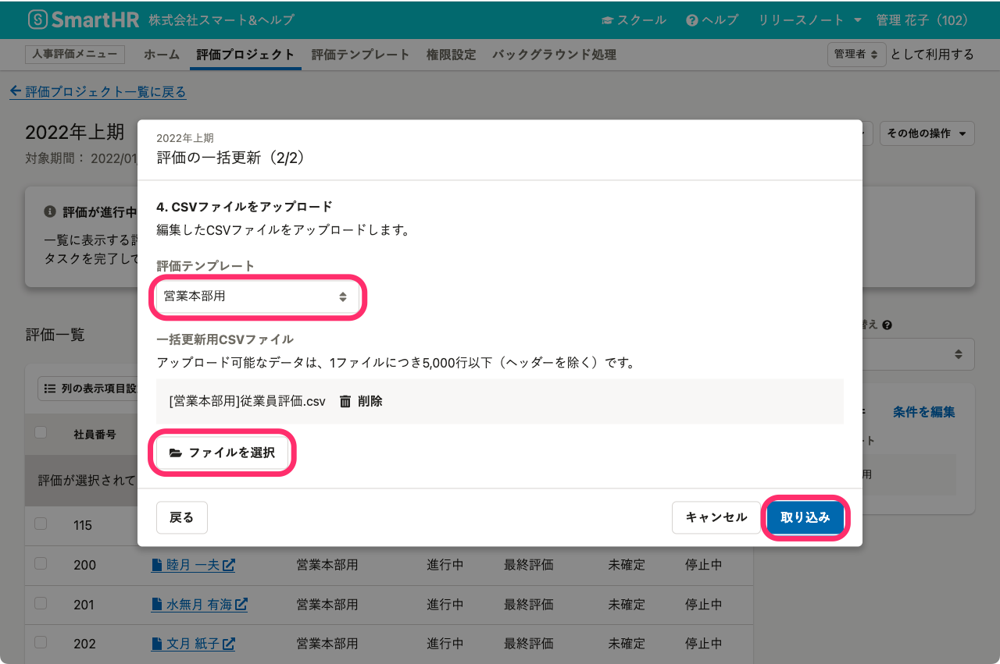

 **［評価プロジェクト］** 画面で、CSVファイルを使って複数の評価をまとめて更新する手順を説明します。

CSVファイルで更新できる内容については、[【一覧】CSVファイルを使って一括更新できる評価シートのフォーム](https://knowledge.smarthr.jp/hc/ja/articles/5072694277913)で確認してください。

# 1\. 更新したい評価を選択して、［停止］

 **［評価プロジェクト］** 画面で任意の評価プロジェクトをクリックすると、 **［評価プロジェクト詳細］** 画面が表示されます。

 **［評価一覧］** で更新したい評価にチェックを入れた状態で **［その他の操作  ］** をクリックして、ドロップダウンリストから **［停止］** をクリックします。

 **［評価を停止しますか？］** という確認画面で、 **［停止］** をクリックすると、評価が停止されます。

評価が停止されている間、従業員は評価シートを閲覧、編集できません。

:::related
[評価を停止する](https://knowledge.smarthr.jp/hc/ja/articles/4550865934873)
:::

# 2.［CSVファイル操作］>［評価CSVを書き出す ］をクリック

評価一覧の右上にある **［CSVファイル操作  ］** をクリックして、ドロップダウンリストから **［評価CSVを書き出す］** をクリックすると、 **［評価のCSVファイル書き出し］** 画面が表示されます。

# 3\. 更新したい評価シート項目を選択して［書き出し］をクリック

 **［評価のCSVファイル書き出し］** 画面で、一括更新用ファイルを作成します。

 **［評価のCSVファイル書き出し（1/3）］** 画面で、**更新したい評価が使っている評価テンプレート**を選択して **［次へ］** をクリックします。

 **［評価のCSVファイル書き出し（2/3）］** 画面で、左サイドバーに表示された**評価テンプレート名**を選択のうえ、**評価テンプレートごとに**更新したい **［評価シート項目］** を選択して **［次へ］** をクリックします。

 **［評価のCSVファイル書き出し（3/3）］** 画面で、 **［書き出し］** をクリックすると、バックグラウンド処理で評価CSVの書き出しを受け付けます。

:::alert
社員番号と氏名以外の従業員項目も書き出せますが、**社員番号、氏名以外の従業員項目が記入されているCSVファイルは評価の一括更新には使用できません**。
従業員情報を修正する場合は、SmartHR基本機能を使用してください。詳しくは、[従業員情報を個別に更新する](https://knowledge.smarthr.jp/hc/ja/articles/360036957193)を参照してください。

:::

# 4\. バックグラウンド処理一覧で［ ダウンロード］をクリック

 **［バックグラウンド処理］** 画面で、 **［評価CSVの書き出し］** の列の **［ ダウンロード ］** をクリックすると、ZIPファイルがダウンロードされます。

# 5\. CSVファイルを編集

ZIPファイルを解凍し、CSVファイルを編集します。

:::alert
一括更新前のバックアップとして、編集前の評価CSVファイルを残しておくことを推奨します。
:::

CSVファイルの行は並べ替えても一括更新できます。ただし、ヘッダーは1行目のまま変更しないでください。また、社員番号、氏名の列は削除しないでください。

:::related
[Q. 展開（解凍）したファイル名が文字化けしてしまったら？](https://knowledge.smarthr.jp/hc/ja/articles/360026265053)
[Q. CSVファイルをExcelで開くと、社員番号の先頭の「0」が消えてしまう場合はどうすれば良いですか？](https://knowledge.smarthr.jp/hc/ja/articles/360026107354)
:::

# 6.［CSVファイル操作］>［評価を一括更新］をクリック

 **［評価プロジェクト詳細］** 画面で、評価一覧の右上にある **［CSVファイル操作  ］** をクリックして、ドロップダウンリストから **［評価を一括更新］** をクリックすると、 **［評価の一括更新］** 画面が表示されます。

# 7\. 評価テンプレートを選択し、CSVファイルを選択して［取り込み］をクリック

 **［評価の一括更新］** 画面で、更新したい評価が使っている評価テンプレートを選択し、一括更新用CSVファイルを選択して、 **［取り込み］** をクリックすると、バックグラウンド処理で評価の一括更新を受け付けます。

 **［バックグラウンド処理］** 画面で、 **［評価の一括更新］** の列に、 **「2022年上期の評価項目の一括更新が終了しました。」** のメッセージが表示されます。

# 8\. 評価一覧で停止を解除したい評価を選択し、［停止を取り消し］をクリック

 **［評価一覧］** で停止していた評価にチェックを入れます。

 **［その他の操作］** をクリックして、ドロップダウンリストから **［停止を取り消し］** をクリックします。

 **［評価停止を取り消しますか？］** という確認画面で、 **［取り消し］** をクリックすると停止が解除され、従業員が評価シートを閲覧、編集できるようになります。
