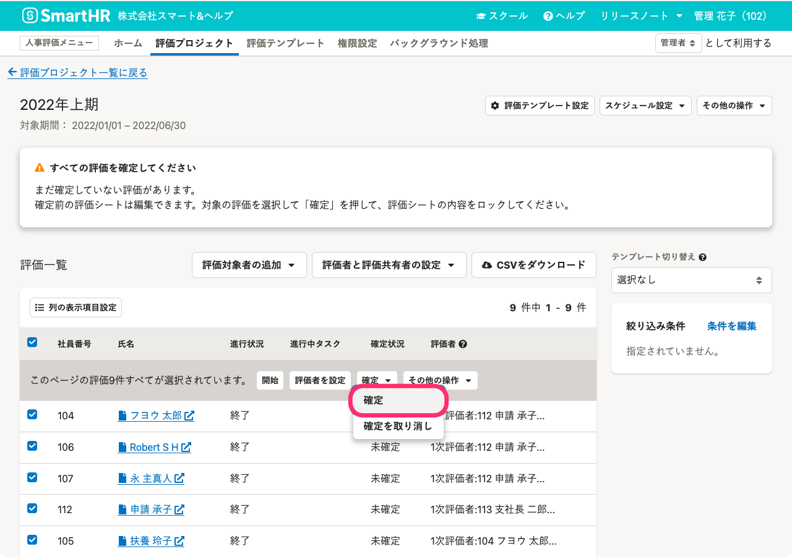
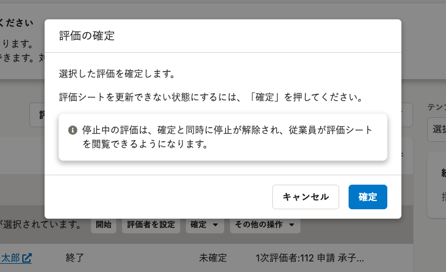

入力を終えた評価シートを編集できないようにする手順について説明します。

# 評価の確定とは

人事評価機能では、**評価シートのデータを更新できないようロックすること**を評価の確定といいます。

通常、すべてのタスク終了後に評価を確定しますが、確定の操作自体は、すべてのタスクを終了していない場合にも可能です。評価対象期間中に休職や退職をして、タスクを終えられなかった評価も確定できます。

一時的に従業員が評価シートを編集できないようにしたい場合には、評価の停止をしてください。

:::related
[評価を停止する](https://knowledge.smarthr.jp/hc/ja/articles/4550865934873/)
:::

## 評価の確定状況

評価一覧で評価の確定状況を表示するには、 評価一覧上部の **［列の表示項目設定］** で **［確定状況］** を選択してください。

評価の状態が、確定していない場合には **［未確定］** 、確定している場合には **［確定済み（確定した日付）］** と表示されます。

評価一覧の表示項目の設定は、[評価一覧の使い方](https://knowledge.smarthr.jp/hc/ja/articles/4407446105497)を参照してください。

# 評価を確定する

## 1\. 評価一覧で確定したい評価を選択し、［確定］をクリック

画面上部 **［人事評価メニュー］** の **［評価プロジェクト］** をクリックして **［評価プロジェクト一覧］** 画面を表示します。一覧から任意の評価プロジェクトをクリックして **［評価プロジェクト詳細］** 画面を表示します。

 **［評価一覧］** で確定したい評価にチェックを入れます。

 **［確定  ］** をクリックして、プルダウンリストから **［確定］** をクリックします。

## 2\. ［評価の確定］画面で、［確定］をクリック

 **［評価の確定］** 画面で、 **［確定］** をクリックすると、評価が確定されます。

:::alert
### 停止中の評価を確定すると、従業員が閲覧できるようになります
評価の確定をすると、評価の停止状態は解除されます。
評価の一括更新のために評価を停止していた場合、評価の停止中であっても確定をすると同時に、従業員が評価シートを閲覧できるようになるため、注意してください。

:::

# 評価の確定を解除する

## 1\. 評価一覧で確定を解除したい評価を選択し、［確定を取り消し］をクリック

 **［評価一覧］** で確定を解除したい評価にチェックを入れます。

 **［確定  ］** をクリックして、プルダウンリストから **［確定を取り消し］** をクリックします。

## 2.［評価確定の取り消し］画面で、［取り消し］をクリック

 **［評価確定の取り消し］** 画面で、 **［取り消し］** をクリックすると確定が解除され、評価シートを更新できるようになります。
