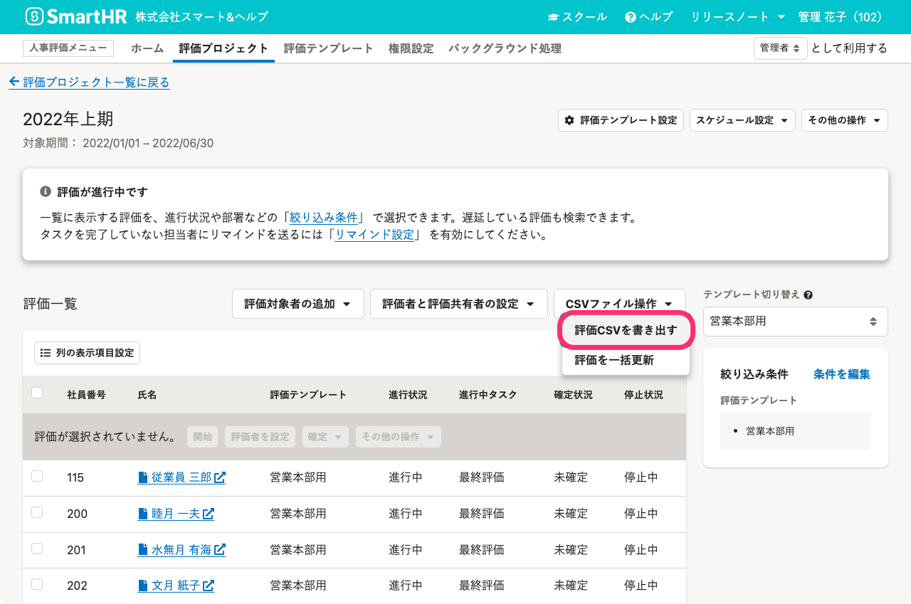
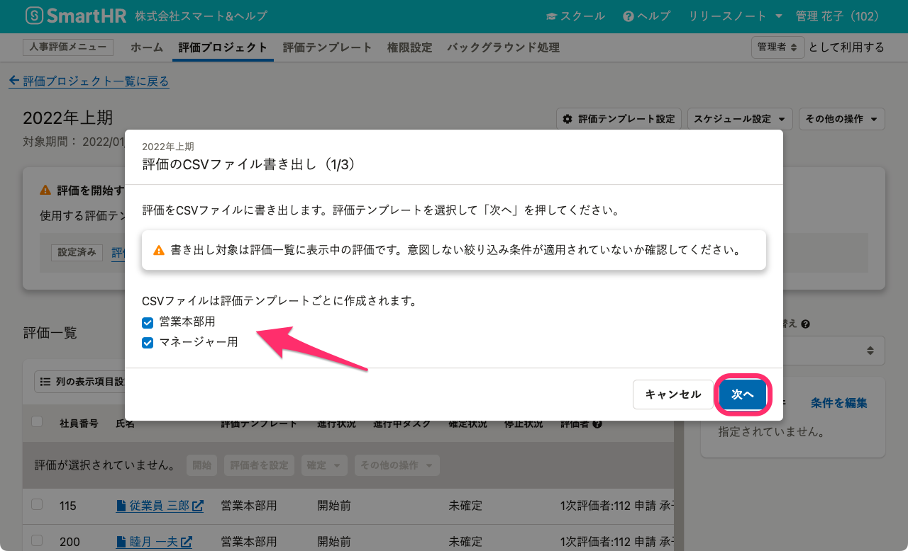
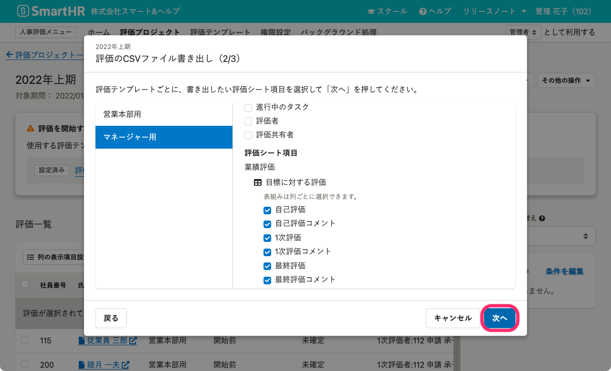
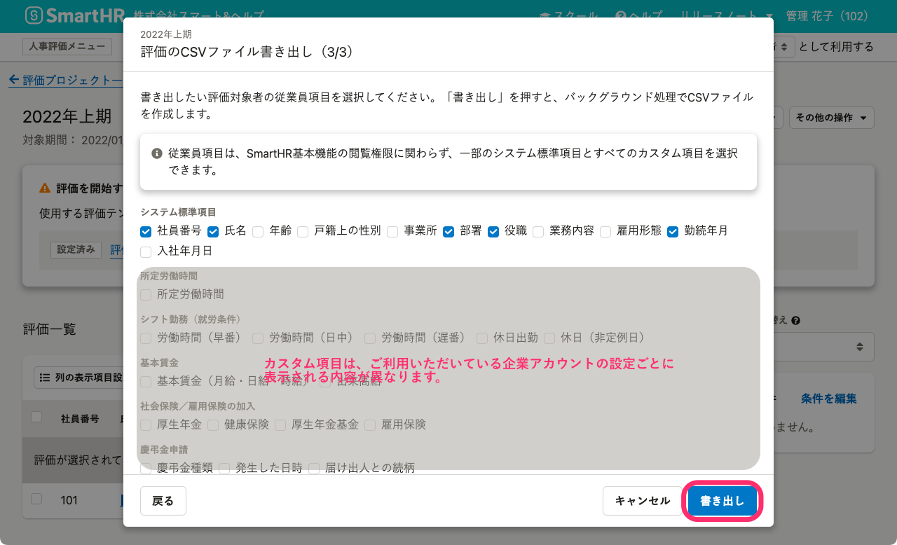

 **［評価プロジェクト］** 画面で、評価をCSVファイルとしてエクスポートする手順を説明します。

# 1.［CSVファイル操作］>［評価CSVを書き出す ］をクリック

 **［評価プロジェクト］** 画面で任意の評価プロジェクトをクリックすると、 **［評価プロジェクト詳細］** 画面が表示されます。

評価一覧の右上にある **［CSVファイル操作  ］** をクリックして、ドロップダウンリストから **［評価CSVを書き出す］** をクリックすると、 **［評価のCSVファイル書き出し］** 画面が表示されます。

# 2\. 評価テンプレートを選択して［次へ］をクリック

 **［評価のCSVファイル書き出し（1/3）］** 画面で、**書き出したい評価が使っている評価テンプレート**を選択して **［次へ］** をクリックします。

# 3\. 書き出したい評価シート項目を選択して［次へ］をクリック

 **［評価のCSVファイル書き出し（2/3）］** 画面で、左サイドバーに表示された**評価テンプレート名**を選択のうえ、評価テンプレートごとに書き出したい **［評価シート項目］** を選択して **［次へ］** をクリックします。

# 4\. 書き出したい従業員項目を選択して［書き出し］をクリック

 **［評価のCSVファイル書き出し（3/3）］** 画面で、 **［書き出し］** をクリックすると、バックグラウンド処理で評価のCSVファイル書き出しを受け付けます。

## ［評価のCSVファイル書き出し］で選択できる従業員項目

**システム標準項目**

- 社員番号
- 氏名
- 年齢
- 戸籍上の性別
- 事業所
- 部署
- 役職
- 業務内容
- 雇用形態
- 勤続年月
- 入社年月日

**すべてのカスタム従業員項目**

:::alert
評価のCSVファイル書き出しでは、SmartHR基本機能の権限で閲覧権限のない従業員項目も、CSVファイルの書き出し対象として選択できます。
詳しくは、[Q. 人事評価機能の管理者権限を付与すると、SmartHR内の従業員情報も閲覧できるようになってしまいますか？](https://knowledge.smarthr.jp/hc/ja/articles/4407500859545)を参照してください。
:::

# 5\. バックグラウンド処理一覧で［ ダウンロード］をクリック

 **［バックグラウンド処理］** 画面で、 **［評価CSVの書き出し］** の列の **［ ダウンロード ］** をクリックすると、ZIPファイルがダウンロードされます。

:::related
[Q. 展開（解凍）したファイル名が文字化けしてしまったら？](https://knowledge.smarthr.jp/hc/ja/articles/360026265053)
[Q. CSVファイルをExcelで開くと、社員番号の先頭の「0」が消えてしまう場合はどうすれば良いですか？](https://knowledge.smarthr.jp/hc/ja/articles/360026107354)
:::
