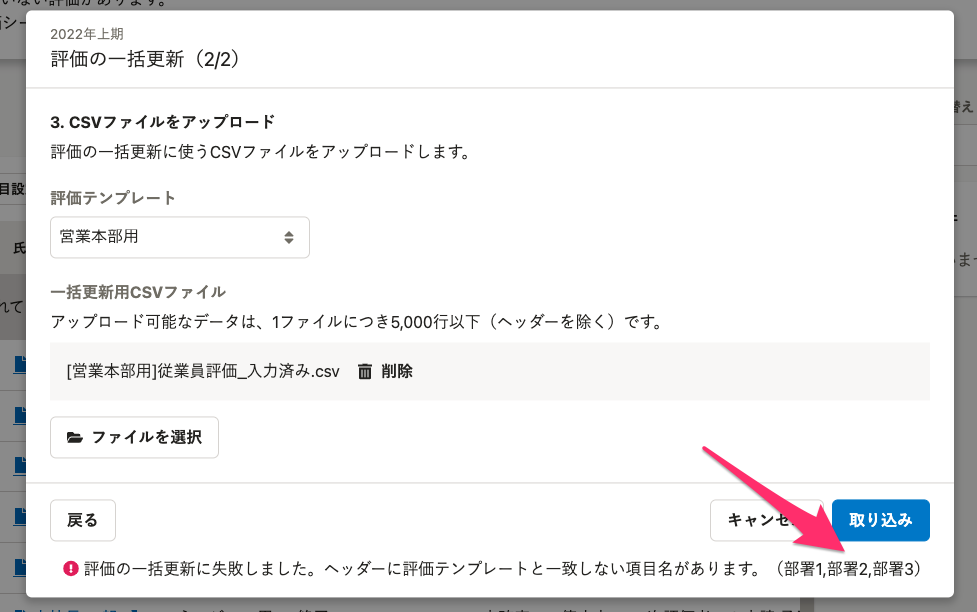

CSVファイルを使った評価の一括更新で、編集できる評価シートのフォームについて説明します。

# 評価シートのフォームごとの更新できる内容

|   **フォームの種類**   |   **一括更新**   |   **更新できる内容**   |
| --- | --- | --- |
|   テキスト入力   |   ◯   |   評価テンプレートで設定した **［入力できる文字数］** に応じて制限されます。  1行のフォームに複数行いれると1行に変換されます。   |
|   数値入力   |   ◯   |   評価テンプレートで設定した **［入力できる数値］** に応じて制限されます。   |
|   選択肢入力   |   ◯   |   評価テンプレートで設定した **［選択肢］** の文字列のみ入力できます。   |
|   固定テキスト   |   ×   |   内容を変更してもエラー表示されません。(無視されます)   |
|   ファイル添付   |   ×   |   内容を変更してもエラー表示されません。(無視されます)   |
|   表組み   |   △   |   表組みを使用してフォームをレイアウトしていた場合も、一括更新できる条件は同様です。   |

:::alert
### 一括更新用CSVファイルに、評価対象者の従業員項目が入っているとエラーになります
**評価対象者の従業員項目はCSV一括更新の対象外**です。
また、一括更新用CSVファイルに評価対象者の従業員項目または、進行中のタスクや評価者などの評価情報が入っているとエラーになり、一括更新ができません。

:::
