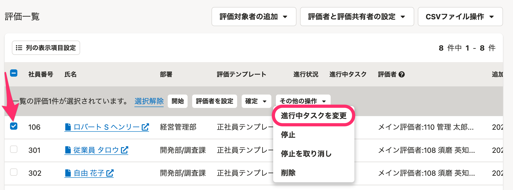

# A.できます

管理者は**評価プロジェクト画面**で、評価ごとに進行を操作できます。

変更できる操作は以下の通り

- 進行状況の変更
    - 開始前・進行中
- 進行中タスクの変更
    - 評価フローで設定した各タスクに進める、戻す
- 停止状況
    - 停止中
- 確定状況
    - 未確定・確定済

進行中のタスクを変更したい場合は、評価にチェックを入れ **［その他の操作］** のドロップダウンリストから **［進行中タスクを変更］** をクリックしてください。

 **［進行中タスクの変更］** 画面で、**その評価で使用している評価テンプレート**と**変更先タスク**を選択し、 **［変更］** をクリックすると、進行中のタスクを変更できます。

:::related
[評価を停止する](https://knowledge.smarthr.jp/hc/ja/articles/4550865934873)
[評価を確定する](https://knowledge.smarthr.jp/hc/ja/articles/4407450170905)
:::
