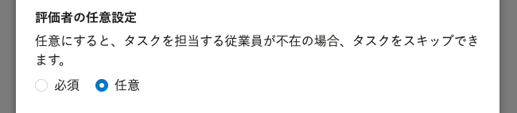
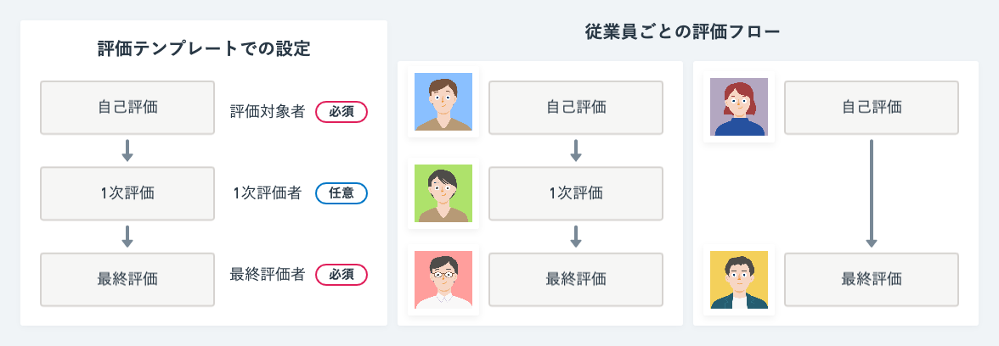

# A. 評価者の任意設定を使ってください

担当者が不在になる場合がある評価ロールに任意設定をします。

評価ロールの設定画面で **［評価者の任意設定］** で任意を選択してください。

評価プロジェクト内で、評価ロールに従業員が紐付けられていない場合、そのタスクをスキップします。

:::related
[評価ロールを作成する](https://knowledge.smarthr.jp/hc/ja/articles/4406859637657/)
[評価者と評価共有者を設定する](https://knowledge.smarthr.jp/hc/ja/articles/4407133726745/)
:::
