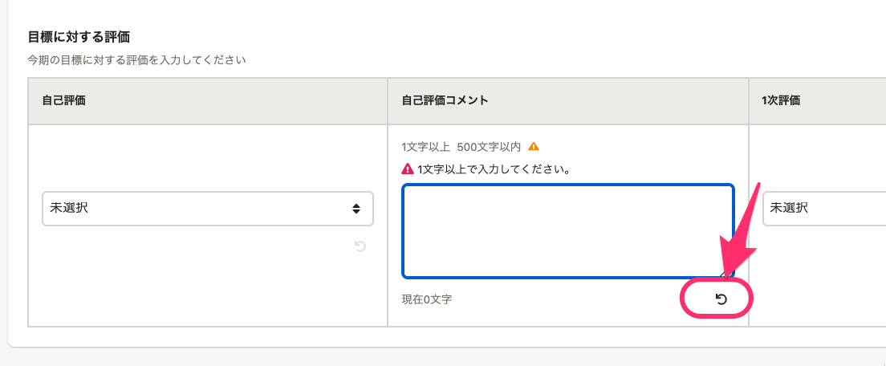

# A. 入力フォーム右下の矢印をクリックしてください

評価シートを更新したり、タスクを終了しようとしたときに、意図せず **［◯文字以上で入力してください。］** などのエラーメッセージが出てしまうことがあります。

入力フォームに一度入力して削除したつもりでも、何かしら文字を入力すると「変更された」というログが残り、入力途中とみなされてアラートが出てしまいます。

対処方法としては、入力フォーム右下の矢印マーク」をクリックするとリセットされ、入力前の状態に戻せます。

