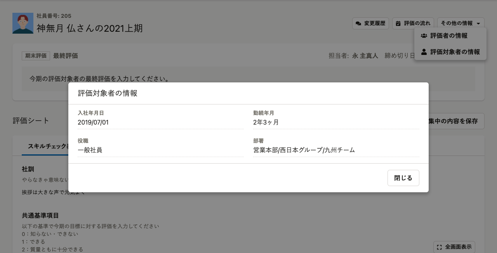
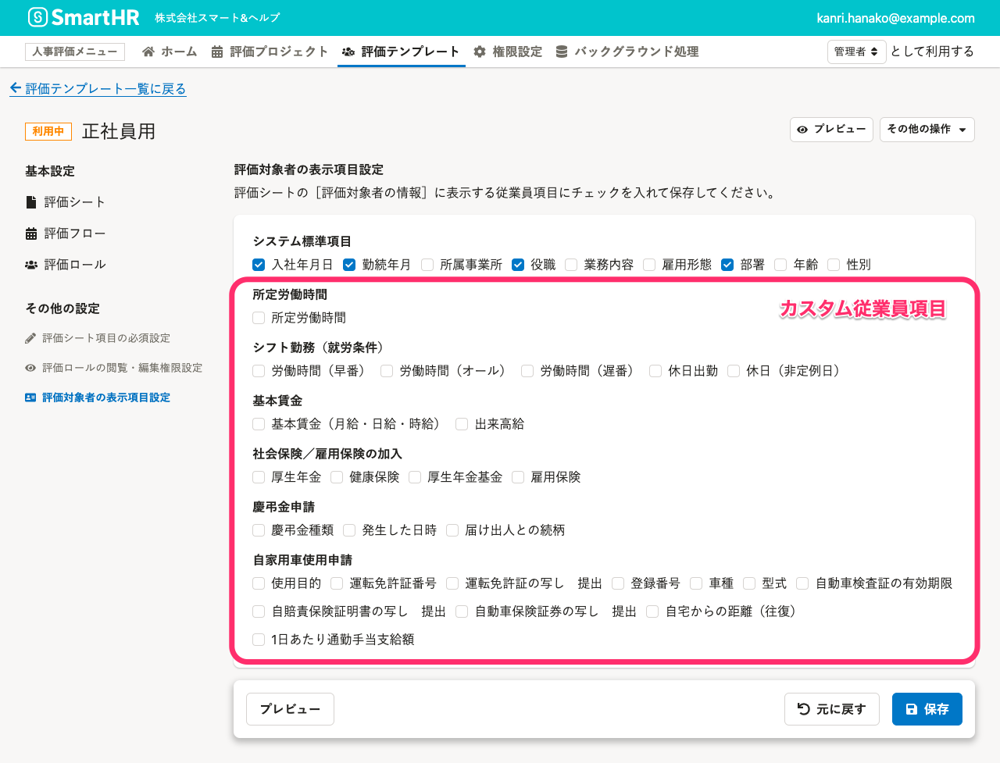
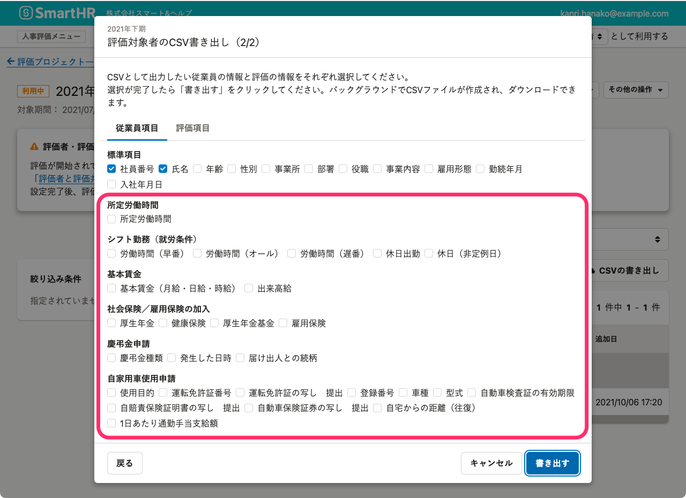

# A. 基本機能の権限とは連動していないため、従業員リストは閲覧できません

人事評価機能の**評価機能管理者**、**評価業務担当者**の権限を付与した場合でも、SmartHR基本機能の **［共通設定］**  >  **［権限］**  で設定する権限が変更されることはありません。

従って、SmartHR基本機能の従業員リスト・従業員情報そのものは閲覧できません。

:::related
[人事評価機能の権限を管理する](https://knowledge.smarthr.jp/hc/ja/articles/4406940321049)
:::

ただし、以下の2点は注意が必要です。

1.  評価シートの**評価対象者の情報**として、設定している項目
2.  評価プロジェクトの評価対象者の**CSV書き出し**

## 評価シートの評価対象者の情報

**評価機能管理者、評価業務担当者**ならびに、**評価者、評価共有者**は、**SmartHR基本機能の権限で閲覧権限のない従業員項目でも、**評価対象者の情報に表示設定した項目を**閲覧できます**。

## 評価プロジェクトのCSV書き出し機能

**評価機能管理者、評価業務担当者**が利用する、評価プロジェクトのCSV書き出しでは、**SmartHR基本機能の権限で閲覧権限のない従業員項目でも、CSVファイルの書き出し対象として選択できます。**

## ［評価対象者の表示項目設定］ならびに［CSV書き出し］で選択できる従業員項目

**システム標準項目**

- 入社年月日
- 勤続年月
- 事業所
- 役職
- 業務内容
- 雇用形態
- 部署
- 年齢
- 戸籍上の性別

:::alert
**カスタム従業員項目はすべての項目が対象です。**
:::

### 評価テンプレート設定 >［評価対象者の表示項目設定］画面

### 評価プロジェクト設定 > ［評価対象者のCSV書き出し］画面

:::related
[評価シートの評価対象者の情報を変更する](https://knowledge.smarthr.jp/hc/ja/articles/4407502065689)
:::
