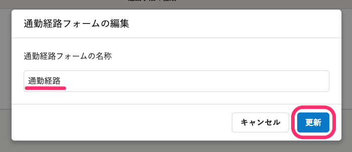

このページでは、通勤経路フォームの追加や編集などの操作手順について説明します。

:::tips
**通勤経路フォームとは？**
定期期間、候補となる経路の表示順など、SmartHRで通勤経路を検索する際の項目を細かく設定できるフォームです。
通勤経路フォームには、複数の通勤手段を登録できます。

:::

# 前提

登録した通勤経路フォームは、SmartHR基本機能のカスタム項目グループとして登録され、従業員情報に表示されるようになります。

# 通勤経路検索の画面に移動する

トップページ左側の **［機能］** 欄にある **［通勤経路検索］** をクリックし、通勤経路検索の画面に移動します。

通勤経路フォーム設定の画面が表示されます。

# 通勤経路フォームを追加する

## 1\. ［通勤経路フォーム設定］の［通勤経路フォームを追加］をクリック

 **［通勤経路フォームを追加］** をクリックすると、 **［通勤経路フォームの追加］** ダイアログが表示されます。

## 2\. ［通勤経路フォームの名称］を入力し、［登録］をクリック

 **［通勤経路フォームの名称］** を入力し、 **［登録できる経路の数］** を選択して **［登録］** をクリックすると、通勤経路フォームの一覧に追加されます。

:::tips
1つの通勤経路フォームにつき、従業員が登録できる通勤経路を5つまで設定できます。
リリース時期は未定ですが、今後は上限をなくし、自由に追加できるように開発を検討しています。
:::

通勤経路フォームを登録すると、SmartHR基本機能のカスタム項目グループ一覧に反映されます。

# 通勤経路フォーム名を編集する

## 1\. ［通勤経路フォーム設定］で編集したい通勤経路フォームをクリック

通勤経路フォームの一覧から、編集したい通勤経路フォームのリンクをクリックすると、通勤経路フォームの詳細画面に移動します。

## 2\. ［通勤経路フォームの操作］ > ［通勤経路フォーム名を編集］をクリック

 **［通勤経路フォームの操作］** \> **［通勤経路フォーム名を編集］** をクリックすると、 **［通勤経路フォームの編集］** ダイアログが表示されます。

## 3\. 通勤経路フォームの名称を編集し、［更新］をクリック

通勤経路フォームの名称を編集して **［更新］** をクリックすると、通勤経路フォームの名称が変更されます。

# 通勤経路フォームに通勤手段を追加する

通勤経路検索機能では、次の通勤手段について詳細を設定できます。

- 電車・バス
- 新幹線
- 自動車・自動二輪・原動機付自転車
- 徒歩・自転車
- 飛行機

ここでは、電車・バスの場合を例に説明します。

## 1\. 通勤手段を追加したい通勤経路フォームをクリック

 **［通勤経路フォーム設定］** で通勤経路フォームの一覧から、通勤手段を追加したい通勤経路フォームのリンクをクリックし、通勤経路フォームの詳細画面に移動します。

## 2\. ［通勤手段を追加］をクリック

 **［通勤手段を追加］** をクリックすると、 **［通勤手段の追加］** ダイアログが表示されます。

## 3\. ［通勤手段の種類］を選択

 **［通勤手段の種類］** で通勤手段を選択すると、通勤手段ごとの詳細な設定画面が表示されます。

ここでは、電車・バスを選択した場合の画面です。

## 4\. 必要な項目を設定し、［登録］をクリック

必要に応じて、項目を設定して **［登録］** をクリックします。

通勤経路フォームに通勤手段が追加されます。

# 通勤手段を編集する

## 1\. 通勤手段を編集したい通勤経路フォームをクリック

 **［通勤経路フォーム設定］** で通勤経路フォームの一覧から、通勤手段を編集したい通勤経路フォームのリンクをクリックし、通勤経路フォームの詳細画面に移動します。

## 2\. ［編集］をクリック

編集したい通勤手段の **［編集］** をクリックすると、 **［通勤手段の編集］** ダイアログが表示されます。

## 3\. 内容を編集し、［更新］をクリック

 **［通勤手段の編集］** ダイアログで、内容を編集して **［更新］** をクリックすると、設定が変更されます。

# 通勤経路フォームを削除する

## 1\. ［通勤経路フォーム設定］で削除したい通勤経路フォームをクリック

 **［通勤経路フォーム設定］** で通勤経路フォームの一覧から、削除したい通勤経路フォームのリンクをクリックすると、通勤経路フォームの詳細画面に移動します。

## 2\. ［通勤経路フォームの操作］ > ［通勤経路フォームを削除］をクリック

 **［通勤経路フォームの操作］** \> **［通勤経路フォームを削除］** をクリックすると、 **［通勤経路フォームの削除］** ダイアログが表示されます。

:::alert
通勤経路フォームを削除すると、SmartHR基本機能に登録されているカスタム項目グループも同時に削除されます。
カスタム項目として従業員情報に登録されているデータも削除され、削除した通勤経路フォームは元に戻せないため、注意してください。
:::
