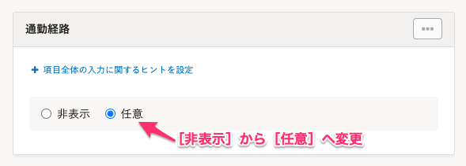
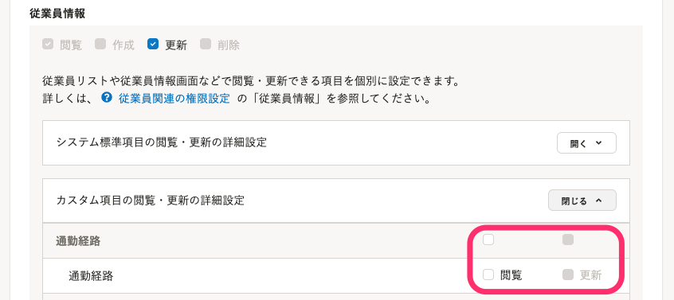

通勤経路検索機能に関するよくある質問と回答を記載します。

# Q. 入社手続き時に通勤経路を従業員から収集する際の設定はありますか？

## A. 従業員に入社手続きを依頼する前に、下記を行なってください。

### 1\. 独自の従業員招待フォームを作成する

あらかじめSmartHRに用意されている従業員招待フォームは、入力項目や必須・任意・非表示の設定を変更できません。

そのため、従業員から通勤経路や通勤費の情報を収集したい場合は、独自の従業員招待フォームを作成する必要があります。

従業員招待フォームを作成する手順については、[従業員招待フォームを追加する](https://knowledge.smarthr.jp/hc/ja/articles/360026265233)を参照してください。

### 2\. 作成した従業員招待フォームで通勤経路検索の項目を［任意］に変更する

通勤経路検索機能で設定したカスタム項目は、デフォルトでは **［非表示］** となっています。

 **［任意］** に変更することで、従業員が入力できるようになります。

ここでは、通勤経路フォーム名を「通勤経路」としている場合の例を記載します。

### 3\. 対象の従業員が通勤経路検索機能で設定したカスタム項目を閲覧できるように権限を付与する

デフォルトでは権限が付与されていないため、従業員招待フォームにカスタム項目が表示されません。

[［カスタム従業員項目］の閲覧・更新権限を設定する](https://knowledge.smarthr.jp/hc/ja/articles/360026265513#toc--7)を参考に、 **［閲覧］**  **［更新］** の権限を従業員に付与してください。

# Q. 通勤経路検索機能で設定したカスタム項目を、従業員招待フォームや申請フォームで必須項目にできますか？

## A. いいえ、できません。

従業員招待フォーム、申請フォームともに選択できるのは **［任意］** と **［非表示］** のみです。

# Q. 経由地を複数追加することはできますか？

## A. いいえ、できません。

時期は未定ですが、開発を今後検討していきます。

# Q. 管理者側で目的地を設定し、その中から従業員に選択してもらうことはできますか？

## A. いいえ、できません。

代わりの手段として、任意の目的地を選択しやすくなる「スポット検索」を今後開発予定です。

# Q. 管理者側で「最短経路だけを経路候補に表示する」や「従業員に自由に金額を選択させる」といった設定はできますか？

## A. いいえ、設定できません。

開発時期は未定ですが、開発を今後検討していきます。

# Q. 新幹線の定期券、グリーン車の定期券には対応していますか？

## A. いいえ、対応していません。

開発時期は未定ですが、開発を今後検討していきます。

# Q. 株式会社ナビタイムジャパンで対応していない路線を利用しており、通勤経路が候補に表示されない場合は？

## A. お手数ですが、備考欄に通勤経路と通勤費を記載してください。

# Q. ダイヤ改正があった場合の対応について教えてください。

## A. ダイヤ改正の対応は、株式会社ナビタイムジャパンに準拠します。

ダイヤ改正に関する具体的な情報が出てきましたら、対応をご案内します。

# Q. 料金改定や駅名の変更などが発生した場合、すでに申請した情報は自動で更新されますか？

## A. いいえ、自動で更新されません。

変更後の情報をあらためて申請する必要があります。

# Q. 従業員情報に登録している現住所をもとに、申請内容が正しいかどうかをチェックできる機能はありますか？

## A. いいえ、ありません。

# Q. NAVITIMEに障害があった場合、通勤経路検索機能を使用できますか？

## A. いいえ、使用できません。

通勤経路検索機能は、株式会社ナビタイムジャパンが提供している「NAVITIME API」を利用しているため、NAVITIMEで障害が発生している場合、通勤経路検索機能も使用できません。

時間をあけてから、再度検索を行なってください。
