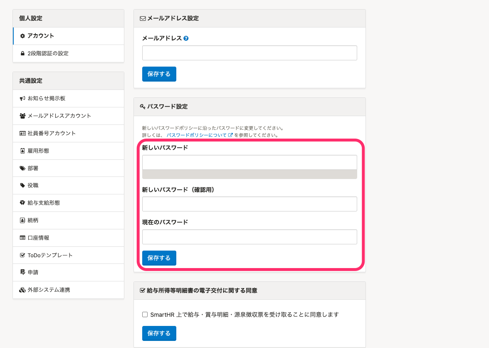

:::alert
In order to improve the security of SmartHR, a new recommended password policy has been put in place by SmartHR based on the opinions of various parties regarding passwords as of February 16, 2022.
[Changes to the password policy](https://smarthr.jp/update/32157)
The period for transitioning to the new password policy is scheduled for **February 16, 2022 to mid-May 2022**.
:::

# A. Please refer to the new password policy to reset your password.

## Password reset procedure

### 1\. Click "Go here to change your password" displayed at the top of the SmartHR screen.

Click "Go here to change your password" displayed at the top of the SmartHR screen to proceed to the password change screen.

### 2\. Go to \[Personal Settings\] > \[Account\] and then enter the \[Password Settings\].

Enter the **New password, New password (for confirmation)**, and **Current password** fields in the **\[Password Settings\]** section and click **\[Save\].**

:::tips
Passwords that can be set are as follows:
- **Password lengths must be between 10 and 72 characters.**
- **There are no character type restrictions for passwords.**
- Passwords that have been leaked in the past are set as **banned (blacklisted) passwords and cannot be used.**
For more information, see the help pages below.
[Password policy](https://knowledge.smarthr.jp/hc/ja/articles/4415296771993/)
[Password policy FAQ](https://knowledge.smarthr.jp/hc/ja/articles/4415576721177)
:::
