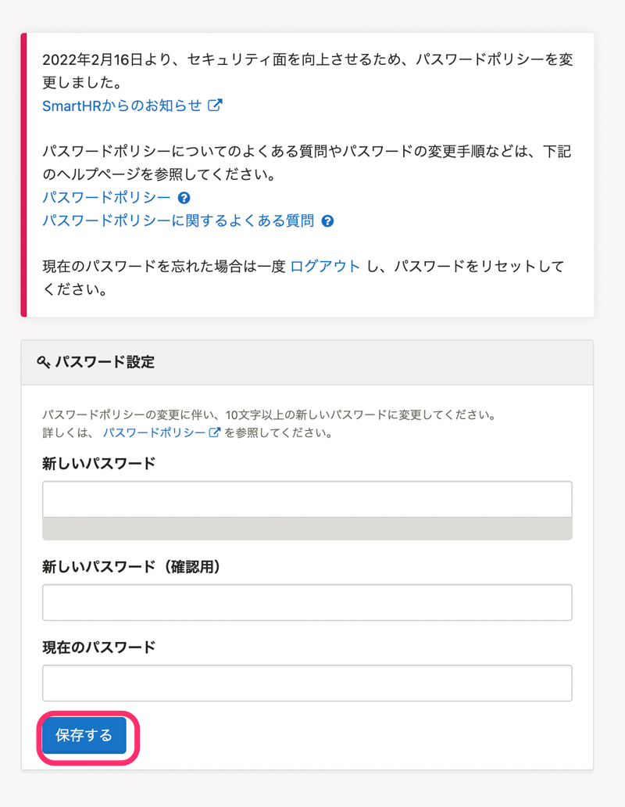
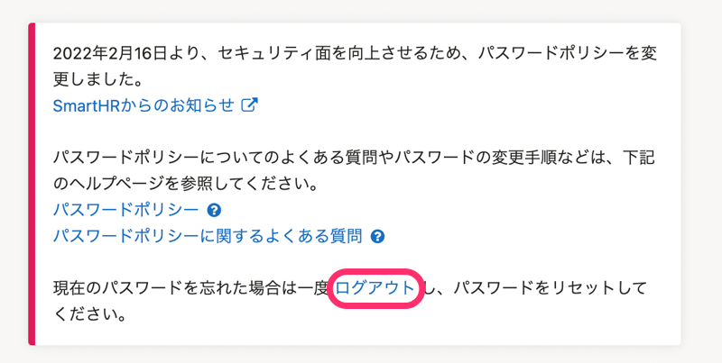

# A. 新しいパスワードポリシーを参考に、パスワードを再設定してください

2022年2月16日より、SmartHRのセキュリティ面をより向上させるため、新しいパスワードポリシーを定めました。

新しいパスワードポリシーに沿ったパスワードに変更していただくため、2022年5月19日より、ログイン後にパスワード設定画面が表示されるようにしています。

下記の手順を参考に、パスワードを再設定してください。

:::tips
現在、新しいパスワードポリシーを満たしたパスワードを設定している場合も、パスワード設定画面が表示されます。
ただし、**同じパスワードを再設定して継続利用が可能**です。
:::
:::related
[パスワードポリシー変更に伴い、パスワードの変更をお願いします｜SmartHR](https://smarthr.jp/update/34765)
[パスワードポリシー](https://knowledge.smarthr.jp/hc/ja/articles/4415296771993/)
[パスワードポリシーに関するよくある質問](https://knowledge.smarthr.jp/hc/ja/articles/4415576721177)
:::

## パスワードの再設定手順

 **［パスワード設定］** の［ **新しいパスワード］［新しいパスワード（確認用）］［現在のパスワード］** を入力し、 **［保存する］** をクリックします。

設定後に、SmartHRのホームに移動します。

### 現在のパスワードを忘れた場合

現在のパスワードを忘れた場合は、 **［ログアウト］** をクリックしてログイン画面に戻り、パスワードをリセットしてください。

:::related
[パスワードを忘れてしまったら？](https://knowledge.smarthr.jp/hc/ja/articles/360026265593)
:::

## 設定できるパスワードの条件

設定できるパスワードの条件は下記のとおりです。

- **文字数は10文字以上72文字以下。**
- **文字の種類に制限はありません。**
- 過去に他のウェブサイトで漏洩した可能性のあるパスワードは、**設定できません。**
