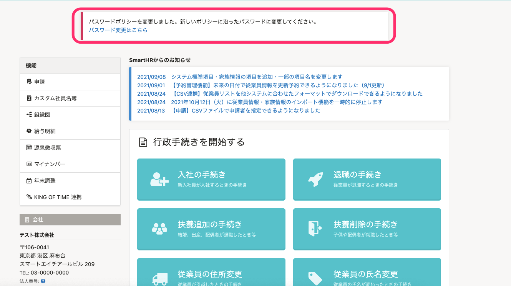
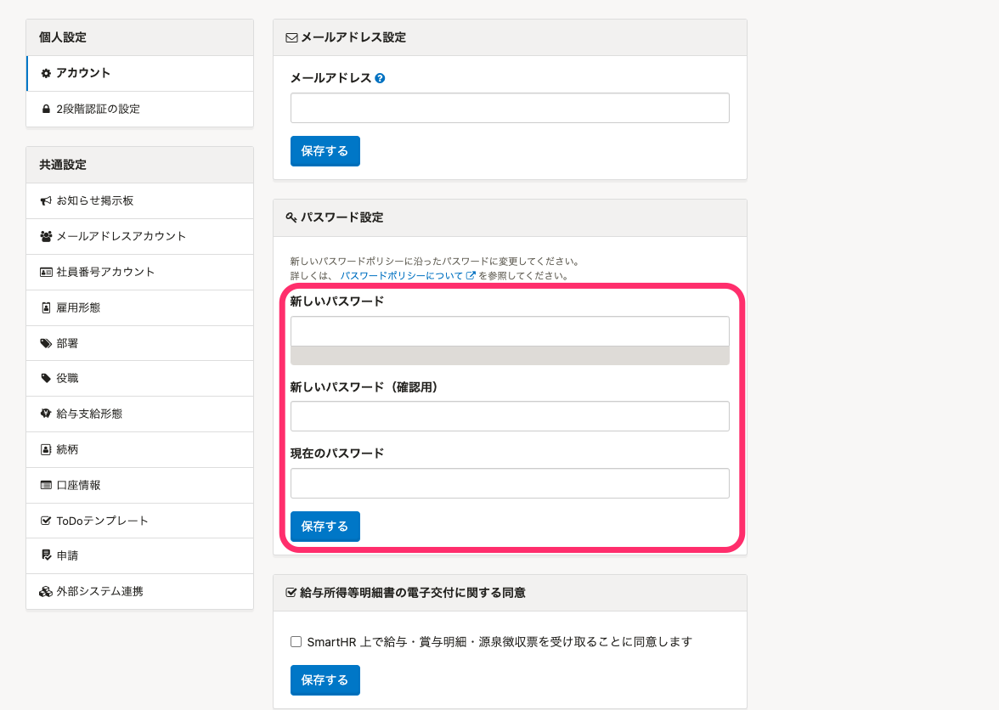

:::alert
2022년2월16일부터 SmartHR의 세큐리티면을 보다 향상시키기위해 패스워드에 대한 각처의 견해를 참고하여 SmartHR이 추천하는 새로운 패스워드 정책을 정하였습니다.
[패스워드 정책을 변경합니다](https://smarthr.jp/update/32157)
개로운 패스워드 정책으로의 이행기간은 **2022년2월16일〜2022년5월 중순까지를** 예정하고 있습니다.しています。
:::

# A. 새로운 패스워드 정책을 참고하여 패스워드를 재설정 해주세요.

## 패스워드의 재설정순서

### 1\. SmartHR 톱페이지에 표시되어 있는 「패스워드 변경은 여기」를 클릭

SmartHR 톱페이지에 표시되어 있는 「패스워드 변경은 여기」를 클릭하여 패스워드 변경화면으로 이동합니다.

### 2\. ［개인설정］>［어카운트］>［패스워드설정］을 입력

 **［패스워드설정］** 의 **「새로운 패스워드」「새로운 패스워드（확인용）」「현재의 패스워드」** 을 입력하고, **［저장］** 을 클릭합니다.

:::tips
설정가능한 패스워드는 아래와 같습니다.
- **글자수는 10글자이상 72글자이하**
- **글자의 종류에 제한은 없습니다.**
- 과거에 유출된 패스워드는 **금지패스워드（블록 리스트）로써 설정할수 없는 사양**으로 되어있습니다.
자세한 내용은 아래의 헬프페이지를 참조하여 주세요.
[패스워드 정책](https://knowledge.smarthr.jp/hc/ja/articles/4415296771993/)
[패스워드 정책에 자주 있는 질문](https://knowledge.smarthr.jp/hc/ja/articles/4415576721177)
:::
