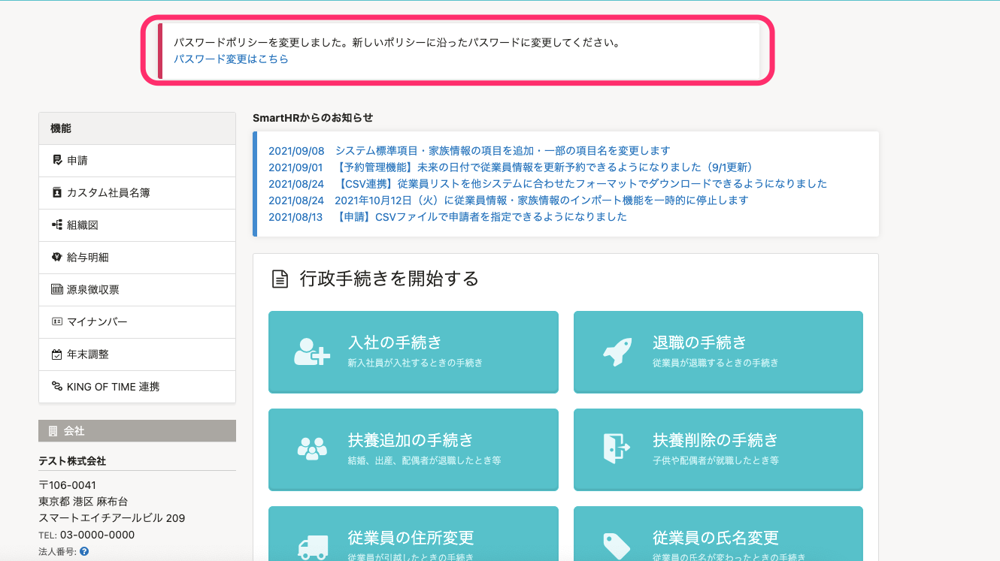

:::alert
自2022年2月16日起，我們參考各方對於密碼的相關見解，訂定SmartHR推薦的新密碼原則，以進一步提高SmartHR的安全性。
[SmartHR將變更密碼原則](https://smarthr.jp/update/32157)
轉移至新密碼原則的期限預定為**2022年2月16日至2022年5月中旬**。
:::

# A. 請參考新密碼原則，重新設定密碼。

## 重新設定密碼的步驟

### 1\. 點選SmartHR首頁畫面顯示的「變更密碼請點選這裡」。

點選SmartHR首頁畫面顯示的「變更密碼請點選這裡」，進入密碼變更畫面。

### 2\. 進入〔個人設定〕>〔帳號〕>〔設定密碼〕

在**〔設定密碼〕**的 **「新密碼** 」、 **「新密碼（確認用）」** 、 **「目前的密碼」** 輸入內容，並點選**〔儲存〕**。

:::tips
可設定的密碼如下所示。
- **字元數為10字元以上到72字元以下**
- **字元種類沒有限制。**
- 系統已將過去外洩的密碼設為**禁用密碼（封鎖清單），無法將其設定為密碼。**
詳情請參閱以下幫助頁面。
[密碼原則](https://knowledge.smarthr.jp/hc/ja/articles/4415296771993/)
[密碼原則相關常見問題](https://knowledge.smarthr.jp/hc/ja/articles/4415576721177)
:::
