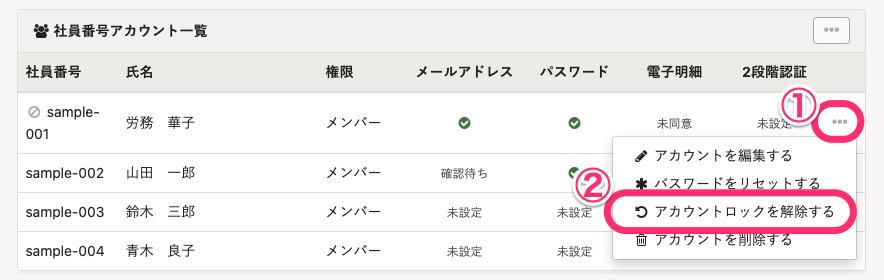

従業員から「アカウントロックを解除してほしい」と問い合わせがあった場合に、管理者がアカウントロックを解除する方法を説明します。

アカウントがロックされると、以下の画面が表示されます。

:::tips
アカウントロックとは、誤ったパスワードで10回ログインを試すと、それ以上同じアカウントでログインを試せなくなる（アカウントがロックされる）機能です。悪意のある第三者による不正なログインを防ぎます。
:::

# アカウントロックの解除方法

:::alert
- 従業員からロック解除の依頼があった場合は、必ず本人からの連絡であることを確認してください。
- パスワードを10回間違えた覚えがないのにアカウントがロックされた場合は、**第三者がアカウントに不正にアクセスしようとしているおそれがあります。**パスワードを複雑なものに変更したり、2段階認証を設定したりして、セキュリティを強化することをお勧めします。
    - [2段階認証を設定する](https://knowledge.smarthr.jp/hc/ja/articles/360026106174)
:::

## パスワードをリセットして、アカウントロックを解除する

社員番号アカウントで、ログイン・通知用メールアドレスを設定していない場合は、従業員自身ではアカウントロックを解除できません。

管理者がパスワードをリセットすることで、アカウントロックを解除できます。

:::related
[社員番号アカウントのパスワードをリセットする](https://knowledge.smarthr.jp/hc/ja/articles/360026263673)
[アカウントロックに関するよくある質問](https://knowledge.smarthr.jp/hc/ja/articles/900006120986)
:::
:::tips
従業員がログイン・通知用メールアドレスを設定している場合は、従業員自身がパスワードをリセットすることで、アカウントロックを解除できます。
詳しくは、下記のヘルプページの「ログイン・通知用メールアドレスを設定している場合」をご覧ください。
[Q. 「このアカウントはロックされています。」と表示される場合は？](https://knowledge.smarthr.jp/hc/ja/articles/900006890363)
:::

## パスワードをリセットせず、アカウントロックのみを解除する場合

パスワードをリセットせず、アカウントロックのみを解除する方法を説明します。

従業員がパスワードを覚えている場合などは、この方法でロックを解除すれば、これまでのパスワードで引き続きログインできます。

:::tips
アカウントロックを解除できるアカウントは、 **［権限設定］>［アカウント管理］** で **［アカウント設定］** の **［更新］** 権限があるアカウントです。
:::

### 1\. ［メールアドレスアカウント］画面または［社員番号アカウント］画面の一覧で、ロックを解除するアカウントを検索

アカウントロックの解除の依頼があったアカウントを検索して探します。

### 2\. ［…］メニュー >［アカウントロックを解除する］をクリック

アカウントロックを解除するアカウントの **［…］メニュー**  > **［アカウントロックを解除する］** をクリックすると、確認ダイアログが表示されます。

ロック解除の依頼が本人からのものであることを確認して、 **［OK］** をクリックすると、アカウントロックが解除されます。

### 3\. 従業員にアカウントロックを解除した旨を連絡

従業員にアカウントロックを解除した旨を連絡します。

従業員は、これまでのパスワードでログインできます。
