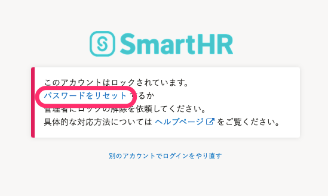

:::alert
アカウントロックは、悪意のある第三者による不正なログインを防ぐための機能です。
パスワードを10回間違えた覚えがないのにアカウントがロックされた場合は、**第三者がアカウントに不正にアクセスしようとしているおそれがあります。**
パスワードを複雑なものに変更したり、2段階認証を設定したりして、セキュリティを強化することをお勧めします。
[2段階認証を設定する](https://knowledge.smarthr.jp/hc/ja/articles/360026106174)
:::

# A. パスワードをリセットするか、管理者にアカウントロックの解除を依頼してください。

パスワードを10回間違えて入力すると、アカウントがロックされ、以下の画面が表示されます。

 **［パスワードをリセット］** をクリックして、パスワードをリセットすることで、アカウントロックを解除できます。

ログイン・通知用メールアドレスを設定しているかどうかによって、リセット方法が異なります。

:::tips
ログイン・通知用メールアドレスとは、 **［個人設定］>［アカウント］>［メールアドレス］** で設定したメールアドレスです。
:::
:::related
[アカウントロックに関するよくある質問](https://knowledge.smarthr.jp/hc/ja/articles/900006120986)
:::

## ログイン・通知用メールアドレスを設定している場合

ご自身でパスワードを再設定します。

[パスワードを忘れてしまったら？](https://knowledge.smarthr.jp/hc/ja/articles/360026265593)の手順2以降を参考に、パスワードを再設定してください。

## ログイン・通知用メールアドレスを設定していない場合

管理者にパスワードのリセットを依頼します。

[社員番号アカウントのパスワードを忘れてしまったら？](https://knowledge.smarthr.jp/hc/ja/articles/360026104374)の「メールアドレス未設定の場合」の手順2以降を参考に、パスワードのリセットを依頼してください。

:::tips
パスワードをリセットすると、初期パスワードが設定されます。
初期パスワードでログイン後に、ご自身で任意のパスワードを設定できます。
:::
