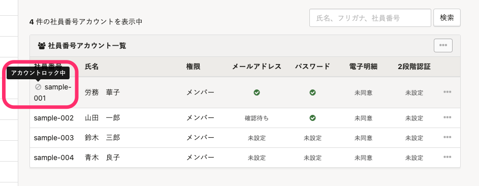

アカウントロックに関するよくある質問を管理者、従業員に分けてご紹介します。

# 管理者からのよくある質問

## Q. アカウントロック機能はオフにできる？

### A. いいえ、セキュリティを担保する機能のためオフにできません。

アカウントロックは、悪意のある第三者による不正なログインを防ぐための機能です。

セキュリティの観点から、アカウントロック機能はオフにできない仕様としています。

## Q. アカウントがロックされるまでの回数は変更できる？

### A. いいえ、できません。

アカウントがロックされるまでの回数は10回から変更できません。

## Q. 従業員のアカウントがロックされると、管理者に通知される？

### A. いいえ、通知されません。

従業員のアカウントがロックされた際に、メールなどでは管理者に通知されません。

ロックされたアカウントは、 **［メールアドレスアカウント］** 画面または **［社員番号アカウント］** 画面で確認できます。

ロックされたアカウントの左に、下記の **［アカウントロック中］** アイコンが表示されます。

# 従業員からのよくある質問

## Q. 身に覚えがないのにアカウントがロックされており、不正アクセスの疑いがある。どうすればいい？

### A. パスワードを複雑なものに変更したり、2段階認証を設定したりしてください。

パスワードを10回間違えた覚えがないのにアカウントがロックされた場合は、第三者がアカウントに不正にアクセスしようとしているおそれがあります。

パスワードを複雑なものに変更したり、2段階認証を設定したりして、セキュリティを強化することをお勧めします。

:::related
[2段階認証を設定する](https://knowledge.smarthr.jp/hc/ja/articles/360026106174)
:::

## Q. ブラウザに誤ったパスワードが記憶されていたため、アカウントがロックされてしまった。記憶されたパスワードを変更するには？

### A. お使いのブラウザのヘルプページを確認し、設定を変更してください。

下記のヘルプページを参考に、ブラウザに記憶されているパスワードを削除または変更してください。

- **Google Chrome**：
    [パスワードを管理する｜Google Chrome ヘルプ](https://support.google.com/chrome/answer/95606?co=GENIE.Platform%3DDesktop&hl=ja)
- **Microsoft Edge**：
    [Microsoft Edge でパスワードを保存または削除する｜Microsoft サポート](https://support.microsoft.com/ja-jp/microsoft-edge/microsoft-edge-%E3%81%A7%E3%83%91%E3%82%B9%E3%83%AF%E3%83%BC%E3%83%89%E3%82%92%E4%BF%9D%E5%AD%98%E3%81%BE%E3%81%9F%E3%81%AF%E5%89%8A%E9%99%A4%E3%81%99%E3%82%8B-b4beecb0-f2a8-1ca0-f26f-9ec247a3f336)
- **Internet Explorer 11**：
    [パスワードを記憶して Internet Explorer 11 の Web フォームに情報を入力する｜Microsoft サポート](https://support.microsoft.com/ja-jp/windows/%E3%83%91%E3%82%B9%E3%83%AF%E3%83%BC%E3%83%89%E3%82%92%E8%A8%98%E6%86%B6%E3%81%97%E3%81%A6-internet-explorer-11-%E3%81%AE-web-%E3%83%95%E3%82%A9%E3%83%BC%E3%83%A0%E3%81%AB%E6%83%85%E5%A0%B1%E3%82%92%E5%85%A5%E5%8A%9B%E3%81%99%E3%82%8B-6883f6ce-0d1c-c2b9-e21e-705976d1c886)
- **Firefox**：
    [Firefox のパスワードマネージャー｜Firefox ヘルプ](https://support.mozilla.org/ja/kb/password-manager-remember-delete-change-and-import)
