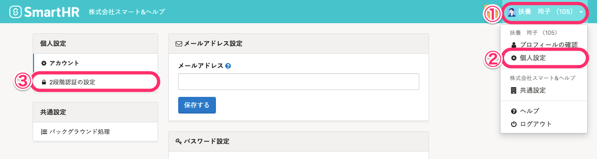
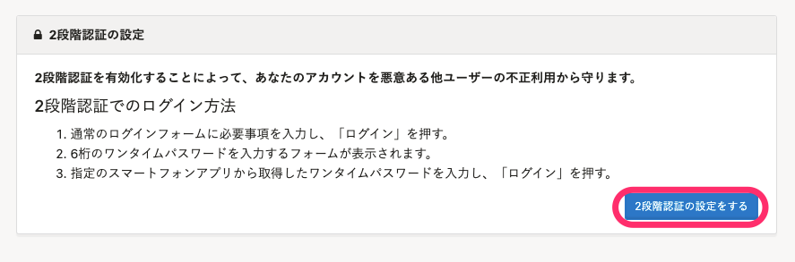
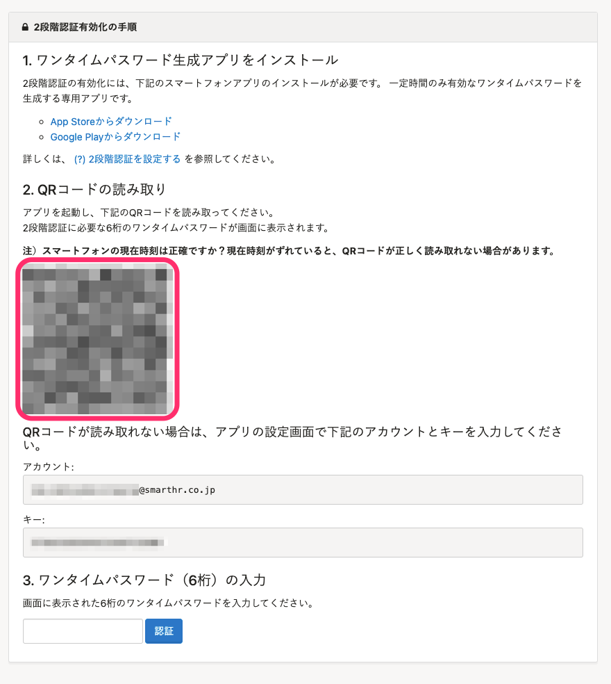
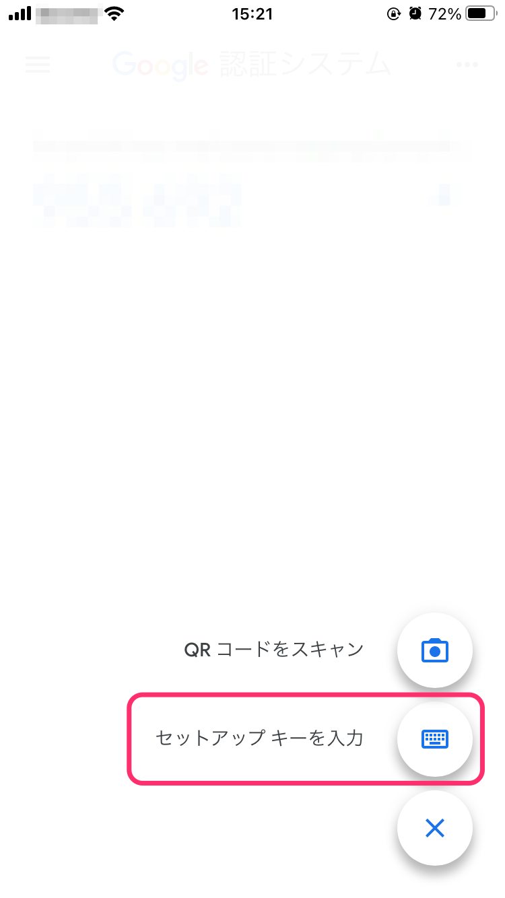
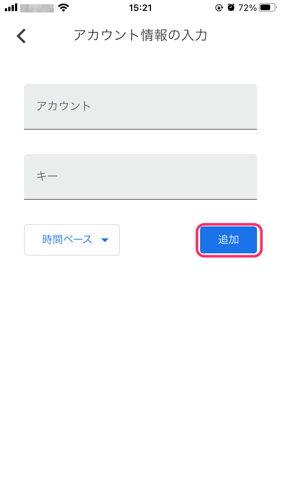
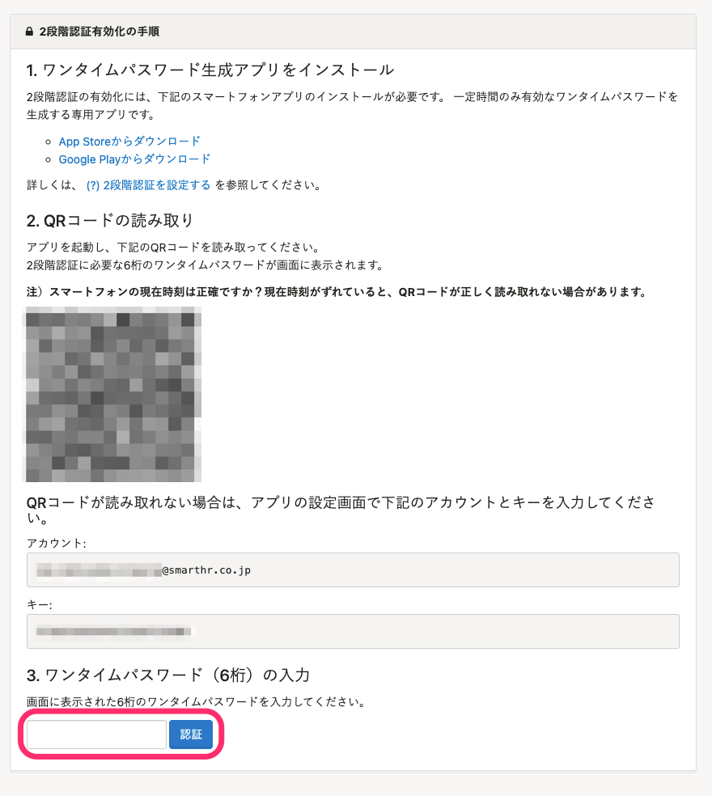
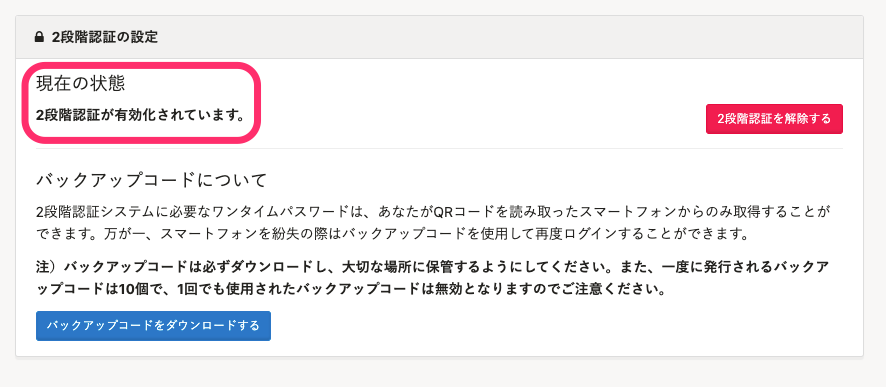

SmartHRにログインする際に、 IDおよびパスワードに加えて、スマートフォンアプリで発行されたワンタイムパスワードを入力することで、セキュリティをより強化できます。

安全にSmartHRをご利用いただくためにも、 2段階認証の設定をおすすめします。

# 1\. 画面右上のアカウント名>［個人設定］>［2段階認証の設定］をクリック

画面右上の **［アカウント名▼］** をクリックして開くメニューから **［個人設定］** を選び、画面左のリストにある **［2段階認証の設定］** をクリックします。

# 2\. 「2段階認証の設定をする」をクリック

 **［2段階認証の設定］** 画面で、 **「2段階認証の設定をする」** をクリックします。

# 3\. スマートフォンにアプリをインストールする

TOTP（Time-Based OneTimePassword）で2FAを行なうアプリに対応しています。

お使いのスマートフォンに合わせて、アプリをインストールしてください。

### 代表的なアプリ

- iOS をご利用の場合 [Google Authenticator｜App Store](https://itunes.apple.com/jp/app/google-authenticator/id388497605?mt=8)
- Android をご利用の場合 [Google Authenticator｜Google Play](https://play.google.com/store/apps/details?id=com.google.android.apps.authenticator2&hl=ja)
- Windows Phone をご利用の場合 [Authenticator｜Microsoft](https://www.microsoft.com/en-us/store/p/authenticator/9wzdncrfj3rj)

# 4\. QRコードを読み取る

アプリを起動し、SmartHRの **［2段階認証有効化の手順］** 画面に表示されているQRコードを読み取ります。

アプリ画面に6桁のワンタイムパスワードが表示されます。

## QRコードが読み取れない場合

スマートフォンでSmartHRを使用しているなどの理由で、QRコードを読み取れない場合は、 **［アカウント］** と **［キー］** をアプリに入力して設定します。

Google Authenticatorを例に、操作方法を説明します。

### 4-1. 「セットアップキーを入力」をタップ

アプリ画面右下の **［＋］** をタップして表示される **「セットアップキーを入力」** をタップします。

### 4-2. ［アカウント］と［キー］を入力して「追加」をタップ

SmartHRの **［2段階認証有効化の手順］** 画面に表示されている **［アカウント］** と **［キー］** をアプリに入力して、 **「追加」** をタップします。

# 5\. ワンタイムパスワードを入力する

アプリ画面に表示された6桁のワンタイムパスワードをSmartHRに入力し、 **「認証」** をクリックします。

 **［2段階認証の設定］** 画面に戻ります。

 **［2段階認証が有効化されています。］** と表示されていれば、設定は完了です。

