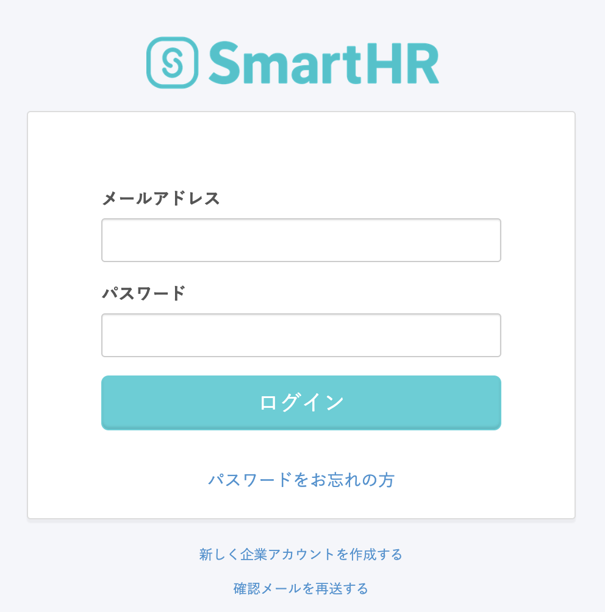
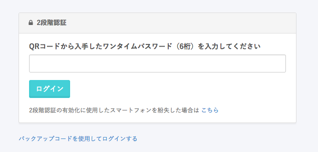

2段階認証を設定したアカウントへは、以下の手順でログインできます。 

# ログイン手順

## 1\. メールアドレスとパスワードを入力

SmartHRのログイン画面で、メールアドレスとパスワードを入力し、**\[ログイン\]** をクリックします。

## 2\. ワンタイムパスワード（6桁）を入力する

認証アプリに表示される **ワンタイムパスワード（6桁）** を入力し、 **\[ログイン\]**  をクリックしてください。

