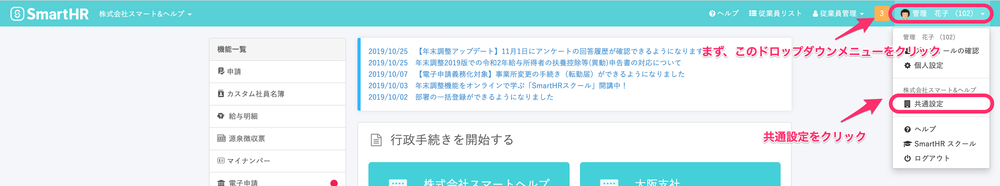
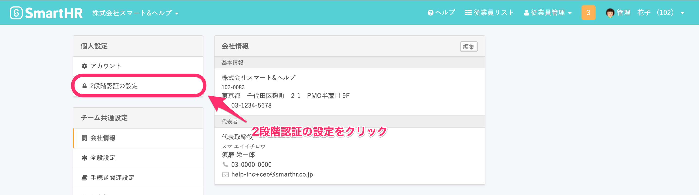
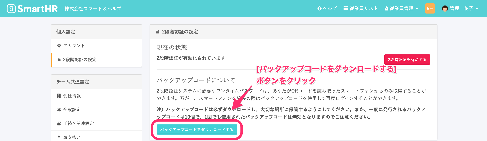
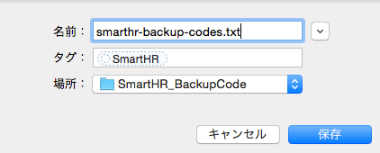

2段階認証有効化後に、スマートフォン（もしくはタブレット）を紛失した際でもログインできるよう、バックアップコードのダウンロードをお願いします。

# バックアップコードの取得方法

## 1\. 画面右上のアカウント名 > \[共通設定\] をクリック

2段階認証を有効化したアカウントでログインし、**画面右上のアカウント名 > \[共通設定\]** をクリックしてください。

## 2\. \[個人設定\] の \[2段階認証の設定\] をクリック

## 3\. \[バックアップコードをダウンロードする\] をクリック

## 4. 「smarthr-backup-codes.txt」を保存する

バックアップコードが記載された「smarthr-backup-codes.txt」を任意の場所に保存してください。

:::tips
1.  バックアップコードは全部で10個あり、それぞれ1回のみ使用可能な使いきりのものです。
2.  これより後にコードを再ダウンロードしていた際は、このファイル上のコードはすべて無効となっています。
3.  使用可能なコードの残りが少なくなりましたら必ず再度ダウンロードし、そちらを保管するようにしてください。
:::
