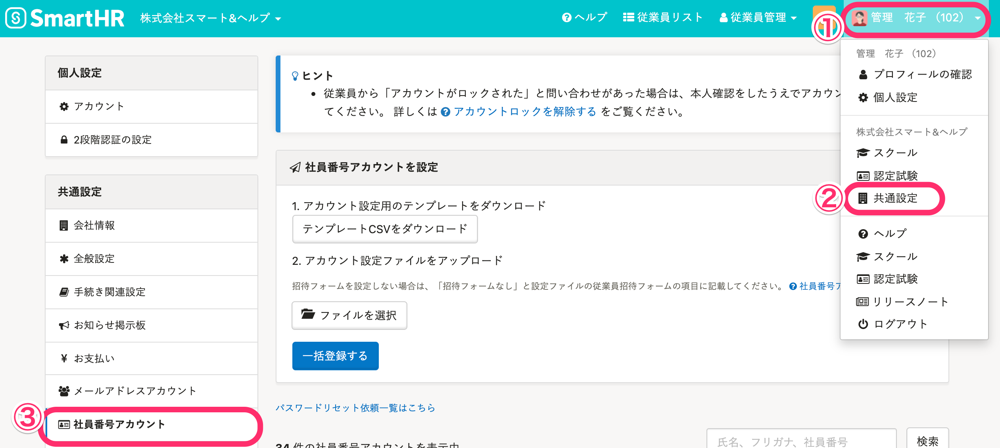

管理者は従業員が2段階認証を設定しているかどうかを以下の手順で確認できます。

# 設定状況の確認手順

## メールアドレスアカウントの場合

### 1.［画面右上のアカウント名］>［共通設定］>［メールアドレスアカウント］をクリック

 **［画面右上アカウント名］>［共通設定］>［メールアドレスアカウント］** をクリックすると、メールアドレスアカウントの **［一覧］** 画面が表示されます。

### 2.［一覧］>［2段階認証］の表示を確認

 **［一覧］** より、対象アカウントの **［2段階認証］** の表示を確認します。

:::tips
- 緑丸のチェックマーク ＝ 設定済み
-  **［未設定］** ＝ 未設定
:::

## 社員番号アカウントの場合

### 1.［画面右上のアカウント名］>［共通設定］>［社員番号アカウント］をクリック

 **［画面右上アカウント名］>［共通設定］>［社員番号アカウント］** をクリックすると、 **［社員番号アカウント一覧］** 画面が表示されます。

### 2.［社員番号アカウント一覧］>［2段階認証］の表示を確認

 **［社員番号アカウント一覧］** より、対象アカウントの **［2段階認証］** を確認します。

:::tips
- 緑丸のチェックマーク ＝ 設定済み
-  **［未設定］** ＝ 未設定
:::
