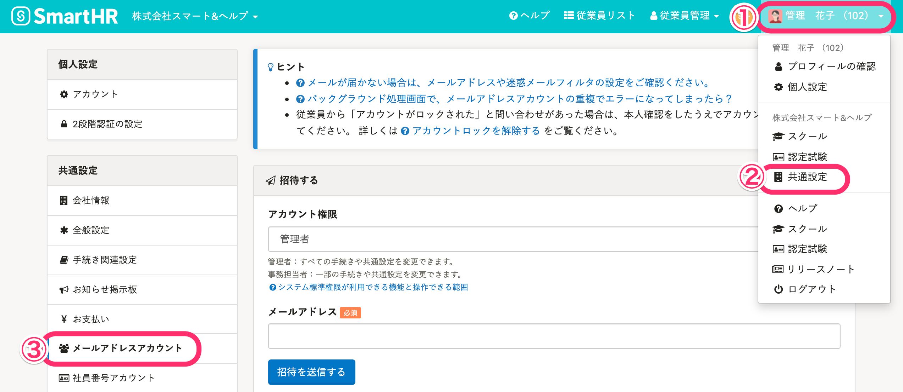
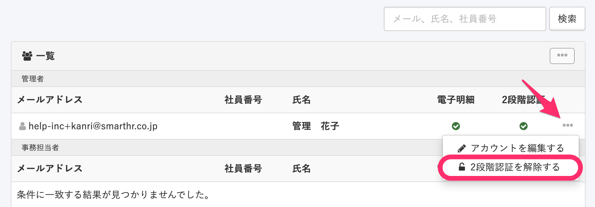
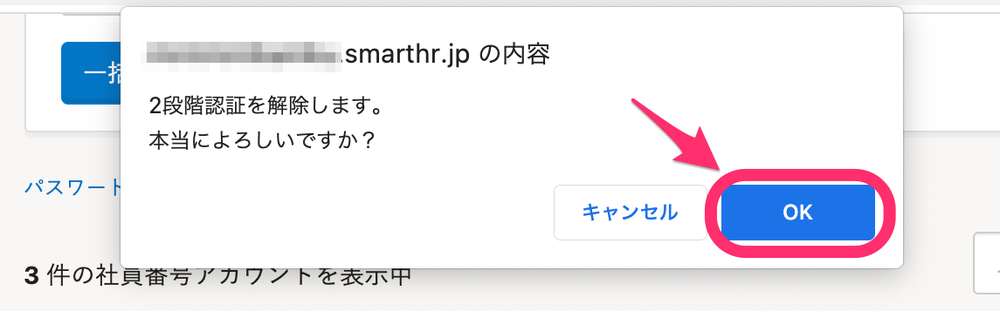
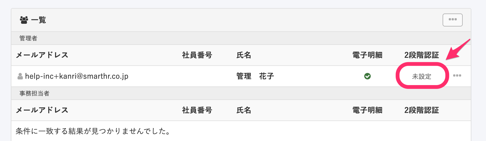
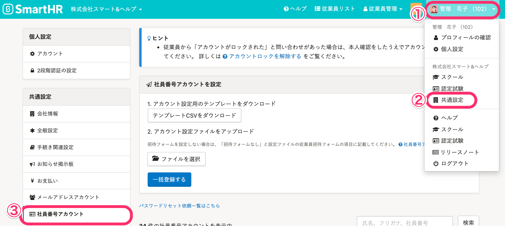
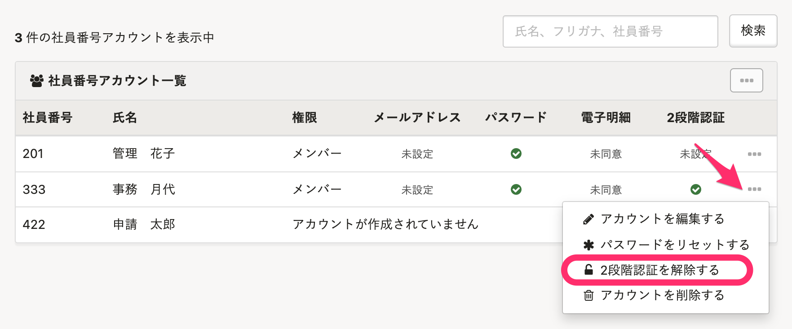
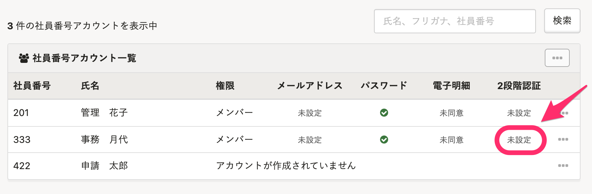

管理者は従業員や他の管理者アカウントに設定されている2段階認証を解除できます。

※ 管理者が1人だけでSmartHRにログインできない場合に限り、弊社にて対応させていただきます。サポートまでご連絡ください。詳しくは下記のページをご確認ください。

[2段階認証の有効化後にスマートフォンを紛失した場合は？](https://knowledge.smarthr.jp/hc/ja/articles/360026107454)

# 解除手順

## メールアドレスアカウントの場合

### 1.［画面右上のアカウント名］>［共通設定］>［メールアドレスアカウント］をクリック

 **［画面右上アカウント名］>［共通設定］>［メールアドレスアカウント］** をクリックすると、メールアドレスアカウントの **［一覧］** 画面が表示されます。

### 2.［...］メニュー >［2段階認証を解除する］をクリック

対象のアカウントの右端にある **［…］メニュー**  > **［2段階認証を解除する］** をクリックしてください。

### 3.［OK］をクリック

2段階認証解除の確認画面が表示されるので、 **［OK］** をクリックしてください。

### 4.［2段階認証］の［未設定］表示を確認

対象のアカウントの **［2段階認証］** が **［未設定］** になっていることを確認してください。

## 社員番号アカウントの場合

### 1.［画面右上のアカウント名］>［共通設定］>［社員番号アカウント］をクリック

 **［画面右上アカウント名］>［共通設定］>［社員番号アカウント］** をクリックすると、 **［社員番号アカウント一覧］** 画面が表示されます。

### 2.［...］メニュー >［2段階認証を解除する］をクリック

対象のアカウントの右端にある **［…］メニュー**  > **［2段階認証を解除する］** をクリックしてください。

### 3.［OK］をクリック

2段階認証解除の確認画面が表示されるので、 **［OK］** をクリックしてください。

### 4.［2段階認証］の［未設定］表示を確認

対象のアカウントの **［2段階認証］** が **［未設定］** になっていることを確認してください。

