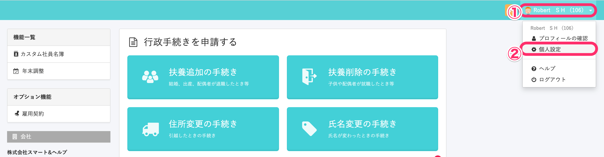
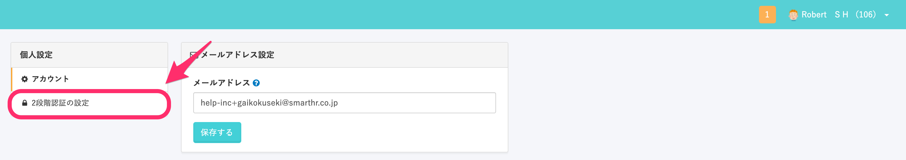
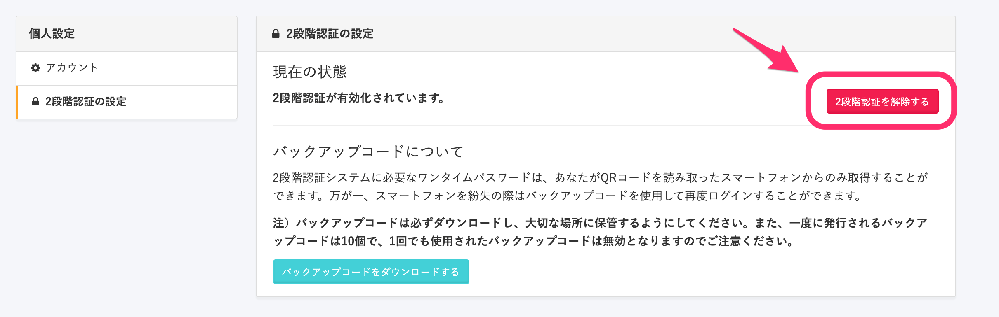
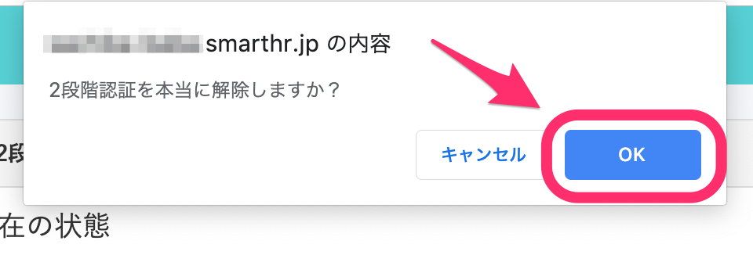

自身のアカウントに設定された2段階認証は、以下の手順で解除できます。

# 2段階認証の解除手順

## 1. 画面右上のアカウント名 > \[個人設定\] をクリック

SmartHRにログインし、**画面右上のアカウント名 > \[個人設定\]** をクリックしてください。

## 2\. \[2段階認証の設定\] をクリック

左メニューの **\[2段階認証の設定\]** をクリックしてください。

## 3. \[2段階認証を解除する\] をクリック

**\[2段階認証を解除する\]** をクリックしてください。

## 4\. \[OK\] をクリック

確認画面が表示されるので、 **\[OK\]** をクリックしてください。

