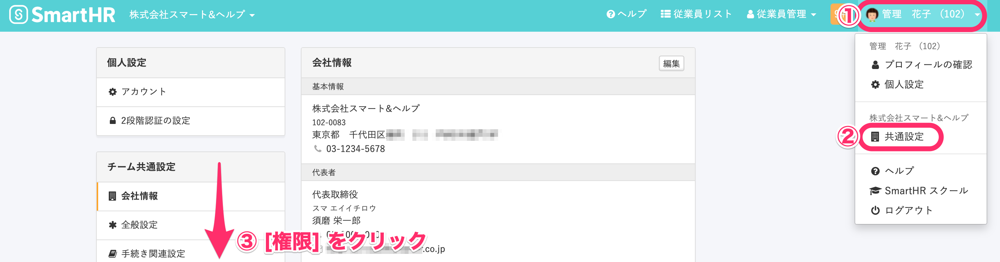
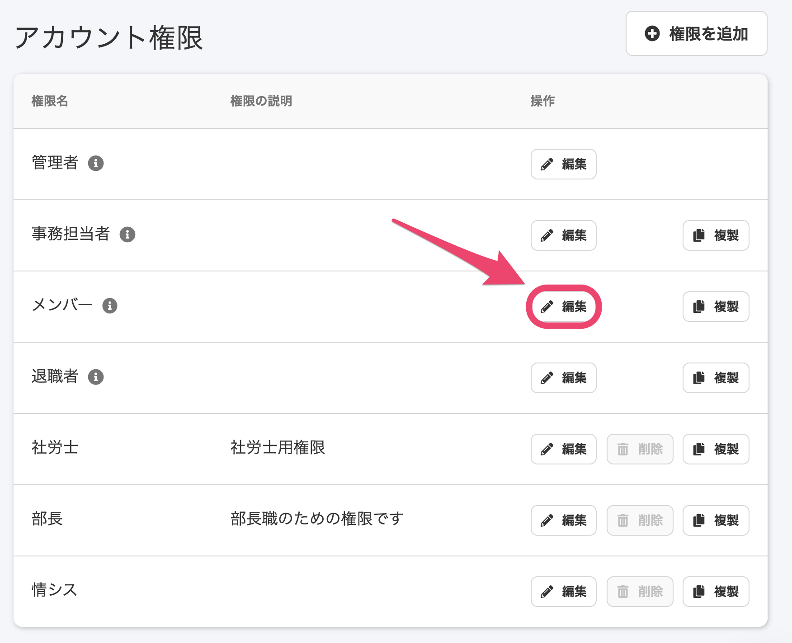
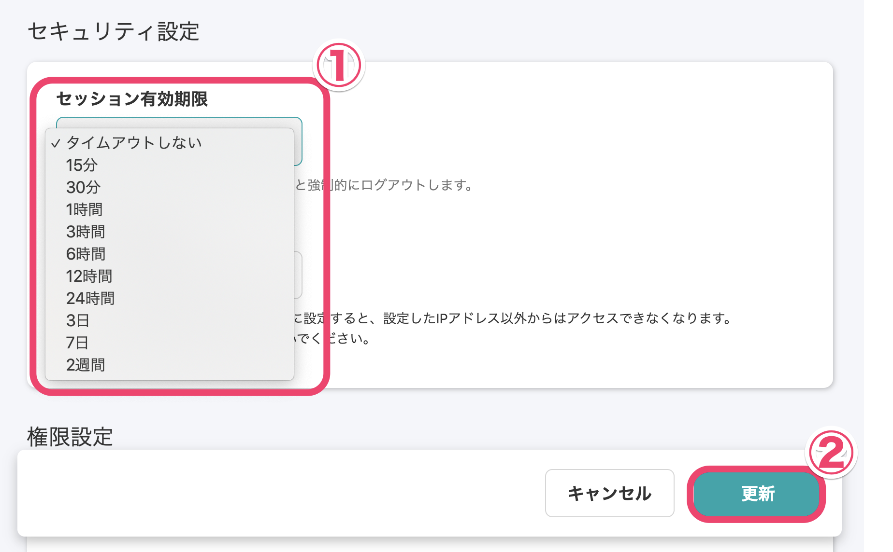

同じPCを複数の従業員で使用している場合や、管理者のログイン状態の時間制限をかけたい時など、自動ログアウト（タイムアウト）する時間を設定できます。

設定は権限ごとに行ないます。

# 1\. 画面右上のアカウント名 > \[共通設定\] > \[権限\]をクリック

**画面右上のアカウント名 > \[共通設定\]** の順番にクリックし、画面左に表示されるメニューの **\[権限\]** をクリックします。

# 2.  編集したい権限名をクリック

**\[アカウント権限\]** 一覧に表示されている、自動ログアウト時間を設定したい権限の **\[編集\]** をクリックすると、編集画面が表示されます。

# 3\. セッション有効期限を設定する

**\[セキュリティ設定\] > \[セッション有効期限\]** にて、設定したいセッション有効時間をドロップダウンリストから選択し **\[更新\]** をクリックすると、設定が反映されます。

:::tips
選択できる時間は下記の項目です。
- タイムアウトしない
- 15分
- 30分
- 1時間
- 3時間
- 6時間
- 12時間
- 24時間
- 3日
- 7日
- 2週間
:::
